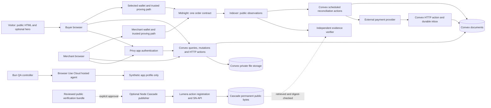
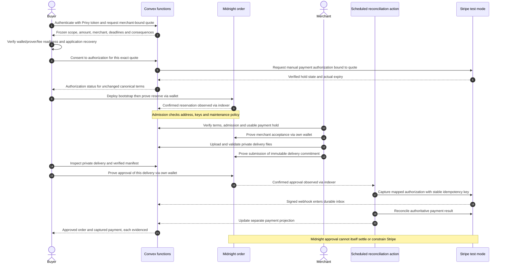
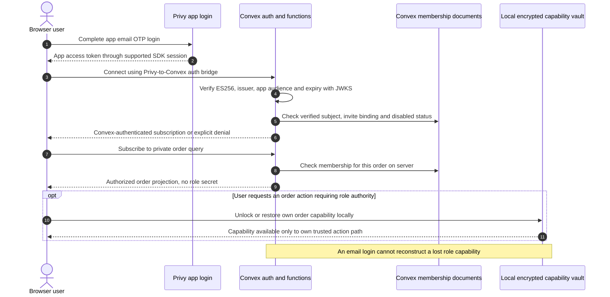
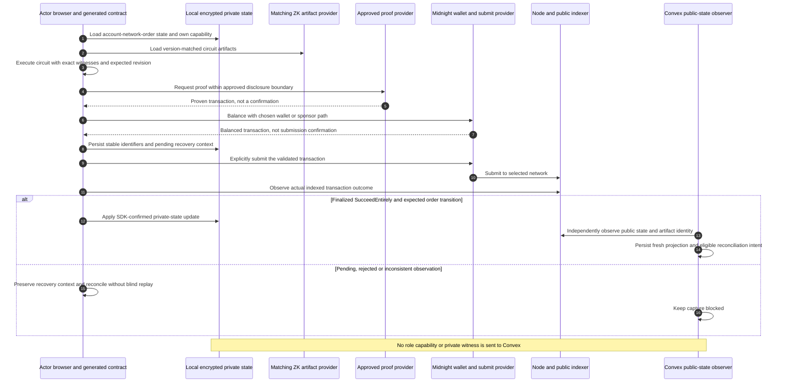
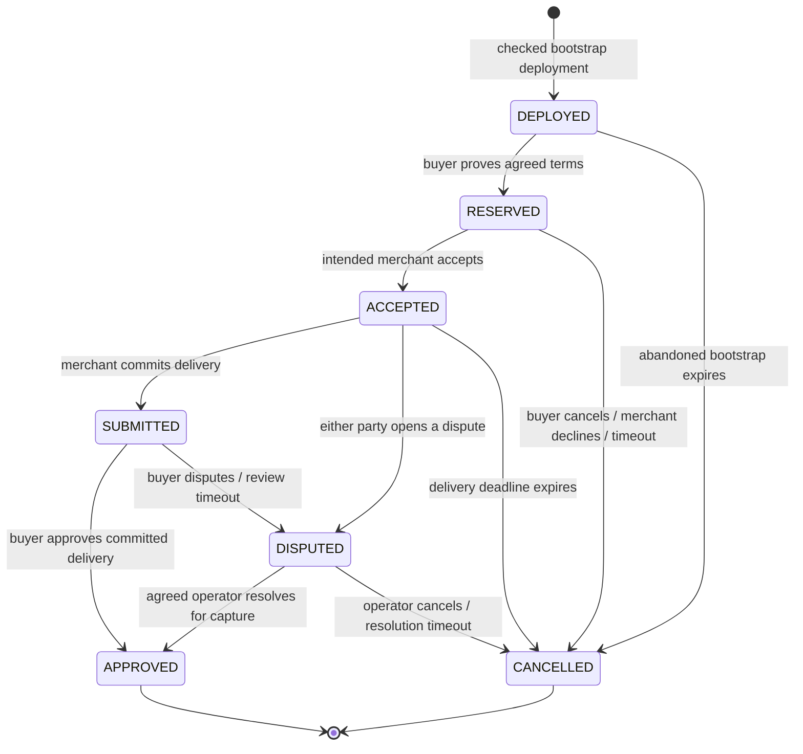
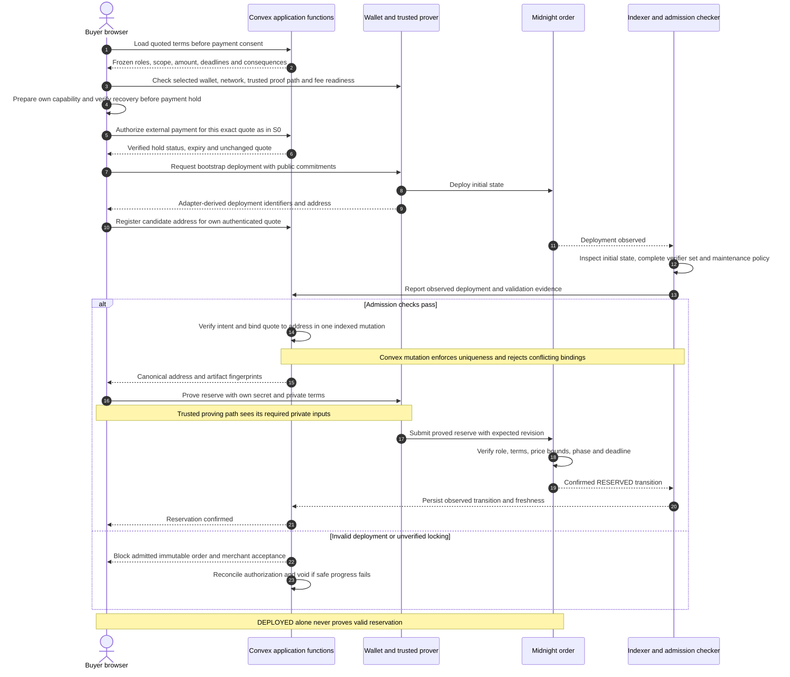
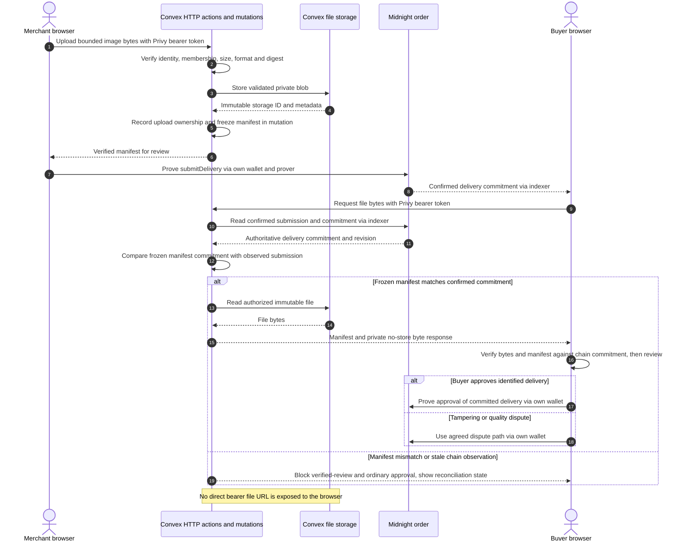
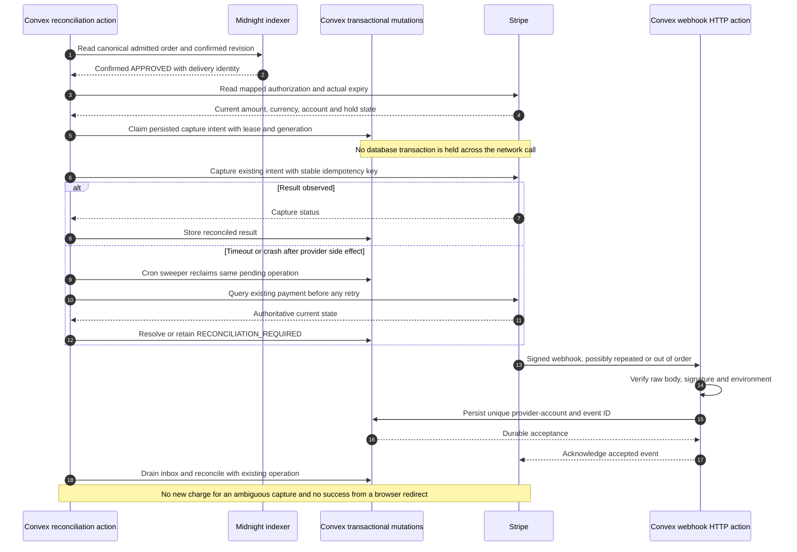
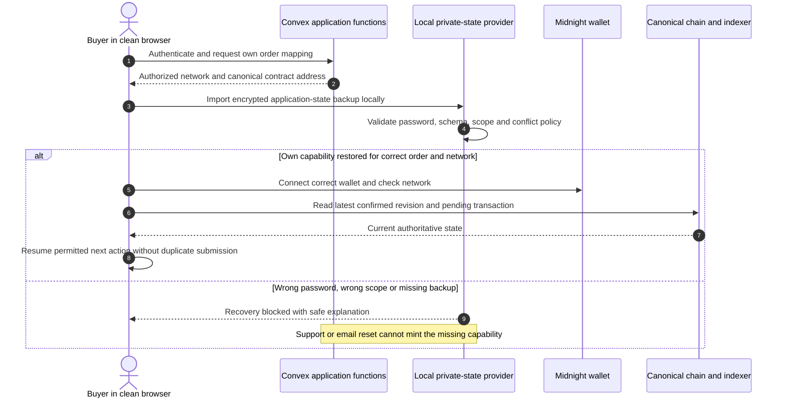

# Milo — implementation blueprint

> **Decision document · revised 7 September 2026 · implementation not yet built.**
> Milo is the chosen product. This document specifies the target, not completed functionality, a security certification, or a tested dependency lockfile.

**Milo: private agreements, clear approvals.** A private commissioning workspace: agree the work, identify the delivery, and verify the approval. Seven service contexts reuse one merchant-bound, fixed-price order protocol. An external payment provider handles money. Midnight enforces the order rules without publishing the underlying commercial terms; it does not judge creative quality or verify payment.

Read this for architecture, dependencies, privacy and implementation decisions. Read the [roadmap](02-roadmap.md) for sequencing/readiness, the [building guide](03-building-guide.md) for engineering judgment and commercialization, the [UI design specification](04-ui-design.md) for routes, page composition, wireframes and source provenance, and the [UX service design](05-ux-design.md) for cross-page consent, participant handoffs and recovery. These are task-specific references, not compulsory full reads before every edit. Protocol, privacy and package decisions remain canonical here; visual proposals cannot override them.

**Redesigned target:** **Bun `1.4.2` + React + Convex + Privy + Midnight**, with Stripe for external order payments and **Browser Use Cloud V4's hosted agent SDK** for cloud GUI workflows. No PostgreSQL, Drizzle, Hono, Better Auth, Playwright, Puppeteer or customer-managed CDP client is selected for the product/QA architecture. Convex owns the backend; Bun owns local build/dev/test orchestration. The [package budget](#65-the-package-budget-eight-product-plus-two-qa) is **eight product packages plus two QA packages**, excluding and separately reporting mandatory Midnight and development-tool dependencies—not a claim that the entire system has ten packages. Experimental integrations are intentional and gated by evidence, not rejected merely for being experimental. This remains a design, not an implemented or tested application.

The [backend design handoff](06-backend-design.md) expands module responsibilities, validation, reconciliation, protected bytes, operations and rollback using the canonical records below. It does not add another data layer, credential store, protocol matrix or package list.

The [post-MVP video specification](07-video-design.md) owns optional launch-film production after real MVP evidence. Its isolated HyperFrames renderer deliberately has a different dependency cohort; it is neither an application service nor a replacement for the selected cloud QA runner.

**Revised architecture:** keep three separate data responsibilities: actor-local Midnight private state, public Midnight order state, and authorized Convex application records/files. Add a **gated Lumera Cascade public-evidence archive**, not a replacement backend or a default destination for customer data. Cascade supplies durable off-chain bytes; it does not supply Convex's transactional application database, reactive subscriptions, membership checks, or payment jobs. The archive adds its own counted SDK/signing dependencies and operational cost. [§2.4](#24-how-private-and-public-state-work-together) defines the state boundary; [§5.9](#59-lumera-cascade-public-evidence-archive) defines the integration and its limits.

The September 6 review confirmed the Lumera partnership and identified unresolved organizer-rubric and network-version discrepancies. Source-confirmed capabilities, selected engineering decisions, and untested product hypotheses remain distinct. The repository currently contains plans, not a submission-ready application; see the [roadmap compliance table](02-roadmap.md#54-buildathon-fit-and-compliance-status).

**Improvement priority:** make the existing order easier to understand and harder to misuse. Start with [purposeful Midnight patterns](#69-purposeful-midnight-patterns), [the wallet/session contract](#342-wallet-integration-and-identity-lifecycle), and [the task-first buyer journey](#82-buyer-experience). Prove safe sponsorship before spending time on an archive or decorative 3D. “Premium” means a distinctive, fast, understandable experience—not more dependencies, concealed wallet requirements, or an award claim.

## Contents

The [Midnight core audit](08-midnight-core-audit.md) records the September 7 source-backed add/reuse/replace decisions, corrected package exports, bilateral trust refinements, hackathon red/yellow risks and next implementation evidence. It preserves this blueprint's protocol and package authority; no optional integration is activated by that report. The roadmap owns the execution manifest; reading sources or updating these specifications does not close a runtime gate.

1. [Product contract](#1-product-contract)
2. [What Midnight contributes](#2-what-midnight-contributes)
3. [Architecture and trust boundaries](#3-architecture-and-trust-boundaries)
4. [Order protocol](#4-order-protocol)
5. [Payments, files, and recovery](#5-payments-files-and-recovery)
6. [Verified dependency decisions](#6-verified-dependency-decisions)
7. [UI source comparison and art direction](#7-ui-source-comparison-and-art-direction)
8. [User journeys and accessibility](#8-user-journeys-and-accessibility)
9. [Repository and developer experience](#9-repository-and-developer-experience)
10. [Verification and operations](#10-verification-and-operations)
11. [Open decisions and source register](#11-open-decisions-and-source-register)

## 1. Product contract

### 1.1 The first customer and transaction

Start distribution with **small launch teams commissioning product-image packs from independent creative providers**. This is the first customer wedge, not Milo's permanent service category. The merchant uses its existing production tools, including AI where appropriate. Milo does not need to generate the images or route model inference.

The initial capability profile, **`image-pack-v1`**, is deliberately narrow: one merchant, one fixed-price order, one immutable delivery of exactly three final images, one buyer, one currency per deployment configuration, no split payouts, and a defined review/dispute window. The same profile serves the seven contexts below; a context is not another contract implementation. Example prices, identities, and images in the demo are synthetic. A 24-hour delivery and 12-hour review window are initial product hypotheses, not validated market requirements.

The pain hypothesis is fragmented coordination: a quote in email, confidential launch material in a shared folder, approval in chat, payment elsewhere, and disagreement about which terms or output were accepted. Milo brings those steps into one understandable order record.

Lead with **“Agree the scope privately. Know exactly what was approved.”** Test the wedge with confidential pre-launch product-image work, not generic demand for blockchain privacy. Existing production tools stay with the merchant; Milo's first value is agreement-to-approval clarity.

**Buyer promise:** know the price, scope, recipient, deadlines, and consequences before authorizing anything; inspect what is public; recover an interrupted order.

**Merchant promise:** receive a bounded brief and an explicit acceptance record, see whether payment authorization is usable, submit an identified delivery, and receive a clear approval or dispute—not an ambiguous chat reaction.

Neither promise includes guaranteed output quality, guaranteed payment, anonymity from the platform, or irreversible card settlement.

### 1.2 Scope that stays fixed

| Build now | Explicitly not the MVP |
| --- | --- |
| Invite-only merchant storefront and order link | Open marketplace, bidding, merchant discovery rankings |
| Seven contextual templates using one bounded capability profile | Seven backends, industry-specific state machines or an arbitrary workflow builder |
| Confidential agreed terms and meaningful Compact checks | Universal AI wallet, inference gateway, shared credit balance |
| Buyer/merchant/order-operator roles | Autonomous purchasing or AI dispute adjudication |
| Approval, cancellation, timeout, and human dispute paths | Trustless subjective quality verification |
| Local-network integration plus a Preview-network path | Assumed production deployment or mainnet eligibility |
| Payment simulator and a separate Stripe test-mode adapter | Native USDC, stablecoin bridge, custody, token speculation |
| Private-state backup/import and honest failure UX | Wallet seed collection or platform-held buyer signing secrets |
| One responsive, accessible product design system | Six overlapping UI libraries or animated financial controls |

### 1.3 The honest competitive position

[Echo][b1] already offers user-funded AI inference and a shared balance across apps. Milo must not become a renamed version of that product. Ordinary forms, file sharing, and payment links are also a serious alternative—not merely an inferior straw man.

Milo's proposed differentiation is **a confidential, independently verifiable agreement-to-approval record across buyer and merchant**, attached to a useful order workflow. Its commercial value still needs customer evidence. If buyers and merchants get equivalent value from a conventional database and payment link, Midnight integration alone will not create demand.

[Filestage][rev-filestage] and [Ziflow][rev-ziflow] are more direct workflow comparisons than an inference-credit service. Compare delivery/version identity, approval evidence, confidential access, onboarding, and total cost; do not build annotation-suite feature parity. Their existence establishes a paid product category, not Milo demand or a verified security weakness in a competitor. Test whether independent rule verification earns its wallet/proving/recovery overhead.

### 1.4 Seven service contexts

These are navigation, brief-template and discovery hypotheses, not seven validated markets or implemented vertical products. **One agreement model; many service contexts; bounded capabilities.** A provider may offer several contexts without creating another account, permission system or order lifecycle.

| Context | Family | Context-specific brief emphasis |
| --- | --- | --- |
| SC-01 | Commerce imagery | Product, listing dimensions, visual consistency and usage rights |
| SC-02 | Product visualization | Unreleased design, approved references and what a render represents |
| SC-03 | Campaign and launch creative | Audience, messaging, launch timing and permitted claims |
| SC-04 | Property and hospitality imagery | Locations, subjects, listing use and consent to supplied material |
| SC-05 | Publishing and entertainment artwork | Release context, spoilers, composition and reproduction rights |
| SC-06 | Brand and market adaptation | Brand constraints, target market, language and adaptation rights |
| SC-07 | Business and sales communication | Intended audience, confidential proposal material and graphic use |

Reuse the existing private `serviceVersion` to identify the compiled capability policy. Store `contextId` and `templateRevision` with the frozen human-readable scope document already bound by the commercial scope digest. Template defaults help prepare an offer; the frozen quote, not the latest template, supplies agreed terms. No new public context field, runtime policy interpreter, database registry or dependency is required. A scope digest binds the document's identity; it does not prove that its prose, rights or claims are true.

An agency in SC-01/UC-03 is the buyer of its freelancer's work. Agency subcontracting can occur in any context; it does not introduce a fourth contract role. An agency's separate client engagement has separate consent, membership, capabilities and payment identity. Do not propagate private client files, approvals, funds or authority between those orders automatically.

### 1.5 Twenty-case fit matrix

All rows are **R0 candidate offers**, not observed demand or enabled services. Each example must be sold as a single fixed-price bundle of **three final PNG/JPEG/WebP images, at most 5 MiB each**, with one immutable submission and full approval/cancellation. The operator and all deadlines must be agreed, and the complete deadline-plus-margin window must fit the actual authorization expiry. A context match does not waive these conditions. A merchant who needs routine revisions, longer financing or excluded outputs does not fit this first profile.

| Case | Context | Buyer ↔ provider | Illustrative three-image bundle | Not implied by the example |
| --- | --- | --- | --- | --- |
| UC-01 | SC-01 | E-commerce brand ↔ product photographer | Three launch-ready product photos | Physical goods fulfillment |
| UC-02 | SC-01 | Online seller ↔ retouching studio | Three retouched product photos | Editable layers or revision rounds |
| UC-03 | SC-01 | Creative agency ↔ freelance designer | Three confidential campaign product visuals | Client delegation or split payouts |
| UC-04 | SC-01 | Marketplace seller ↔ listing designer | Three agreed listing visuals | Marketplace publishing/integration |
| UC-05 | SC-02 | Manufacturer ↔ 3D artist | Three raster product renders | Native 3D/CAD files or technical certification |
| UC-06 | SC-02 | Crowdfunding team ↔ visualization studio | Three pre-launch product visuals | Evidence that a physical prototype exists |
| UC-07 | SC-03 | Brand ↔ advertising designer | Three static campaign creatives | Ad placement or performance guarantees |
| UC-08 | SC-04 | Restaurant ↔ food photographer | Three menu/listing photos | A complete menu or publication service |
| UC-09 | SC-04 | Real-estate agent ↔ property photographer | Three property-marketing photos | Full galleries, tours or verified property claims |
| UC-10 | SC-04 | Hotel ↔ hospitality photographer | Three accommodation-listing images | Booking-system integration |
| UC-11 | SC-03 | Software startup ↔ marketing designer | Three unreleased-product launch graphics | Software development or feature verification |
| UC-12 | SC-05 | Publisher ↔ cover designer | Cover artwork and two promotional images | Print-ready PDF or editable book layout |
| UC-13 | SC-05 | Musician ↔ visual artist | Release artwork and two promotional images | Audio production or licensing certification |
| UC-14 | SC-03 | Event organizer ↔ graphic designer | Three event-promotion graphics | Print production or ticketing |
| UC-15 | SC-06 | Fashion brand ↔ illustrator | Three collection illustrations | Garment manufacture or source vectors |
| UC-16 | SC-05 | Game studio ↔ concept artist | Three confidential concept images | Production-ready game assets |
| UC-17 | SC-06 | Consumer brand ↔ packaging designer | Three packaging presentation mockups | Dielines or print/manufacturing approval |
| UC-18 | SC-07 | Consultancy ↔ presentation designer | Three confidential proposal graphics | An editable deck or professional advice |
| UC-19 | SC-03 | Nonprofit ↔ campaign designer | Three fundraising visuals | Donor processing or verified fundraising claims |
| UC-20 | SC-06 | Brand ↔ localization designer | Three market-specific campaign images | Certified translation or locale compliance |

This matrix owns case identity and fit, not gate results. The [roadmap coverage contract](02-roadmap.md#44-context-coverage-and-reuse-evidence) owns the evidence needed to admit an offer or advertise support. Research records for each candidate should distinguish confidential-input need, normal revision practice, usual job duration, support cost and actual willingness to use the workflow. Twenty plausible examples are not twenty customer validations.

### 1.6 Extension contract

Separate the context, the agreed offer, and the capability policy. A new category can reuse the profile; a new capability must earn its own evidence. Keep existing `quotes`, `orders`, manifests and payment records rather than adding a parallel “agreement” database or another state enum.

| Change | Required work before claiming support |
| --- | --- |
| Another context, example or brief prompt | Fit review and synthetic fixture; freeze context/template provenance in scope; no new role, SDK or circuit solely for a label |
| Different price, scope, rights or deadline within current policy | New acknowledged quote before commitment; existing typed bounds, consent, recipient and capture-window checks still apply; never mutate admitted terms |
| Bounded variable image count | Replace the exact-three policy deliberately; compile/test bounds, canonical manifest count/order, TypeScript/Compact vectors, file finalization and responsive review before enabling it |
| PDF, video, source files or larger images | Storage/size/security/retention and safe preview/download work; hash originals, not only previews. Change circuits only if committed encoding or enforced rules change |
| Revisions, milestones or partial acceptance | Versioned lifecycle, concurrency, consent, recovery and payment design; not a delivery replacement toggle |
| Delegated reviewers or multi-party work | Capability/role and disclosure design; no permissions inherited from a category or agency label |
| Longer work or another settlement arrangement | Separate commercial/provider policy, deadline and reconciliation evidence; no hidden same-order reauthorization |

The selected profile retains the exact-three rule; variable counts are an explicit next capability, not already supported by this documentation refactor. Do not present these deliberate initial limits as permanent technical impossibilities. Keep each experiment narrow, reversible before admission, and tied to the [existing exploration lanes](02-roadmap.md#64-exploration-lanes-with-stop-conditions).

## 2. What Midnight contributes

### 2.1 Necessary work, not decorative transactions

The Compact contract must reject invalid transitions and validate private inputs against immutable commitments. A database mirror cannot override the on-chain decision. A chain transaction containing only the hash of an arbitrary JSON document is insufficient for this blueprint.

The first proof-backed rules are:

- The caller possesses the credential bound to the relevant order role.
- The terms supplied to an action open the agreed terms commitment.
- The private price uses bounded integer minor units and satisfies the configured service rules.
- At reservation, the private total is within the buyer's privately declared approval limit. This is a buyer-policy check, **not evidence of funds or an employer-approved budget**.
- The action is legal for the current phase, revision, and public deadline.
- Approval refers to the immutable submitted delivery commitment—not a subsequently replaced file.

Compact is a separate, TypeScript-inspired smart-contract language, **not ordinary TypeScript**. Generated TypeScript/JavaScript integrates its circuits with the application. Use the [language documentation][m2], [runtime testing guide][m3], and [supported version matrix][m1].

### 2.2 Privacy claim, precisely scoped

The MVP protects selected content from **public chain observers**. It does not make the platform, payment processor, connected wallet, proving service, or merchant magically unable to see information they process.

Convex now hosts protected application records/files; Privy handles app identity/email OTP and session metadata. Both are explicit data recipients, not privacy-free infrastructure. Browser Use Cloud receives **only isolated synthetic QA content and narrowly scoped test sessions**, never real briefs, real account sessions, wallet seeds or order capabilities. Review the providers' region, retention, deletion/export and subprocessors before a live pilot. Native SDK integration does not mean local execution.

| Data | Public ledger / indexer | Buyer | Merchant | Milo API / operator | Other recipient |
| --- | --- | --- | --- | --- | --- |
| Contract address, phase, revision, action timing | Visible | Visible | Visible | Visible | Network observers |
| Absolute deadlines and protocol version | Visible by design | Visible | Visible | Visible | Network observers |
| Random order nonce and role/terms commitments | Visible; may still correlate activity | Visible | Visible | Visible | Network observers |
| Price, scope, commercial terms | Commitment only, not plaintext | Visible | Visible | Visible in v1 | Payment processor sees required amount/details |
| Brief and deliverable files | Never uploaded to chain | Authorized access | Authorized access | Protected storage access in v1 | Merchant's production tools if explicitly used |
| Buyer-private approval limit | Not plaintext | Visible | Not required | Do not transmit as application telemetry | Chosen prover may receive it |
| Buyer/merchant capability secret | Never | Own secret only | Own secret only | Must not receive | Chosen prover receives necessary witness material |
| Payment instrument / card data | Never | Hosted payment UI | Processor-dependent account view | No raw card collection | Payment provider |

Commitments are not automatically unlinkable. Low-entropy prices need random salts; reused identifiers reveal relationships; public deadlines and transaction cadence reveal business activity. A malicious frontend can steal unlocked client secrets. A remote prover that sees a reusable role secret can impersonate its holder. These are architectural risks, not footnotes.

An advertised list price can make an order's amount easy to infer even when its commitment is salted. Keep actual customer quotes behind authorized access, and never claim to conceal information already published by the merchant. “Fixed price” means the agreed order price does not meter inference usage; it does not require publishing every customer's quote.

**Copy allowed:** “Commercial terms stay off the public ledger; Midnight verifies the order rules.”

**Copy prohibited:** “Nobody can see your order,” “anonymous checkout,” “untraceable,” “trustless escrow,” “guaranteed creator quality,” or “Midnight settles your dollars.”

### 2.3 Evidence that should impress a Midnight reviewer

Demonstrate the public/private boundary live: the buyer sees an agreed private amount while the ledger inspector shows only the disclosed metadata and commitments. Change the terms, try a wrong role, replay an approval, and race cancellation against acceptance: show rejection at the contract layer, not merely a disabled button.

Then close the tab, restore encrypted application state, reconnect to the correct network, and recover the confirmed order. Show the distinction between a successful proof, a submitted transaction, an indexed confirmation, and a successful test payment. This is deeper integration than an extra wallet-connect badge.

Prioritize terms substitution, wrong-role actions, and delivery substitution over the self-declared spending-limit example: the latter is a policy relation, not evidence of funds. A public evidence bundle can help a reviewer reproduce verification, but neither its presence on Cascade nor a UI checkmark proves an order valid.

### 2.4 How private and public state work together

Midnight private state is **not a shared encrypted cloud database**. Each actor's private-state provider persists its own local data; witnesses supply inputs to local circuit execution. Circuit constraints must verify those inputs against the admitted contract's commitments and rules. An unconstrained witness returning “authorized” proves nothing. A proof validates the specified relation; the network does not receive a synchronized plaintext copy of each actor's private store [m2][m7].

| Plane | Milo data and owner | Integration rule |
| --- | --- | --- |
| Actor-local private state | Own capability, buyer-only limit, locally needed openings/salts and pending-operation context | Scope by account/network/order; encrypted backup; supply only to the selected trusted proof path. Never synchronize role secrets through Convex or Cascade |
| Agreed private application data | Canonical terms shared with counterparties, briefs, delivery bytes, dispute evidence | Convex checks current membership on every protected operation. Participants validate typed commitment openings and file digests locally. This is authorized application sharing, not automatic Midnight private-state sharing |
| Public Midnight ledger | Protocol version, role/terms commitments, nonce, deadlines, phase/revision and delivery/evidence commitments | Only permitted circuits change order state; audit every disclosure, public argument and output. Commitments and timing still reveal metadata |
| Convex projections and payment records | Canonical address binding, observed chain revision, provider IDs/status, durable inbox/outbox | Cache observations with provenance/freshness. Reconcile independently; neither a row edit nor a webhook authorizes an order transition |
| Optional public Cascade archive | Reviewed synthetic verification bundle and reproducibility artifacts | Bytes remain external to Midnight. Recheck their digest and canonical chain state; storage is not settlement, private-state backup or circuit execution |

For **reserve → submit → approve**, the data path is:

1. Parties agree the versioned terms and role commitments through authorized application exchange. Each retains only its own role secret; the buyer-only limit is not shared with the merchant.
2. The buyer checks deployment admission, network, verifier artifacts and maintenance policy, then proves reservation using its private opening/authority. Only the intended public state and proof-bound transition are submitted.
3. The merchant stores validated delivery bytes privately, freezes the manifest, and proves submission of its commitment. A file URL, Convex storage ID or Cascade action ID is not the delivery commitment.
4. The buyer fetches authorized bytes, verifies the exact manifest locally, makes the human quality decision, and proves approval against the same commitments. Midnight verifies the rule, not artistic quality or future file availability.
5. The client observes confirmation before updating confirmed local state; ambiguous submission retains recovery context and is reconciled before retry. Convex independently observes the canonical contract before attempting external capture.
6. A reviewer can inspect public state without acquiring an order capability. A private receipt may include an explicitly consented opening; a public archive must not. v1 does not claim arbitrary field-level selective-disclosure proofs.

Test a modified Convex projection and a tampered downloaded artifact against independent chain/artifact checks. An indexer remains an observation dependency, not a locally verified consensus proof; record its endpoint and freshness and fail closed on contradictory observations. Deep integration means preserving these boundaries, not moving every record onto a blockchain.

## 3. Architecture and trust boundaries

### 3.1 Deployment shape

Use a small monorepo, not duplicate backends. **Bun HTML imports/build tooling** serve a static-first public entry and a React DApp entry [c8]. **Convex** supplies typed queries/mutations, reactive client subscriptions, schema/storage, HTTP actions and scheduled reconciliation. **Privy** supplies app login; Convex validates its JWTs and enforces Milo membership. No SQL database, separate API framework, Bun database driver, S3 adapter or always-on worker is needed for the selected slice. The Midnight contract remains the authority for order transitions.

The prototype deployment target is **Cloudflare Pages Free + Convex Free + Privy Developer's eligible free tier + Stripe sandbox + Midnight local/testnet**, subject to the [asset, quota and no-spend gates](#610-free-tier-deployment-and-spending-boundary). This selects a frontend host, not another backend. Optional [review assistance](#38-review-assistance-and-agent-operated-prototypes) neither changes the protocol nor authorizes paid inference.

The optional Cascade publisher is an isolated operator-run Node tool, orchestrated by Bun after explicit publication approval—not a second always-on API or a new buyer wallet requirement. It handles only allowlisted public artifacts and a separate Lumera fee/signing identity. Keep its SDK/WASM out of the DApp and Convex runtime until the archive gate proves a supported execution path.

These are distinct runtimes: browser code runs in the browser; Bun runs development/build/QA orchestration; hosted Convex queries/mutations run in Convex's runtime, not Bun. External calls run in actions; choose a supported Node action runtime only after SDK compatibility or measured workload/memory requires it [n14][c10]. Hosted Convex supports Node 20, 22 and 24; Node 24 is a candidate, not a platform requirement. Self-hosted Convex follows its own runtime pin rather than this hosted per-project selection. Keep upstream Midnight/local-network tooling on its supported runtime. WebAssembly support in Convex does not establish that a full Midnight wallet/prover should run there; user proof inputs stay in the actor's trusted path. The [backend file pipeline](06-backend-design.md#6-file-lifecycle-and-application-restoration) keeps bytes out of function/scheduler payloads before considering more memory.



Diagram arrows are information flows, not a claim that all information crossing them is public or that the API can sign as a user. The proof path is a separate trust boundary even when a wallet abstracts it.

### 3.2 Sources of truth

| Fact | Authority | What the application may cache |
| --- | --- | --- |
| Legal order phase / revision | Target Midnight contract | Indexed projection with freshness and transaction ID |
| Meaning of agreed scope | Versioned terms acknowledged by parties | Protected canonical terms document |
| Payment authorization / capture / refund | Payment provider | Reconciled status and provider identifier |
| File bytes | Convex storage, checked against submitted digest | Authenticated byte response and verified manifest |
| Caller capability | Circuit verification against role commitment | Encrypted client state; never a server impersonation token |
| Human quality decision | Buyer or explicitly agreed dispute operator | Authenticated evidence record; not cryptographic truth |

No browser-supplied `approved: true`, webhook payload, Convex mutation or admin edit may authorize a normal payment capture. A reconciliation action independently observes the expected confirmed contract state. Convex subscriptions show a useful projection, not independent proof of chain finality. Conversely, an `APPROVED` contract does not mean payment succeeded.

### 3.3 One contract per order, with an explicit cost gate

Use **one deployment per order** for the first implementation: isolated state, bounded reasoning, no shared mutable order map, and simple adversarial tests. Freeze all role commitments at creation, including the intended merchant; never let the first arbitrary accepter become the merchant.

This choice exposes contract count and adds deployment/proving cost. Measure it on the target wallet and network on the first integration day. If latency or cost is unacceptable, open an architecture decision for a shared registry contract before scaling. Do not silently switch storage layout halfway through the MVP; it changes privacy, contention, migrations, and proof behavior.

**Deployment is not proof of correct initialization.** The ledger's [ContractDeploy API][m16] accepts an arbitrary initial contract state. Deploy into a noncommercial `DEPLOYED` bootstrap phase using only public configuration/commitments, then execute an actual buyer-authorized `reserve` circuit to validate private terms and enter `RESERVED`. Do not put the only price/role checks in a local constructor and call them on-chain verified. Admission must inspect the expected initial state and complete verifier-key/entrypoint set, bind the canonical address, and retain the confirmed reservation transition; an address already claiming `APPROVED` is not admissible evidence.

**Maintenance authority is also authority.** Midnight supports circuit maintenance, described in its [deployment/operation guide][m17]. Milo's target policy forbids changing active-order rules. Before canonical admission/reservation, verify a supported, irreversible locking/revocation procedure and its effect on every relevant maintenance operation. A retained deployment/maintenance signing key must not quietly permit a circuit replacement. Until that gate passes, label the deployment upgrade-trusted and block the immutable-order/pilot claim. Do not guess that deleting a local key or setting a threshold to zero locks the contract.

The documented ledger default without authority is an empty committee with threshold one, which cannot authorize maintenance; **Midnight.js `deployContract` instead installs a single-signature authority by default** [m17]. Do not conflate those defaults. Verify the actual deployed policy and a rejected maintenance attempt under the exact SDK cohort; deleting a locally generated key is not proof of protocol immutability.

Admission evidence follows one sequence: validate the frozen quote and independent payment window; inspect bootstrap state, entrypoints and artifact/verifier fingerprints; establish and observe the required maintenance policy; atomically bind the canonical address; then prove and observe reservation. Preserve pending identifiers and private recovery context if interrupted between steps. No failed admission can produce a usable order merely because deployment succeeded.

Irreversible maintenance locking trades upgrade flexibility for fixed order rules. Before admitting real orders, document how their bounded lifetime fits the supported proof-system window and how an announced incompatibility stops new admissions. New versions serve new orders; an immutable active order cannot be silently migrated or patched. Retain old artifacts, observations and finance reconciliation, and define operator escalation if an existing order cannot complete. This is a release/availability risk, not permission to add a hidden upgrade key [m17].

### 3.4 One app sign-in, independent authorization

An application login is not contract authorization. The browser holds a fresh, high-entropy, per-order capability secret for its own role. A circuit verifies a domain-separated commitment to that secret against the role fixed in the ledger. A caller-supplied witness returning `ownPublicKey()` or a string identifying a user is not sufficient authentication unless the circuit verifies the corresponding authority.

Bind capability commitments to a protocol domain, network, random order nonce, and role. Do not introduce a circular constructor dependency by hashing an unknown deployment address into fields that determine that address. After deployment, pin the actual contract address in the order receipt and transaction builder; test cross-order and cross-network replay rejection.

The merchant creates its role commitment with the quote. The buyer receives the commitment, not the merchant secret. The operator's dispute authority is also committed before purchase. Each role supplies only its own credential to its own proving path. Shared terms are not shared credentials.

“Merchant-bound” means bound to that precommitted capability on-chain. Mapping the capability to the displayed business is the invite-screened account and quote process, not proof of legal identity. Before acceptance, the API and merchant client must establish a one-time `(network, quote ID, order nonce) → contract address` binding, verify the deployed terms/roles, and reject a second address for the same quote. Otherwise copied public commitments could create a clone-order confusion even though an existing proof cannot simply be replayed onto another contract. This application binding is not a claim of global on-chain nonce uniqueness.

**Select Privy for app authentication**, using `@privy-io/react-auth@3.40.0` in auth-only mode. Managed email OTP replaces the previous magic-link/session database and its login-mail integration. This is a deliberate UX/provider change: measure invite completion, latency, accessibility, cost and client bundle weight rather than assert it is universally better. Disable unsolicited embedded-wallet creation and unrelated wallet login methods. The Midnight connector and each actor's encrypted capability vault remain separate [n18].

**Use Convex's native `customJwt` verification**, not a second backend auth SDK. Privy documents ES256 access tokens with `iss: "privy.io"`, `aud` equal to the Privy app ID, and `sub`, `iat`, `exp` [n19]. Configure those exact values with `type: "customJwt"`, `algorithm: "ES256"`, `applicationID` and the app's JWKS [c1]. The current published Privy Node SDK resolves keys at `https://api.privy.io/v1/apps/<PRIVY_APP_ID>/jwks.json` [c6]; verify the real app's key ID and endpoint during the spike rather than copy an older third-party URL. The API hostname and token issuer are different strings. Never omit audience checking to get a token accepted.

Wire `PrivyProvider` → a memoized auth bridge → `ConvexProviderWithAuth` [c2]. The bridge exposes `isLoading`, `isAuthenticated` and `fetchAccessToken`; only load protected Convex queries after **Convex itself** reports authenticated. Convex requests `fetchAccessToken({ forceRefreshToken })`, but Privy's public `getAccessToken()` has no documented force-refresh argument. Do not invent an option: test normal near-expiry refresh, rejected-but-cached tokens, reconnect, logout and key rotation. Use bounded backoff and reauthentication when a usable fresh token cannot be obtained; no infinite refresh loop or acceptance of an expired token. The cross-provider bridge is an **experimental integration gate**, not a claimed first-party Privy–Convex adapter.

Every protected Convex function and HTTP action checks verified identity plus local invite, disabled-account and order membership records. Bind invitations atomically to a verified Privy subject; if an invite starts with an email address, verify that address from provider-authenticated evidence or a reviewed server-side lookup—not a browser-supplied string. Use a random, single-use invitation capability where appropriate; it grants only app membership, not contract authority. Do not infer a user's email from an access JWT that does not contain it. Subject/issuer identity is distinct from displayed merchant legal identity.

Use the SDK's supported session handling; do not add token persistence or token-bearing URLs. Explicitly review its default browser storage versus optional cookie mode: an HttpOnly same-site cookie cannot simply authenticate cross-origin Convex WebSocket subscriptions. Apply restrictive CSP, exact origin allowlists and token redaction; membership checks bound disabled users even while a cryptographically valid token remains unexpired. No `@privy-io/node` or `jose` direct dependency is necessary for ordinary Convex JWT verification. Admin provisioning needs its own verified API/permissions if added later. MVP notifications are reactive in-app records; external transactional mail is deferred, not magically supplied by Privy's login service.

Logout is not evidence that an independent JWT verifier immediately rejects a copied, unexpired token. Test logout with active subscriptions and account switching, and enforce app-level disabled/membership checks. If immediate per-session revocation becomes a requirement, define and test a server-enforced policy using verified session identity rather than assuming JWKS validation consults Privy session state.

### 3.4.1 Convex data and execution contracts

| Module / record | Native responsibility | Invariant to retain |
| --- | --- | --- |
| `memberships`, `invites` | Verified identity, actor membership, invite consumption, disable/revoke policy | Query/mutation/HTTP authorization is server-side and fail-closed |
| `offers`, `quotes`, `orders` | Versioned terms and canonical `(network, quote, nonce) → address` admission mapping | Read the indexed key and insert/bind in **one mutation**; reject conflicting canonical addresses |
| `chainObservations` | Network/address/revision/transaction/artifact fingerprints and freshness | Written by internal observation actions, never accepted as truth from the browser |
| `paymentIntents`, `paymentInbox`, `settlementOps` | Provider mapping, unique events/effects, attempt state and reconciliation | Durable intent before side effect; one operation identity throughout retries |
| `deliveries`, `fileGrants` | Protected storage references, validated digest/manifest, upload ownership and retention | No public file URL or arbitrary storage-ID attachment |
| `auditEvents`, `notifications` | Allowlisted events and reactive user-visible notifications | No raw JWT, secret, brief, price or full provider payload in diagnostic logs |
| Isolated QA records | Execution namespace, fixture identity and evidence pointers | Absent or inaccessible in live production; test actors cannot cross namespaces |

Convex's `.unique()` checks a query result; it is **not a SQL UNIQUE constraint**. Implement every business uniqueness rule as a shared indexed read-and-write mutation and exercise concurrent callers under Convex's transaction/retry model [c5]. Do not split existence checks and inserts across separate calls or import a custom ORM. Use `v` validators for arguments/returns and schema, generated `Id`/API types, and pure shared policy functions; use Zod at external/untrusted JSON and form boundaries. Paginate bounded reads rather than full-table scans.

Queries/mutations have no external side effects. `fetch`, payment SDK calls and public chain observation belong in actions; actions call `runQuery`/`runMutation` for persisted state. Schedule initial work transactionally from the intent mutation. Scheduled mutations are retried/exactly-once within Convex's documented guarantees, but scheduled **actions are at-most-once and not automatically retried** [n13]. A bounded cron sweeper must find pending/ambiguous operations, reclaim expired leases and recheck external state. Scheduled timers do not execute a Midnight timeout circuit automatically; a supported public-input transaction path still has to submit and be observed.

### 3.4.2 Wallet integration and identity lifecycle

**One account experience; separate security responsibilities.** Privy is Milo's only app sign-in. Do not add a “Sign in to Midnight” screen, a second user database, or a second login session. A Milo-owned coordinator composes the existing Privy/Convex auth bridge with the narrow Midnight adapter and local recovery store; it is application code, not a new authentication SDK. One account menu and one task-oriented setup sheet show only the missing prerequisite, retain the intended order, and return to it after OTP, wallet permission or recovery. Wallet approval is explicit action/device consent—not a second product login. Repeat actions reuse a still-valid session and verified connection without bypassing consent or freshness checks.

Keep three independent checks: **Privy + Convex membership permits private app access; the selected Midnight connector supplies chain services; the actor-local capability permits the order action.** A wallet address, email address or successful login is not a substitute for the other checks. Reading an authorized quote/order needs no connected wallet. Privy's EVM/Solana connector configuration and raw-signing APIs do not establish a managed Midnight wallet [wallet-privy][wallet-privy-raw]. Keep Privy in auth-only mode, with automatic embedded-wallet creation and unrelated wallet login methods disabled.

The [connector `4.0.1` specification][wallet-spec] and its [published declarations][wallet-package] are the candidate contract, not EIP-1193 or a generic wallet tutorial:

| Integration point | Required implementation |
| --- | --- |
| Discovery | Enumerate `window.midnight` entries of `InitialAPI`; injection keys are UUIDs, not a stable `lace` property. Check `apiVersion`; sanitize `name`/`icon`; treat `rdns` as metadata, not an authenticated vendor identity. Handle absent/late injection and multiple wallets; connect only after user selection |
| Connection | Call `connect(networkId)` with the named, verified profile. Recheck `getConnectionStatus()` and `getConfiguration()`; reject a mismatch with the node/indexer/artifact profile. `hintUsage` declares intended methods, returns no permission manifest, and does not make a later call guaranteed to succeed |
| Context changes | `4.0.1` does not define standard `accountsChanged`, `chainChanged`, `switchNetwork` or `disconnect` methods. Recheck on foreground/reconnect and before consequential work; compare the returned network and needed shielded-key fingerprint. Increment a local connection generation, invalidate builders, lock the previous actor's vault and ignore late results when it changes. Verify each wallet's actual switching behavior |
| Authority | Returned public keys support the SDK adapter; they do not prove app identity or replace the committed order role. No extra wallet-login signature is needed for v1. A future ownership-linking feature needs a verified challenge/signature/key-binding and replay policy, not a browser-supplied address |
| Proofs | Rebuild the connector proof provider when connection context changes. Prefer the documented `getProvingProvider` path; its private preimages are visible to the selected proof path. “Wallet-mediated” does not prove “on-device.” Never fall back to an undisclosed remote prover |
| Errors and disconnect | Distinguish permission rejection, disconnection, invalid request and internal error using the connector's structured error contract. Preserve drafts; never loop permission prompts. Milo's local disconnect clears references and sensitive UI state; extension permission revocation is a separate wallet operation |

Privy subject changes and logout also clear protected subscriptions, blobs and unlocked capability state. A wallet change alone does not log the user out of Milo, and an email change does not transfer a contract role. Track these as separate state machines; do not implement one overloaded `connected` boolean.

The coordinator derives readiness from verified `appAccess`, `chainConnection`, `orderCapability`, `proofPath` and `feePath`, all scoped to the current actor/order/context generation. These are proposed Milo state names, not vendor API fields. It exposes the next required step and permitted actions to the UI, never secrets or a server-trusted `canApprove` flag. Query authorization remains in Convex; transition authorization remains in Compact. Reauthentication resumes the draft/status check, **never automatically submits an old intent**. No duplicated SDK token storage, custom auth server, or Privy raw-signing shim is justified by the desire for one experience.

**One active SDK network per JavaScript realm.** The selected `midnight-js-network-id@4.1.1` stores network ID at module scope [wallet-network]. Separate provider objects are not isolation. Finish/quarantine pending work before changing it; use a genuinely isolated realm if concurrent networks become necessary. Never mutate the network underneath an in-flight proof.

The adapter must bridge different interfaces: Midnight.js `balanceTx` versus connector `balanceUnsealedTransaction`, synchronous SDK key getters versus asynchronous `getShieldedAddresses`, and SDK `submitTx` versus connector `submitTransaction`, whose result is `Promise<void>`. Derive and persist stable ledger `identifiers()` before submission; do not invent an ID from that void return or watch only `transactionHash()`, which can change when transactions merge [wallet-types][wallet-ledger]. Persist sensitive provisional state only in the actor's encrypted recovery context, never in Convex diagnostics.

Select **one tested wallet/version/browser/network profile**, not a universal wallet-support claim. Lace, 1AM and Gero are candidates, not three required integrations. The release evidence records connector version, relevant returned keys/configuration, proof recipient, fee route, cancellation/reload behavior and supported device. A token-claim portal's wallet integration establishes neither Midnight transaction support nor proving compatibility [blog-claim-wallet]. The June Turnkey announcement is a promising embedded-wallet lead, but its future-tense integration claim is not an executable adapter or grounds to add a second auth vendor [wallet-turnkey]. B-09 owns the real compatibility evidence.

### 3.4.3 Operational authority assignments

Use “operator” only for the named responsibility. Keep these authorities separate even if one screened person receives more than one assignment:

| Authority | Credential and permitted responsibility | Not granted implicitly |
| --- | --- | --- |
| `disputeOperator` | Actor-local capability committed to that order; bounded full resolution through the circuit | Payment-provider access, broad support-file access or archive signing |
| `financeOperator` | Explicit Convex operations permission and separately controlled payment-provider access; reconciliation and approved financial incident handling | Any participant's circuit secret or permission to forge approval |
| `archivePublisher` | Explicit publication approval and isolated Lumera signing identity for reviewed public synthetic evidence | Private-order access, payment authority or dispute capability |

Use explicit assignments, separate credentials and audited actions rather than a universal `isAdmin`. A shared operator shell does not imply shared permission. An automation worker has only its configured backend/provider authority; it never acquires a human's dispute capability.

### 3.5 S0 — general sequence: the whole order

Read this overview first, then S1 for login, S2 for reservation, S3 for files/delivery, S4 for payment reconciliation and S5 for recovery. Sequence arrows show **who acts and in what order**; they are not atomic cross-system transactions. Solid arrows are requests/actions and dashed arrows are responses/observations. Wallet/prover details are expanded in S2; the overview abbreviates them, not bypasses them.



### 3.6 S1 — login grants API access, not a contract capability



Privy login alone does not grant a Milo membership. The auth bridge must settle before protected queries run, and invitation consumption must remain atomic. Redact OTPs/tokens and avoid account enumeration. Test token rotation and logout with active subscriptions; a stale UI cache must not survive an identity switch.

### 3.7 Midnight integration coverage contract

**“1:1 coverage” means every required Midnight provider capability and every Milo on-chain operation has an explicit implementation boundary and acceptance test—not that every package in the ecosystem must be installed.** The design below maps **6/6 required provider slots and 14/14 order operations**. Implementation evidence remains **0/6 and 0/14**: no Milo contract/client application exists yet. Mark a row verified only after its named positive, negative and real-execution evidence is recorded. Compile success, a simulated browser flow or a Convex status field cannot close these rows.

The official support matrix rechecked on 2026-09-06 matches the candidate cohort in [§6.2](#62-midnight-protocol-cohort), but the August network report names a newer Preprod/Mainnet node release; the discrepancy is retained there rather than presented as verified live-network compatibility. Some generated API pages still label themselves `v4.0.4`; use those pages for conceptual guidance, then verify exact `4.1.1` exported declarations and compiled artifacts before implementing calls [m1][mc1][mc2]. Do not substitute Bun hashing for Compact commitment encoding or Privy's embedded-wallet APIs for the Midnight connector merely because either reduces apparent dependencies.

#### Six required provider slots, one actor-local assembly

Construct one typed `MidnightProviders` tuple per validated `(network, wallet connection/key context, actor, contract/artifact version)` in `packages/midnight-client`, subject to [the single-network realm rule](#342-wallet-integration-and-identity-lifecycle). Do not assume the connector supplies a standard account ID. Derive circuit identifiers/private-state types from generated artifacts, not a parallel manually maintained union. The official contract requires all six slots below; the optional logger is not a seventh required provider [mc1][mc2]. A provider **slot** is not a package count: use documented SDK exports, count every actual direct import declaration and preserve supported transitives.

| Coverage ID / SDK slot | Milo implementation boundary | Required acceptance evidence |
| --- | --- | --- |
| **MID-P1 · `privateStateProvider`** | Actor-local encrypted private state/signing-key provider, scoped to account/network/order; protected by Milo recovery export. Never Convex/Privy/cloud QA storage | `midnight.provider.private-state`: fresh state, encrypted round trip, wrong password/account/network denial, browser-storage loss, recovery consistency after pending/confirmed transactions |
| **MID-P2 · `publicDataProvider`** | Selected indexer provider for browser reads/transaction observation; separate bounded server observer for Convex projections | `midnight.provider.public-data`: correct address/network/revision, confirmation status, reconnect/missing/stale observations, cloned-address rejection and no false capture |
| **MID-P3 · `zkConfigProvider`** | Fetch provider for browser artifacts; Node artifact provider only for local tooling. Source/compiler/artifact fingerprints bind keys and ZKIR to circuit version | `midnight.provider.zk-config`: all required artifact paths work in Bun production build; tampered/missing/wrong-cohort artifacts fail before trusted submission |
| **MID-P4 · `proofProvider`** | Actual connector proving capability when available; otherwise explicitly approved trusted/local HTTP prover. Exactly one selected proof path per action | `midnight.provider.proof`: real valid proof, invalid witness rejection, unavailable prover, no silent remote fallback, disclosure review of all private witness material |
| **MID-P5 · `walletProvider`** | Selected injected Midnight wallet; account/network capabilities and DUST balancing, not Privy authentication | `midnight.provider.wallet`: permission denial, account/network change, valid balancing, insufficient DUST, unsupported capability and optional sponsor failure |
| **MID-P6 · `midnightProvider`** | Supported wallet/network submission of the proven, balanced transaction; preserve operation/transaction identity for later observation | `midnight.provider.submission`: actual node acceptance and indexed success, rejection/timeout/reload, ambiguity reconciliation and no duplicate successful transition |

Optional `loggerProvider` gets only a typed allowlisted diagnostic sink; no private-state dumps. Connector proving and HTTP proving are alternatives, not two calls for every action. DUST funding is mandatory; a sponsor integration is optional. Wallet SDK/headless testkit belong to their isolated tooling cohort, not the buyer's auth bundle. The SDK umbrella exports `contracts`, `networkId`, `protocol`, `types` and `utils`; prefer those documented entry points where appropriate rather than installing their subpackages redundantly or inventing a façade that conceals the count.

#### Every order operation maps to a real circuit/deployment test

Every row uses the actor-local provider tuple, generated contract/runtime, matching artifact fingerprint, expected network/address/revision, and the [§4 state-machine predicates](#42-state-machine). Test IDs below are contracts for future tests, not files or passing tests claimed to exist. For each row record generated-runtime vectors **and** actual local-network pipeline positive/negative evidence, identifying the stage where a rejected request stops. Repeat applicable rows in the supported human browser-wallet path; Preview is a separate evidence tier.

| Coverage ID / Milo operation | Private authority | Chain completion / minimum rejection evidence | Stable test ID |
| --- | --- | --- | --- |
| **MID-T01 · Bootstrap deploy** | Actor-local deployment/signing material; only public initial configuration goes on chain | Indexed `DEPLOYED`; reject malicious initial state, wrong verifier keys and unapproved maintenance policy | `midnight.order.bootstrap` |
| **MID-T02 · Reserve** | Bound buyer capability, agreed terms opening and buyer limit | Actual proof `DEPLOYED → RESERVED`; reject wrong terms/role, out-of-bounds total, expired deadline and cloned order | `midnight.order.reserve` |
| **MID-T03 · Accept** | Bound merchant capability and agreed opening | `RESERVED → ACCEPTED`; reject another merchant/buyer, stale revision and late acceptance | `midnight.order.accept` |
| **MID-T04 · Cancel reserved** | Buyer capability | `RESERVED → CANCELLED`; prove acceptance/cancellation race cannot both win | `midnight.order.cancel` |
| **MID-T05 · Decline** | Bound merchant capability | `RESERVED → CANCELLED`; reject foreign merchant and replay; no invented refund result | `midnight.order.decline` |
| **MID-T06 · Submit delivery** | Bound merchant capability and immutable manifest commitment | `ACCEPTED → SUBMITTED`; reject replacement, repeated submission and late delivery | `midnight.order.submit` |
| **MID-T07 · Approve** | Buyer capability, same terms/delivery opening | `SUBMITTED → APPROVED`; reject approval before delivery, wrong digest, replay and dispute race | `midnight.order.approve` |
| **MID-T08 · Open dispute** | Either role in `ACCEPTED`, buyer in `SUBMITTED`; evidence commitment | Allowed phase → `DISPUTED`; reject wrong caller/phase, duplicate opening and normal capture afterward | `midnight.order.dispute` |
| **MID-T09 · Resolve** | Precommitted operator capability | `DISPUTED → APPROVED` or `CANCELLED`; exercise both outcomes and reject wrong operator, late/stale resolution | `midnight.order.resolve` |
| **MID-T10 · Expire bootstrap** | No private terms or order-role secret; fee-paying caller still required | `DEPLOYED → CANCELLED`; before/at/after acceptance-deadline boundary | `midnight.order.expire-bootstrap` |
| **MID-T11 · Expire reserved** | Same public-input timeout boundary | `RESERVED → CANCELLED`; boundary plus concurrent accept/cancel | `midnight.order.expire-reserved` |
| **MID-T12 · Expire undelivered** | Same public-input timeout boundary | `ACCEPTED → CANCELLED`; boundary plus concurrent submission/dispute | `midnight.order.expire-undelivered` |
| **MID-T13 · Escalate unreviewed** | Same public-input timeout boundary | `SUBMITTED → DISPUTED`, never auto-approval; boundary plus buyer review race | `midnight.order.escalate-unreviewed` |
| **MID-T14 · Expire dispute** | Same public-input timeout boundary | `DISPUTED → CANCELLED`; boundary plus operator-resolution race | `midnight.order.expire-dispute` |

**Cross-stack closure tests are additional, not substitutes for these rows:**

- `midnight.integration.cohort`: fully compile `contract/`, `keys/`, `zkir/` without skip flags; import generated code; record compiler/runtime/ledger pins and artifact hashes. Keep testkit's differing internal wallet cohort isolated, without global overrides.
- `midnight.integration.admission`: independently observe contract code/initial state and the expected non-upgradable maintenance configuration **before** canonical admission/reservation. The official guide says Midnight.js deployment installs a signing authority by default; immutability requires deliberate relinquishment/verified unsatisfiable authority, not deleting a local key [mc1]. Test a malicious deployment and attempted later circuit replacement. If the selected connector/SDK cannot achieve and observe the policy, block the immutable-order release claim.
- `midnight.integration.auth-separation`: Privy login plus Convex membership permits app access but cannot forge any buyer/merchant/operator witness. Bind a wallet's app association only through a supported ownership challenge if required; do not mistake its public address, a Privy subject or a linked-wallet claim for a role capability.
- `midnight.integration.delivery`: Convex's authenticated file response → byte digests → typed immutable manifest → the chain-confirmed delivery commitment → the buyer's deliberate approval. Modified bytes and a newer off-chain manifest must fail.
- `midnight.integration.payment`: only independently observed confirmed order state authorizes reconciliation of the mapped Stripe intent. Wrong chain/address, stale observation, malformed provider response and timeout after capture must not manufacture either authority's success.
- `midnight.integration.resume`: preserve the SDK's provisional versus confirmed private-state lifecycle; reload, reconcile transaction outcome and commit the correct private-state update exactly once. Restore across an account/network switch only into the matching namespace.
- `midnight.integration.liveness`: Convex cron may notice deadlines and notify a supported caller; it is not a proof/fee-paying wallet. Public timeout circuits must succeed without order-role secrets, but still need a real funded caller, prover and submission. An unattended headless relayer is a separately reviewed custody/availability addition, not a hidden worker in the minimal stack.

**Transaction UX mirrors the real pipeline:** explicit intent → local circuit execution/witnesses → proving → wallet/sponsor balancing → submission → indexed outcome → reconciled projection. Show a wallet prompt stage only if the chosen path actually requests one. Some high-level SDK helpers wait for finalization without an application timeout. Do not assume `AbortController` cancels a submitted chain transaction. Select the SDK's supported asynchronous lifecycle, persist operation/ledger identifiers before sending, and reconcile through public observation. For `submitCallTxAsync`, require finalized `SucceedEntirely` **and the expected order/address/revision transition** before applying its next private state exactly once; `callTxData` is sensitive. Inclusion/finalization alone can include failed execution sections [mc3][wallet-contracts]. Provider disconnect/reconnect invalidates pending builders and scoped caches. Never convert “agent finished,” “proof created,” “submitted” or “Convex updated” into “confirmed.”

Convex observation uses bounded, authenticated **internal** actions and a verified public indexer schema. It does not instantiate the six secret-bearing actor providers or host an infinite indexer WebSocket consumer inside a scheduled action. HTTP polling/cursors must be proven adequate for the selected network; browser subscriptions can use the supported provider. Node-only SDK observers require an actual runtime/packaging spike, not a cast to browser types. More integration here means traceable provider usage and failure coverage—not moving witnesses to a SaaS backend.



### 3.8 Review assistance and agent-operated prototypes

**Optional design, not a prerequisite or implemented feature.** One bounded `reviewService`/`reviewLoop` can support three role configurations: merchant preflight before immutable submission, buyer review recommendations, and a `disputeOperator` case brief. Each returns cited observations, uncertainties and suggested next steps—not an authoritative verdict. Deterministic file/manifest checks remain application logic; Compact checks commitments and transitions, not visual quality. One role can use different models by task; three roles do not require three backends or three model subscriptions.

| Mode | What it may demonstrate | Boundary and evidence label |
| --- | --- | --- |
| Human-assisted order | An authorized participant requests optional advice, then separately decides and signs | Human acceptance, submission, approval/dispute and resolution remain mandatory; finance follows its existing authorized workflow. No model-held keys or autonomous real-order actions |
| Synthetic live-testnet agent actors | Buyer, merchant and dispute-operator test actors, plus scoped deployment and permissionless fee-payer contexts, exercise the same fourteen operations through an isolated harness | Explicitly synthetic identities, approved fixtures, sandbox money and isolated actor-local test signers; deterministic harness enforces roles/terms/phase, never gives the LLM signing material. Reusing an identity as fee payer exercises public timeout authority, not its order-role capability. Record actual transaction observations and whether inference was live or scripted separately |
| Scripted fixture demonstration | Reproducible UI/protocol scenarios with scripted role proposals and mocked observations | Clearly label simulation; no claim of live inference, provider verification, chain execution or independent adjudication |

Modes are isolated deployment/fixture configurations, never a production switch that bypasses human authorization. A real testnet transaction driven by a script proves a testnet transition, not an LLM decision; a live model response alone proves neither. Independent test actors require separate authority contexts even if one developer runs them. Different prompts on the same provider/operator are **not independent adjudication**.

Review order is **authorization → permitted disclosure → task/modality → qualified provider → budget → bounded execution**. Consent names the data, recipients (including router/provider), purpose and applicable retention limits before any external transfer. Never send wallet keys, capability secrets, openings, witnesses, credentials or arbitrary private files. Private/TeeML is a provider execution claim to verify, not a substitute for disclosure permission, operator-blind application storage, or a guarantee that the router cannot see input. Refusal, unavailable inference, invalid/stale output or exhausted allowance leaves the human workflow fully usable.

The [backend agent contract and MID-T01–T14 mapping](06-backend-design.md#7-human-roles-agents-and-operator-exposure) owns request/response validation, per-operation boundaries and failure tests. The [model decision](#611-review-model-selection-and-routing) owns candidates and routing; [UX](05-ux-design.md) owns contextual consent and non-authoritative presentation. No new contract operation, delegated production signer, revision facility, AI-chat surface or package declaration is introduced.

## 4. Order protocol

### 4.1 Canonical data

The exact Compact syntax and hash encodings must be compiled and tested in the first spike. The following is a logical schema, not copy-paste contract code.

**Public, immutable at creation:** protocol version; random order nonce; terms commitment; buyer, merchant, and dispute-operator capability commitments; acceptance, delivery, review, and resolution deadlines.

**Public, mutable through circuits only:** phase; monotonic revision; submitted delivery commitment; resolution evidence commitment where applicable.

**Private agreed terms:** service version, pack quantity, output count, unit price per pack, integer total, currency, commercial scope digest, rights/usage policy digest, payment-policy identifier, and a cryptographically random commitment salt. Both parties receive this canonical agreed bundle. Buyer-only authorization inputs need not be passed to merchant circuits.

**Off-chain confidential records:** human-readable brief, private file pointers, provider payment identifiers, contact details, and dispute material. These never become public transaction arguments for convenience.

Encoding rules:

- Use typed, fixed-order encoding from the pinned Compact/runtime toolchain—not incidental `JSON.stringify` output as a cross-language commitment format.
- Distinguish schema/domain/version and field lengths. Test TypeScript-to-Compact round trips against fixed vectors.
- Use integer minor units, bounds checked before multiplication/addition. Never floating point for money. A currency's exponent comes from configuration, not a universal assumption of two decimals.
- Use fresh cryptographic randomness for salts and capabilities. Never derive a secret from email, order number, a price, or a timestamp.
- Commit a manifest of immutable file digests, not a mutable download URL. Replacing a blob at an old URL must fail verification.
- v1 commits the agreed terms as a bundle. Do not advertise arbitrary field-by-field cryptographic disclosure without implementing an appropriate commitment/proof schema.

For `image-pack-v1` in every service context, require `packQuantity == 1`, `outputCount == 3`, `unitPrice > 0`, `total == unitPrice * packQuantity`, the configured currency and service version, and `total <= buyerApprovalLimit` during reservation. Bound all operands/results before arithmetic. Output count describes the pack, not a per-image charge. The private buyer limit is checked at reservation and is not needed for merchant acceptance. This demonstrates a confidential policy relationship; it does not verify available money. The context/template is bound through the frozen scope digest, not interpreted as arbitrary circuit code; reject unsupported service versions instead of falling back to a different policy.

### 4.2 State machine

`DRAFT` is local/application state, not a funded on-chain order. `DEPLOYED` is an on-chain bootstrap state, not an admitted commercial reservation. There is no on-chain `SETTLED` status in v1.



| Action | Authorized caller | Preconditions and effects |
| --- | --- | --- |
| Bootstrap deploy | Designated quote/deployment workflow | Public commitments/configuration only; `DEPLOYED`; validate initial state, verifier keys, canonical address, and maintenance policy |
| Reserve | Bound buyer capability and acknowledged merchant quote | `DEPLOYED`, private terms valid, acceptance deadline future, deadlines ordered, roles fixed; actual proof enters `RESERVED` |
| Accept | Bound merchant | `RESERVED`, before acceptance deadline, same terms opening; increments revision |
| Cancel reserved | Buyer | Still `RESERVED`; a concurrent acceptance must invalidate a stale attempt |
| Decline | Bound merchant | Still `RESERVED`; records cancellation, not a false refund |
| Submit delivery | Bound merchant | `ACCEPTED`, before delivery deadline; sets delivery commitment once |
| Approve | Buyer | `SUBMITTED`, before review deadline; refers to same terms and delivery |
| Open dispute | Buyer in `SUBMITTED`; either party in `ACCEPTED` | Records evidence commitment; prevents normal capture |
| Resolve | Pre-agreed operator | `DISPUTED`, before resolution deadline; only full approval or full cancellation in v1 |
| Expire reserved | Any caller able to pay/prove | `RESERVED`, acceptance deadline reached; cancels |
| Expire bootstrap | Any caller able to pay/prove | `DEPLOYED`, acceptance deadline reached; cancels on-chain; observed cancellation makes the external hold eligible for separate void reconciliation |
| Expire undelivered | Any caller able to pay/prove | `ACCEPTED`, delivery deadline reached; cancels |
| Escalate unreviewed | Any caller able to pay/prove | `SUBMITTED`, review deadline reached; opens dispute, never silent auto-approval |
| Expire dispute | Any caller able to pay/prove | `DISPUTED`, resolution deadline reached; cancels |

Every transition checks the current revision/state. Logical permissionless timeout paths must not require any party's private terms or role secret: they depend only on disclosed state and time predicates. They still need a functioning caller, fees, proving, and network availability; a deadline does not execute itself.

**Payment checks are application policy, not circuit enforcement.** The reserve/accept circuits do not know Stripe's hold or expiry. A capability holder can submit a valid circuit call outside Milo without satisfying its UI/backend payment gate. Milo blocks its own workflow and flags inconsistent observations, but must not claim the circuit prevents unpaid acceptance. A payment oracle/attestation would be a separately reviewed trust/dependency design, not an implicit v1 feature.

Use Midnight's [block-time predicates][m4], not a JavaScript clock or a “current time” witness. Define exact integer-second boundary behavior and test one second before, at, and after each deadline. Retain atomic transitions; do not introduce partial-failure checkpoints into a state change without a separate correctness argument.

### 4.3 Invariants and liveness

1. No role replacement after reservation; merchant authorization is not first-come-first-served.
2. No accepted or approved action can change the terms commitment.
3. No approval before a submitted delivery; no delivery substitution after submission.
4. `APPROVED` and `CANCELLED` are terminal. Repeated or stale actions cannot create another transition.
5. Dispute resolution is a disclosed human authority, not unilateral platform power hidden from checkout.
6. A timeout never fabricates approval, receipt, payment, or quality.
7. Each actor can execute its action without another actor's capability secret.
8. The API cannot bypass circuit authorization by editing cached state.
9. Contract deadlines must leave enough time to act before an actual payment authorization expires; the contract itself cannot verify that expiry without an oracle.
10. A user can inspect and export the confirmed public record even if Milo's API is unavailable; private files and recoverability still depend on their separate retention/backup arrangements.
11. Deployment alone proves neither constructor execution nor a valid reservation. Admission checks initialization, verifier keys, maintenance policy, and the actual reservation transition.

The MVP uses full cancellation/full capture only. In-place revised terms/deliverables, reopened orders, role rotation and milestone payments are outside this protocol. A genuinely new quote/order may use the same fixed-service flow after the old outcome is safely resolved; it has fresh consent, nonce, capabilities and payment binding, not rewritten history. Same-order payment replacement and automated refunds are not selected v1 capabilities.

### 4.4 S2 — bootstrap, admission and proved reservation



S2 is intentionally stricter than “the constructor ran.” The real proof can still fail after admission: keep the UI pending/failed, reconcile the hold, and never relabel a deployment as a successful reservation. Maintenance locking is an unresolved mechanism gate, not an invented API call in this diagram.

## 5. Payments, files, and recovery

### 5.1 Two independent state machines

Suggested off-chain payment states:

```text
NOT_STARTED → AUTHORIZING → AUTHORIZED → CAPTURE_PENDING → CAPTURED
                         ↘ AUTH_FAILED
AUTHORIZED → VOID_PENDING → VOIDED
AUTHORIZED → EXPIRED
CAPTURE_PENDING → CAPTURE_FAILED
```

Refunds and chargebacks/disputes are separate provider-incident observations, not automatic v1 order actions. Retain actual refund identifiers, amounts and pending/succeeded/failed status; only a provider-confirmed full refund may be labeled “Refunded.” Partial or inconsistent external results remain explicit exceptions, not hidden full-refund success. “Completed” requires both an approved order and an observed capture with no unresolved financial incident; later incidents remain visible without changing the terminal contract phase.

Use [Stripe manual capture][p1] as the first external-payment adapter, initially **test mode only**. Prefer hosted payment UI to avoid collecting card details. Fixed-price work must complete within the actual provider-reported authorization window. Read `capture_before`; do not hard-code “seven days.” Some card/network combinations have shorter windows.

Keep manual capture explicit: Stripe's `automatic_delayed` can capture before authorization expiry without a Milo approval, so it is not an acceptable expiry workaround. An expired authorization releases the hold; it does not cancel or reopen an already approved Midnight order. Test and display the resulting financial exception separately [p1].

**Select hosted Checkout, not a new browser payment SDK.** A Convex action uses the existing server `stripe` package to create a payment-mode Checkout Session with `payment_intent_data.capture_method: "manual"` and the supported card-method restriction. In the inspected `stripe@22.6.1` declarations, the hosted UI value is `ui_mode: "hosted_page"`; verify the matching account/API version rather than copying an older enum [payment-checkout][payment-package]. Derive line items/currency/amount from the frozen server quote, disable unagreed price adjustments, and send only necessary payment metadata—not the brief or confidential scope. Persist the creation operation before the external call and the returned Session/PaymentIntent mapping as it becomes available; use the same idempotency identity after ambiguity. Redirect through the validated provider-returned Session URL. No `@stripe/stripe-js`, React Stripe package, custom card form or Stripe account login is required for this selected path.

Return to the same membership-checked quote/order through an allowlisted route. A success URL, Checkout completion event or browser-supplied Session ID is not proof of a usable hold: independently retrieve the bound Session/PaymentIntent and charge, require the expected account/environment/amount/currency and `requires_capture`/capturable amount, and inspect `capture_before` before reservation/merchant acceptance. A cancel/back redirect likewise does not prove that no authorization occurred. Recheck wallet/recovery readiness after returning; never auto-submit a stale intent. B-06 must prove the full redirect, interrupted-return, expiry and duplicate-event path. Expire abandoned open Checkout Sessions as well as reconciling any resulting PaymentIntent so a stale payment page cannot authorize a second attempt later.

The normal workflow is: quote → authorize payment → reserve terms → merchant acceptance → delivery → buyer approval → worker requests capture → provider confirms capture. If authorization succeeds but reservation fails, retry the same operation only while safely valid or void the hold. A contract reservation is not proof that a hold exists. Milo's merchant-acceptance workflow checks/displays the independently verified usable hold; this is an app gate, not a Stripe condition enforced by Compact.

**Admission-time window check:** before deployment/admission/reservation, retrieve the actual authorization and require `latestApprovalOrResolutionDeadline + captureSafetyMarginSeconds < capture_before`. Use the latest immutable deadline at which this protocol can still produce approval, including dispute resolution; use the same integer-second units and a positive, configured margin covering measured observation/capture/retry time. Missing/unsupported expiry, insufficient time or an unconfigured margin blocks progress and triggers safe hold reconciliation/void. Do not shorten frozen quote deadlines silently. Recheck usable status/window before merchant acceptance and capture. B-06 tests below/equal/above boundaries and the chosen measured margin; this app policy cannot guarantee network/provider availability or prevent direct circuit calls.

**One payment attempt per quote/order in v1.** Bind one Checkout Session/PaymentIntent mapping immutably once established. A crash/retry reconciles that same creation/settlement identity; never replace the intent because a redirect or webhook was lost. Expired/failed/voided attempts do not support same-order reauthorization, even with a new consent dialog. For a dispute approaching expiry, stop normal capture and use the real cancellation/dispute/support route. A new quote is available only as a separately agreed order after the previous outcome is safely resolved. An already `APPROVED` but unpaid order stays approved/unpaid and requires the agreed finance/support exception process, not an impossible cancellation or duplicate purchase. A future replacement-payment feature requires an ADR with immutable attempts, active-attempt rules, per-attempt effects and late-event/race tests.

**Trust boundary:** an operator with sufficient payment-provider credentials can bypass Milo's worker and request a capture elsewhere. Contract approval is an auditable condition of Milo's workflow, not a cryptographic restriction on Stripe. Do not call this native escrow.

### 5.2 Reconciliation, not distributed-transaction theater

- Use a durable inbox for [verified webhooks][p2]; validate signatures over the original body and reject wrong environment/account events.
- Uniquely identify events by provider account and event ID; also deduplicate business effects by order and transition.
- Do not assume delivery order. Re-fetch authoritative provider state before applying consequential changes.
- Persist a payment intent mapping and a `settlementOps` outbox operation before calling the provider. In one Convex mutation, indexed-read and create the `(order, settlement action, contract revision)` identity, then transactionally schedule the initial action. This is a business uniqueness invariant, not a claimed unique-index feature.
- Use provider idempotency keys, but also maintain permanent application-level uniqueness. A provider's idempotency retention is not the order's entire lifetime.
- Crash after capture but before the database update: query the existing payment intent on restart; do not create another charge.
- Chain observation stale, missing, or ambiguous: mark `RECONCILIATION_REQUIRED`, fail closed for capture, and surface it to the operator.
- Provider outage: retain intent and bounded retries; no “success” toast until the relevant authority confirms success.

Claim operations with a lease and generation/fencing value in a mutation; completion updates must match that attempt. An old generation cannot overwrite a newer result, but fencing the database does not fence an already-issued external payment request. Use the same provider operation/idempotency identity, inspect its authoritative state and refuse to issue a new charge when the earlier outcome is uncertain. A cron sweeper rechecks pending/expired leases because scheduled actions are not automatic retries [n13]. Inspect schema/backfill changes before deployment; no SQL migration or always-on queue worker remains.

**Terminal-state reconciliation is symmetric.** Compact never calls Stripe. Every confirmed cancellation route—buyer cancellation, merchant decline, bootstrap/reservation/delivery timeout, operator cancellation or dispute expiry—feeds the same observed-state reconciliation policy:

| Authoritative observation | Durable action | Completion and exception rule |
| --- | --- | --- |
| Expected finalized `APPROVED` transition, canonical address/revision and usable hold | One `CAPTURE_PENDING` operation for the mapped intent | Re-fetch Stripe; mark `CAPTURED` only for the expected confirmed capture. Expired, mismatched or uncertain state remains an explicit exception |
| Expected finalized `CANCELLED` transition, canonical address/revision and uncaptured hold | One `VOID_PENDING` operation; re-fetch and cancel the eligible mapped PaymentIntent | Mark `VOIDED` only after provider-confirmed cancellation with no captured funds; preserve observed expiry where applicable. Bank release timing is not guaranteed by Milo |
| Cancelled order but payment already captured, still processing or inconsistent | `RECONCILIATION_REQUIRED`; deny ordinary capture and route to `financeOperator` | No automatic refund call. Follow the authorized external financial-incident process and reconcile actual provider refund results; never label captured money voided |
| Abandoned quote/failed reservation before canonical admission | Quote-scoped cancellation intent; reconcile/expire Checkout and any hold | Recheck pending deployment/reservation and provider outcomes before retry/replacement; never infer no side effect from a browser redirect or timeout |

Test every cancellation source, duplicate/out-of-order observations, capture-versus-void races, provider timeouts and restart after an external effect. Claim only the terminal state each authority actually confirms; order cancellation, payment cancellation and money becoming available are different facts.

**Financial incidents in v1:** an explicitly authorized finance person follows the approved refund/liability policy through the payment provider's own surface; Milo supplies no automatic refund endpoint or partial-refund editor. Record the decision, authorized actor and existing provider operation/refund IDs without duplicating a refund after ambiguity. Re-fetch provider results, keep their amounts/currency/status separate from capture history, and reflect them in receipts. B-06 includes externally initiated test refunds, delayed/duplicate/out-of-order events and failed/partial results. Live operation is blocked until authority, policy and incident ownership are approved; a dispute capability or coding-agent task does not grant that authority.

For a real multi-merchant launch, select a documented [Connect charge model][p3], merchant-of-record arrangement, onboarding/KYC process, jurisdictions, dispute liability, refunds, taxes, and payout obligations. A test payment on one development account does not establish any of these. No live funds until those gates pass.

### 5.3 DUST and sponsorship

[DUST][m5] is the network's shielded, non-transferable capacity resource generated from associated NIGHT. It is not a stablecoin, customer balance, redeemable service credit, or revenue.

The baseline developer path uses a funded test wallet. The preferred **consumer experiment** is operator-funded sponsorship so a buyer need not acquire NIGHT or another token; it is conditional on B-10, not a shipped gasless promise. The [August sponsorship guide][blog-sponsorship] separates action authority from fee payment. Its conversion statistics are not Milo measurements, and its illustrative local-proof/wallet-prompt sequence must not be assumed for every adapter.

Separate **operator-funded sponsorship** from **user-paid alternative-token capacity exchange**. The latter would add a token-purchase/quote flow Milo does not need in v1. `@sundaeswap/capacity-exchange-providers@3.0.4` is a candidate with connector `4.0.1` and ledger `8.1.0` peers, not an assumed native behavior of any wallet. Its sponsored provider does not itself request wallet confirmation and ignores its separate `balanceTx` TTL argument; require explicit Milo consequence confirmation, verified transaction-level expiry and response validation rather than assuming those safeguards exist [sponsor-package].

The sponsor gets only the reviewed proven transaction payload, never private witnesses, `callTxData`, application backups or reusable capability secrets. Admit the expected network/contract/action/effects, bind requests to a durable operation and user intent, enforce eligibility/rate/cost ceilings, reject altered responses and reconcile timeouts before retrying. Test depleted capacity, denial, malformed payloads, expired transactions, repeated requests and lost responses. No silent fallback to a user-paid fee or a different proof recipient. Keep the funded-wallet developer profile explicitly separate.

Record the actual fee payer, provider, capacity, observed per-action cost and support burden. [DUST generation requires registration and has generation/capacity/decay phases][blog-dust]; do not treat a NIGHT balance as immediately usable fuel, hard-code blog ratios as network constants, or promise unlimited free transactions. An unavailable sponsor preserves the draft and explains the next safe step. A hosted sponsor introduces a separate availability/privacy dependency; a self-hosted signing service would need an explicit infrastructure/custody decision and counted operations, not a hidden Convex job. Sponsorship does not pay Stripe charges or Lumera storage fees and does not solve private-state recovery.

Its distributed `LICENSE.md` is **Capacity Exchange License v1.0**, not plain Apache-2.0. It restricts removal/bypass of server discovery in the paid alternative-token sponsorship flow. Preserve required discovery and notices; verify compatibility with the submission's licensing requirements before adopting it. Keep this adapter optional. A supported SDK API does not guarantee sponsor capacity, pricing, privacy, or SLA. See [package metadata][m12] and the license inside that exact release.

The [exact npm release archive][m15] contains `package/LICENSE.md` and `package/package.json`; both were inspected without installation. The manifest explicitly declares the connector/ledger peers above. Preserve the archive's registry integrity value in the dependency record; a repository's current branch is not a substitute for the release's actual license.

No native USDC/bridge dependency is selected. The reviewed [Circle CCTP supported-chain list][p4] does not establish a Midnight settlement route. That is a dated observation, not a claim that integration can never exist. Do not mint pretend dollars to hide the absence of a payment rail.

### 5.4 Proving is a privacy boundary

Prefer wallet-mediated proving if the selected wallet exposes the compatible capability and its actual prover deployment is understood. Otherwise use a user-controlled local proof server for the developer demo. [Midnight's proof-server guide][m6] explains that the prover processes sensitive data.

Do not send reusable role secrets to a shared, untrusted hosted prover. TLS protects transport, not against the prover operator. Do not expose an unauthenticated local prover publicly to make browser testing convenient. CORS, localhost access, TLS/mixed-content behavior, origin permissions, and proof-artifact integrity belong in the browser integration spike.

A consumer-ready no-install proving path is an **unresolved rollout gate**, not something a polished landing page can claim has been solved. If local setup is necessary, label the result “developer preview.”

### 5.5 Files and application recovery

v1 uses **Convex file storage behind authenticated HTTP actions**, with provider at-rest protection and HTTPS. It is not end-to-end encrypted from Milo or Convex. Do not return `storage.getUrl()` for confidential files: those URLs are reusable bearer access, not per-request authentication or expiring presigned URLs [c3]. Use a protected delivery ID, resolve its storage reference server-side, check Privy identity/membership and return bytes with `Cache-Control: private, no-store` and an explicit safe content type.

Start with three PNG/JPEG/WebP images, **at most 5 MiB each**, handled one at a time, below the documented 20 MB HTTP-action request/response ceiling [c3]. Stream-count/reject oversized input, validate allowed byte signatures and metadata, reject HTML/SVG and arbitrary storage-ID attachment, and limit per-user outstanding uploads. Treat filenames as display data; sanitize attachment names. Store a validated immutable blob reference and digest before delivery finalization. Storage writes and document mutations are not one transaction: track upload ownership, handle failed attachment without exposure, and garbage-collect unreferenced blobs after a bounded grace period. Test denial, interrupted upload, deletion and orphan cleanup. Do not assume Bun's image/S3 APIs exist in Convex or that a larger file will work by streaming around the host limit.

The browser obtains its token through Privy, calls the authenticated file endpoint with an `Authorization` header, converts the returned blob to an object URL for preview and revokes it on replacement/unmount. Do not put tokens in `` or download URLs. Configure exact app-origin CORS/preflight for `Authorization`; CORS is not authorization. No public bucket, public content-addressed upload, file URL in telemetry or long-lived download grant is part of this confidential-file path. The isolated synthetic public archive in §5.9 does not relax that rule. Public demo assets must be synthetic or explicitly licensed.

Retention is a product decision: define when drafts, delivery files, dispute evidence, and payment records expire, and which legal obligations override deletion. Deleting a private file does not erase a ledger commitment or someone else's downloaded copy.

The [private-state provider interface][m7] includes encrypted export/import functionality. Application private-state export excludes SDK signing keys, which require separate handling where used. A wallet seed does not reconstruct lost application state. Verify the selected provider's documented password requirements and exact export behavior rather than inventing a new crypto container.

The exact `midnight-js-types@4.1.1` artifact documents `exportPrivateStates()`/`importPrivateStates()`, AES-256-GCM export payloads, and a minimum 16-character export password. Set contract-address scope before private-state operations; isolate provider instances/operations per order so a concurrent tab cannot accidentally switch another order's mutable scope. Use conflict detection on import instead of silently overwriting a newer state. Recovery tests must cover two orders and two tabs, not only one happy-path export.

Before a payment hold or first consequential order action, require a usable recovery export and verification that it restores the relevant actor state. A clean-browser-profile restore remains mandatory engineering evidence. The proposed customer UX is “Save order recovery kit” → reselect the saved encrypted file → enter its password → verify in an isolated, disposable provider scope without overwriting the active vault. This is a **gated UX design**, not an asserted provider feature: if safe isolation cannot be demonstrated, retain the explicit developer recovery procedure and block the easy-onboarding claim. The predeployment kit binds actor, network and order nonce; checkpoint the canonical address and subsequent recoverable state after deployment/actions. A pre-reservation export alone is not evidence that later state is backed up. Never export the user's wallet seed or another participant's secrets, and never store plaintext capabilities in localStorage, logs, server sessions, screenshots, or support tickets.

B-09 must also verify a supported predeployment staging/export path: a nonce is not a contract address and must not be passed as one to satisfy provider scoping. If the selected provider cannot safely preserve the capability before deployment, the checkout/recovery design remains blocked pending an explicit sequencing decision—not a home-made encryption container or an unannounced payment hold.

An encrypted vault helps at rest; it does not defeat XSS while unlocked. Apply CSP and origin isolation, disallow arbitrary remote UI scripts in the DApp, and keep marketing experiments outside its capability-bearing runtime. See [OWASP browser-storage guidance][s1]. End-to-end encrypted briefs or advanced key rotation are later, separately reviewed work—not a homemade v1 cryptographic protocol.

### 5.6 S3 — private files, immutable delivery and buyer approval



Storage metadata is not sufficient proof that the buyer reviewed the chain-committed delivery: compare the immutable manifest commitment with the observed submission, then verify returned bytes. Revoke local preview object URLs on logout/account changes. A missing or deleted blob produces an explicit integrity/unavailability state, never ordinary approval.

### 5.7 S4 — capture, ambiguous failure and webhook replay



The diagram omits the rejecting branch for brevity: unverified/stale chain state, mismatched account/amount, expired hold or conflicting payment state must stop capture. Duplicate webhooks can be acknowledged only after their earlier durable acceptance is established. See §5.2 for permanent business-effect uniqueness beyond provider idempotency windows.

### 5.8 S5 — recovery keeps the two authority planes separate



The API supplies convenient authenticated mapping in S5, not the only copy: the exported receipt/backup must retain the canonical network/address mapping so local restoration and public-chain inspection can proceed during an API outage. That does not restore unavailable private files or bypass their access controls.

### 5.9 Lumera Cascade public-evidence archive

#### Decision and evidence boundary

**Cascade complements Convex; it does not replace it directly.** Midnight's [August report][rev-network] describes permanent off-chain storage for encrypted files and proof anchors, and [Lumera's August 5 announcement][lumera-partnership] confirms the partnership and states Cascade is live on Lumera mainnet. The linked [Lumera Vault demo][lumera-demo] illustrates encrypted certificates on Cascade with commitments/pointers and claim verification on Midnight. This is an application composition, not evidence of a native Convex-equivalent backend, automatic Compact-controlled storage access, or a tested Milo deployment. We inspected documentation/public artifacts, not a successful wallet/upload/proof round trip.

| Responsibility | Keep in Milo | Why Cascade is not a direct substitute |
| --- | --- | --- |
| Mutable application records, atomic membership/quote binding, reactive UI | Convex queries/mutations/subscriptions | Storage actions and immutable bytes are not a transactional application database |
| Webhooks, durable inbox/outbox, scheduled reconciliation and private reads | Convex functions/actions | A storage SDK does not execute Milo's authorization/payment workflows |
| Role secrets, witness state and recovery | Actor-local Midnight private-state provider | Permanent storage does not implement safe capability sharing, deletion or private-state rollback |
| Order phase, authority, terms/delivery integrity | Midnight circuits/public ledger | Cascade storage checks do not prove order transitions or payment |
| Confidential briefs and deliverables with retention/access controls | Authenticated Convex file transport | Permanence and gateway access rules do not meet the current deletion, recipient and confidentiality contract |
| Public release/verification artifacts and synthetic receipts | Optional Cascade adapter | Durable bytes can support portable verification without moving private records or changing order authority |

Removing Convex would require replacement database consistency, auth, subscriptions, scheduler, webhook processing, file policy and operations. That is a separate backend rearchitecture with new dependencies—not a Cascade SDK swap. No such replacement is selected.

#### SDK/API and operating constraints

The reviewed npm release is **`@lumera-protocol/sdk-js@0.3.0`**, Apache-2.0, Node `>=18`, registry source revision `c5b681ddc3a2c4b78cc188c6962407345288a137` [lumera-package]. Its dependency graph includes CosmJS, Zod 3, BLAKE3/Zstandard implementations and RaptorQ WASM; do not force these onto Milo's Zod 4 or Midnight cohort. Use an isolated `tools/cascade` Node 24 package/process with a resolved exact signing cohort and frozen lockfile. Bun orchestrates the tool but is not assumed to execute it compatibly. No Go/Rust SDK, new browser wallet or always-on relay is required by the selected public-archive experiment.

The [JS SDK][lumera-sdk] exposes `createLumeraClient`, `client.Blockchain.Action`, `client.Cascade.uploader` and `client.Cascade.downloader`. It combines Cosmos RPC/LCD chain operations with a Supernode REST gateway (SN-API). A dedicated operator Lumera signer must support transaction signing and ADR-036 arbitrary signing; the Node example composes direct and Amino signers. Declare `@cosmjs/proto-signing` and `@cosmjs/amino` when imported, and `@cosmjs/stargate` only if directly used; the quick-start install list alone does not cover every import. Pin compatible exact versions during B-08, without adding a second product auth system or copying example mnemonics [lumera-quickstart].

Use the documented testnet preset (`lumera-testnet-2`) for the first explicitly approved synthetic publication; mainnet (`lumera-mainnet-1`) needs separate operational/spend approval. Public testnet uploads are still disclosures—do not assume they are private or erasable. Query current storage fees with `getActionFee(Math.ceil(byteLength / 1024))` and budget transaction gas separately in `ulume`. Midnight DUST does not pay those fees. `expirationTime` is the deadline for processing/finalizing a storage action, **not a file TTL or deletion date** [lumera-quickstart][lumera-upload].

The published SDK's generic download path signs even for public files. Current Supernode source can accept unsigned public retrieval, while the docs describe signed downloads [lumera-download][lumera-supernode]. These are version-specific paths, not a universal anonymous-download guarantee. Bind the tested gateway/network/version and preserve a reviewed local export for verification; an unauthenticated app-facing demo relay does not establish a native wallet-free protocol path. Never expose a reusable relay credential in the browser.

`isPublic: false` is an access setting, not encryption or Milo's buyer/merchant ACL. The [encrypted-storage guide][lumera-encryption] explicitly requires client-side encryption; its example calls encryption twice for a wrapped key's ciphertext and nonce, and falls back from action ID to task ID. Neither pattern is safe to copy. No supported object deletion/overwrite was established in the inspected SDK. Erasure coding and storage challenges improve redundancy/integrity; do not turn a provider's permanence claim into Milo's unlimited availability SLA.

#### Minimal archive protocol: public bytes, independent verification

The first allowed payload is a versioned **synthetic public verification bundle**, not a production receipt or customer file. Set a small explicit byte/count budget. Build it from a schema allowlist, inspect exact bytes/metadata and obtain human approval **before** irreversible registration/upload. Automated QA may prepare and validate the bundle, but cannot authorize publication or spending.

| Record | Allowed contents | Exclusions / trust rule |
| --- | --- | --- |
| Bundle bytes | Schema version; synthetic-data label; public source/compiler/artifact fingerprints; Midnight network/address; public commitments, revision and transaction references; declared observation method and limitations | No real customer/order linkage, terms/openings/salts, private file digests or URLs, provider IDs, identities, JWTs, seeds, capability/export data or unreviewed media |
| External archive receipt/journal | Lumera network, action ID, task IDs, transaction identity when available, SDK/gateway version, byte count, digest algorithm/value, approved publication identity and verification status | Not part of its own hashed bundle: avoid circular action-ID/digest references. Signatures and keys stay in protected signer state, never public logs |
| Verification result | Byte-integrity result, expected artifact/admission match, observed canonical Midnight phase/revision and freshness, limitations | Storage success is not authenticity, current chain state, customer approval, payment capture or everlasting availability |

Use a versioned exact-byte digest such as SHA-256 for the archive envelope, with a trusted expected value retained in the approved release/journal. Cascade's BLAKE3 content hash and Compact's typed salted commitments serve different purposes; never substitute one for another or accept a digest supplied only by the same untrusted bundle. Public commitment values may be included for synthetic orders; **openings and underlying confidential manifest digests may not**. Real-order public archiving requires a future consent/linkability review even when some fields already appear on-chain.

The adapter follows the published split API rather than assuming an upload task is a storage reference [lumera-package][lumera-upload]:

1. **Prepare:** `prepareFile(bytes)`; validate schema, size, content policy, expected digest, network and current fee budget. Persist an operator-approved publication intent before any external effect.
2. **Register:** `registerAction(prepared, { fileName, isPublic: true, expirationTime })`; persist its **`actionId`** and available transaction identity before transfer. A lost response can mean registration succeeded: reconcile the intended action/transaction from chain before registering again. If the exact SDK cannot establish that identity after a crash, stop for operator reconciliation rather than inventing exactly-once registration.
3. **Transfer:** `sendFileToSupernodes(actionId, authSignature, bytes, { taskOptions })`; retain action and task IDs separately. Bound retries/timeouts and record unsuccessful terminal states. An SDK promise resolving or a task ID being issued is not archive success.
4. **Observe and retrieve:** query `Blockchain.Action.getAction(actionId)`, require the tested successful processing/finalization states, then `Cascade.downloader.download(actionId)`. Bound streamed bytes and wall time; independently hash the returned bytes. The published downloader returns a stream, not Milo's independent integrity verdict.
5. **Verify:** validate the bundle against the trusted release/compiler/artifact identity and admitted Midnight address, then inspect actual public state using the configured observation path without relying on Convex projections. Test altered bytes, wrong network/address/artifacts and stale observations. Successful hashing alone cannot prove that an arbitrary deployed contract enforced Milo's rules.
6. **Recover or disable:** reconcile pending/failed actions and report fees actually incurred. A timeout may end processing without deleting content; removing a link or disabling the feature does not recall published bytes. Keep the core order, private-file, recovery and payment paths operational without Cascade.

This is a one-way archive of already public evidence: **no new Cascade pointer is inserted into active order terms, no cross-chain callback becomes approval authority, and no fifteenth order circuit is added**. Preserve all six provider slots and fourteen operations. The archive can ship only with B-08 evidence; otherwise publish the ordinary reviewed export/repository artifacts and label Cascade not integrated. It is not a way to claim a real Midnight execution from a synthetic storage demonstration.

An encrypted-delivery extension is deferred until customer need justifies client encryption, recipient key envelopes, dispute access, recovery/rotation, metadata and permanent-ciphertext/legal review. Do not replace Milo's existing private-state export or Convex retention policy with a wallet-signature key-derivation example. Revoking future access cannot revoke a recipient's prior plaintext copy.

## 6. Verified dependency decisions

### 6.1 “Latest” means latest appropriate for the compatibility boundary

The 7 September 2026 registry recheck reconfirmed the ten core product/QA releases and their declared peers, and inspected exact Midnight umbrella/protocol/wallet/testkit and optional EffectStream metadata and published source without installing or executing them. It corrected the nonexistent umbrella `/protocol` export below. Other tooling/UI-source pins retain their earlier observation dates; registry `latest` is not a compatibility policy. No installed lockfile or runtime compatibility claim follows from either review.

Versions below were checked against official documentation and public npm metadata on **2026-09-05 and re-audited on 2026-09-06**. They are exact proposed pins, **not a collectively installed or tested set**. The first implementation gate must resolve a lockfile, inspect peers and transitive dependencies, compile a contract, and execute the real browser flow.

Use the newest **verified appropriate** cohort, including exact experimental releases when a bounded experiment justifies them. For Midnight, the supported protocol cohort still overrides an unrelated higher npm tag. Bun `1.4.2` is the rechecked stable target and fixes build/AsyncLocalStorage regressions in `1.4.1` [n1]; its moving canary tag is not the release policy. Pin every experiment and record its acceptance criteria, risk and exit plan. Do not put floating `latest`, `*`, or unreviewed canary ranges in a release. A new package or hosted-model version is a hypothesis to evaluate, not evidence of state-of-the-art performance.

### 6.2 Midnight protocol cohort

| Component / package | Selected pin | Why / restriction |
| --- | --- | --- |
| Compact devtools `compact` | `0.5.1` | Official matrix; this is not the compiler or language version |
| Compact compiler | `0.31.1` | Generate contracts and proof artifacts with this cohort |
| `@midnight-ntwrk/midnight-js` | `4.1.1` | Contract lifecycle, typed providers, transaction integration |
| `@midnight-ntwrk/midnight-js-protocol` | `4.1.1` | Declare directly when importing its `/ledger`, `/compact-runtime`, `/compact-js` or other published subpaths; the umbrella has no `/protocol` export |
| `@midnight-ntwrk/compact-runtime` | `0.16.0` | Cohort pin; npm latest observed `0.19.0` is not selected |
| `@midnight-ntwrk/compact-js` | `2.5.1` | Protocol dependency; do not independently upgrade |
| `@midnight-ntwrk/platform-js` | `2.2.4` | Protocol dependency |
| `@midnight-ntwrk/onchain-runtime-v3` | `3.0.0` | Protocol dependency |
| `@midnight-ntwrk/ledger-v8` | `8.1.0` | Required ledger cohort, including sponsor peer |
| `@midnight-ntwrk/dapp-connector-api` | `4.0.1` | Browser wallet contract; capability-check actual implementation |
| `@midnightntwrk/wallet-sdk` | `1.2.0` | Current no-dash wallet namespace; headless tools only if needed |
| `@midnight-ntwrk/midnight-js-dapp-connector-proof-provider` | `4.1.1` | Wallet-mediated proving when supported |
| `@midnight-ntwrk/midnight-js-http-client-proof-provider` | `4.1.1` | Explicit trusted/local proof-server path |
| `@midnight-ntwrk/midnight-js-fetch-zk-config-provider` | `4.1.1` | Browser fetching of matching proof artifacts |
| `@midnight-ntwrk/midnight-js-node-zk-config-provider` | `4.1.1` | Node-side local tooling; not the browser bundle |
| `@midnight-ntwrk/midnight-js-indexer-public-data-provider` | `4.1.1` | Public-state reads / observation |
| `@midnight-ntwrk/midnight-js-level-private-state-provider` | `4.1.1` | Encrypted application private state; restore must be tested |
| `@midnight-ntwrk/testkit-js` | `4.1.1` | Local/remote integration environments, development only |
| `@sundaeswap/capacity-exchange-providers` | `3.0.4`, conditional | Published compatible peers; separate license/capacity/privacy gate |

An important naming trap: the old dashed `@midnight-ntwrk/wallet-sdk` registry entry reported `latest: 1.1.0`, while its exact `1.2.0` also exists. The current `@midnightntwrk/wallet-sdk` entry reports `1.2.0`. This is not permission to remove the dash from every Midnight package. Follow the [current wallet guide][m8] and each package's actual metadata.

`testkit-js@4.1.1` itself depends on the older dashed Wallet SDK `1.1.0`. Keep testkit in a development/integration workspace and inspect the resolved graph for duplicate wallet/runtime cohorts. Do not force-replace its dependency with the newer scope. If provider types or runtime identities conflict, isolate that integration harness/process and pass serialized fixtures/observations across the boundary rather than sharing incompatible objects.

The published `midnight-js@4.1.1` export map exposes `.`, `/contracts`, `/network-id`, `/types`, `/utils` and `/package.json`, **not `/protocol`** [protocol-exports]. Its root declaration also has no protocol re-export. Use a directly declared `@midnight-ntwrk/midnight-js-protocol@4.1.1` for handwritten `/ledger`, `/compact-runtime`, `/compact-js`, `/platform-js` and `/onchain-runtime` imports [protocol-package-exports]. A transitive dependency does not make its import a supported umbrella subpath or an undeclared direct dependency safe.

Where several core APIs are needed, the supported umbrella subpaths can replace separate direct contracts/network-id/types/utils declarations; those packages remain transitive. A narrower package may be preferable for a single boundary. Choose one documented import style per workspace after typecheck/build evidence, not both by default. Keep separately imported provider packages declared. This cohort table is not an install-every-row command. Retain compiler-required direct runtime declarations, never hand-edit generated imports, and never force incompatible transitive versions through a blanket override.

| Network infrastructure | Preview target | Preprod / Mainnet matrix snapshot |
| --- | --- | --- |
| Node | `1.0.1` | `1.0.2` |
| Indexer | `4.3.5` | `4.3.3-hotfix` |
| Proof server | `8.1.0` | `8.1.0` |

These are matrix versions, not invented container tags. Resolve actual image names and immutable digests from the supported local-dev configuration. Never use a mainnet endpoint in a disposable test profile.

**Network-source discrepancy, rechecked September 7:** the matrix already distinguishes Preview from Preprod/Mainnet as shown above; that distinction is not itself a conflict or a new architecture change. The [August 2026 network report][rev-network] separately says `2.1.0-beta.1` was released to Preprod/Mainnet, while the refreshed matrix still lists `1.0.2`. This specific announcement/matrix mismatch remains unresolved. Check release notes, actual target endpoint and maintainer guidance together; compile/prove/submit/observe on the named network before closing compatibility. Do not independently replace only the node version or silently call the beta stable. The report's wallet, VIA Labs, Celestia and DUST-sponsorship announcements are discovery leads, not evidence Milo needs bridges, token trading, or a new wallet. Supported wallet capabilities and sponsored-cost/privacy gates still apply.

### 6.3 Web, design system, and toolchain

| Package / tool | Pinned version | Decision and boundary |
| --- | --- | --- |
| Bun | `1.4.2` | Application runtime, package manager, unit runner, HTML imports, frontend bundling and HMR [x1] |
| Node.js | `24.20.0` LTS | Isolated Midnight/local-development tooling runtime; it is not an npm dependency and does not enter the package budget [d1] |
| `react`, `react-dom` | `19.2.8` each | The single UI renderer pair [x2] |
| `react-router` | `8.3.1` | Library-mode routing/navigation; Bun integration is gated, not React Router framework mode [x3] |
| `radix-ui` | `1.6.7` | Milo's sole direct, app-owned interaction-primitive system, not the only UI code in vendor transitives [x4] |
| `zod` | `4.5.4` | Shared input, configuration, agent-observation and provider-payload validation [x5] |
| `convex` | `1.45.0` | Application database, generated functions/API, storage, subscriptions and scheduling—not a PostgreSQL client [x6] |
| `@privy-io/react-auth` | `3.40.0` | Browser authentication client; it does not create a Midnight authority [x7] |
| `stripe` | `22.6.1` | Server-side payment adapter, test mode first [x8] |

Bun HTML imports provide the frontend bundler/HMR path, so Vite and its React plugin are not selected. Use CSS variables and CSS modules for the design system; React 19 form actions plus native form controls replace Tailwind, Motion, class/variant helpers, React Hook Form/resolvers and a separate query cache. Retain Radix and Zod because they own distinct interaction and validation responsibilities. This is a deliberately small selected set, not permission to bulk-install former optional UI tooling.

The inspected router requires React/React DOM `>=19.2.7` and declares Node `>=22.22.0`; the selected React pair and separate Node tooling satisfy those declared bounds. A Node engine declaration does not prove Bun compatibility. Library mode is selected; framework-mode build plugins, automatic route splitting/prerendering and framework route modules are not implicitly available [router-modes]. Demonstrate public/private entry separation, route refresh/deep links and actual production asset serving in B-01 instead of assuming a development server proves deployment readiness.

The six direct development declarations are `typescript@5.9.3`, `@types/react@19.2.18`, `@types/react-dom@19.2.7`, `@types/node@24.13.3`, `@types/bun@1.4.1`, and `@biomejs/biome@2.5.12` [x9][x10]. TypeScript `7.0.2` is the rechecked npm latest, but Biome documents TypeScript **5.9** language support [typescript-latest][biome-support]. Choose 5.9.3 conservatively for the documented syntax baseline; this is not a demonstrated incompatibility of every TS 7 program. A TS 7 upgrade needs source/generated-syntax, typecheck and formatter/linter evidence rather than disabled rules. Enable `strict` as required by Zod [zod-requirements]. The selected compiler, Bun HTML path, React actions, Convex code generation, Privy and generated Midnight code still need a fresh lockfile/typecheck/browser canary together. The mandatory Midnight cohort remains separately versioned and unverified until its supported matrix is resolved; it is not counted as a non-Midnight runtime package.

### 6.4 API, storage, and verification tooling

| Boundary | Selected implementation | Responsibility that remains |
| --- | --- | --- |
| Application backend | Convex documents, queries, mutations, actions/HTTP actions, subscriptions, scheduler and storage | Idempotency, authorization, schema evolution, export/restore, external-call recovery and privacy review remain Milo work [x6][n13][n14] |
| Authentication | Privy React client → ES256 custom JWT accepted by Convex | Verify issuer, audience/app ID, expiry and subject; map the verified subject to invite/order membership. Login is not an on-chain role or wallet authority [x11][x12] |
| Payments | Stripe server adapter called from the appropriate Convex external-action boundary | Verify webhooks, keep payment authorization/capture/void distinct from ledger finality, and reconcile ambiguous outcomes [p1][p2] |
| Unit and contract vectors | `bun:test` and Midnight's supported harness | Synthetic test identities only; no real wallet, seed, buyer capability or production provider credential [n6] |
| Cloud interaction QA | `browser-use-sdk@3.11.3` hosted Agent API V4 | Synthetic public deployment only; no Playwright, Puppeteer, or Milo-owned CDP client [x13][x14] |
| In-app accessibility diagnostics | `axe-core@4.13.0` in a QA-only diagnostic panel | Automated findings are incomplete accessibility evidence, not a certification [x15] |

Convex is the backend rather than an added projection: do not retain Hono, Elysia, PostgreSQL, Drizzle, Bun SQL/S3, Pino, Resend, Better Auth, React Query or a parallel API/service layer. Bun's native SQL and S3 APIs are therefore not needed. Use Convex storage only after exercising access isolation, retention, export and immutable-delivery requirements; the managed service does not remove those product responsibilities.

### 6.5 The package budget: eight product plus two QA

The core target is **eight non-Midnight product runtime packages**—`react`, `react-dom`, `react-router`, `radix-ui`, `zod`, `convex`, `@privy-io/react-auth`, and `stripe`—plus **two direct QA packages**: `browser-use-sdk` and `axe-core`. That is **10 direct core product-plus-QA declarations**, not a cap that prohibits justified additions.

The six development declarations above bring the non-protocol manifest total to 16. This is not a claim of ten packages in the resolved dependency graph, a whole-monorepo count, reduced browser bytes, lower vendor risk, or an achieved performance result. Privy's and Convex's transitive graphs, generated Midnight tooling, and protocol-mandated packages are counted and reviewed separately.

A native REST-only Browser Use adapter could make the direct product-plus-QA declaration count nine, but the requested and selected integration is `browser-use-sdk@3.11.3`; package count does not justify replacing its typed lifecycle wrapper. Do not revive the previous 40% arithmetic or delete an integration/test responsibility merely to preserve a number.

The optional Cascade tooling cohort adds `@lumera-protocol/sdk-js` and every directly imported CosmJS signer package, plus its transitives. Disclose both core and **full enabled-feature totals**; calling the publisher a tool does not make its dependencies disappear. No baseline/candidate application lockfiles exist, so no percentage reduction, bundle improvement, lower cost or regression parity has been measured.

The [UI specification's source audit](04-ui-design.md#13-free-source-selection-and-provenance) is not a nine-library installation plan. Its default adaptation uses existing React/Radix/CSS and reviewed source. Optional `three` is an extra marketing-runtime declaration; optional `agentation@3.0.2` is an extra internal-development declaration, not part of the six baseline devtools or ten core product/QA packages. Keep Agentation out of production output; its PolyForm Shield terms do not become Apache-2.0 because it is a dev dependency. Thinking Orbs, OriginKit, Aceternity and 21st platform tooling are not selected packages. No new package has been installed by these documents.

The [optional post-MVP media cohort](07-video-design.md#10-selected-free-local-hyperframes-workflow) selects `hyperframes@0.8.30` and `gsap@3.15.0` as dated planning candidates in a separately locked project. Count both direct declarations, renderer transitives (including Puppeteer/browser-management and Hono internals), browser binaries, FFmpeg/FFprobe, fonts and assets in full enabled-tooling totals. CLI rendering does not require `@hyperframes/producer` or a hosted paid service. HyperFrames is Apache-2.0; GSAP has its own no-charge standard license. Neither the core ten-package figure nor “no application browser driver” means this separate renderer has no dependencies. Do not import it into the app, Convex or the cloud QA controller; rendered assets are its only approved product-facing output.

Compare identical feature coverage and count boundaries: direct product/QA/dev/protocol/extension declarations; unique resolved package versions; browser initial/lazy bytes; services/configuration owned; integration code; cold/warm install/build/test times; flakes and provider cost. A reduction is `(baseline - candidate) / baseline` for a named nonzero metric, not arithmetic mixing packages, runtimes and hosted services. Native `bun run --parallel` and `bun test --parallel` do different jobs; `bun dedupe` adjusts lockfile duplication, `bun prune` removes extraneous installs, and `bun audit fix` can change pins. Review changes against the Midnight cohort; keep TypeScript and Biome.

Convex is a custom backend/database architecture, not PostgreSQL-as-a-service [rev-convex]. Better Auth can also integrate directly with Convex [rev-better-auth]; it does not inherently require a separate SQL/API deployment. Privy is selected for managed login responsibility, not a proved smaller client graph. Its wallet-related transitives still require bundle measurement in auth-only mode. The inspected Browser Use SDK's ordinary API-key graph has no required Playwright/Puppeteer dependency; this establishes neither application-wide absence nor equivalent deterministic test coverage [x7][x13].

**Resolved duplication is not automatically removable.** `browser-use-sdk@3.11.3` pins `zod@4.4.3` and includes `dotenv`, alongside Milo's direct Zod `4.5.4`; optional Cascade has its own Zod 3 cohort. Count these resolved versions rather than claiming a single Zod or forcing overrides across API boundaries. Privy's optional Solana/Farcaster/other-chain peers need not be added for auth-only Milo, but its Base UI, Headless UI and styling internals still belong in the measured graph [x7][x13]. Do not fork a vendor SDK to remove implementation dependencies merely to improve the count, or import its transitives as undeclared Milo dependencies.

The September 7 exact metadata also marks Convex's Auth0/Clerk integrations and Browser Use's `@x402/evm`, `@x402/fetch` and `viem` peers optional. Do not add them for the selected Privy custom-JWT and ordinary API-key QA paths. This avoids unnecessary direct declarations, not every existing transitive copy. Recheck resolved peers and browser output at B-01/B-03/B-05; optional-peer metadata alone does not establish working auth or QA. React DOM `19.2.8` requires React `^19.2.8`, while the router accepts `>=19.2.7`; retain the matched pair rather than lowering React to the router's minimum.

### 6.6 Native integration recipes

**Smaller dependency surface, not weaker evidence.** Prefer already selected native APIs when their behavior meets the same acceptance contract: Bun HTML/CSS tooling instead of another frontend bundler, Convex validators/generated types instead of an ORM or duplicate internal schemas, native Convex JWT verification instead of a second server auth SDK, Web Crypto for ordinary byte digests instead of a general crypto package. Zod remains for external/form JSON, the Stripe SDK for the selected payment adapter, and Compact's typed commitment primitives for protocol encodings. None of these choices implies fewer transitives or measured faster execution. An exact experimental release may replace a dependency only after its export, peer/runtime, privacy, license and equivalent failure-path tests pass; record both graphs and a rollback decision in the existing gate, not a second framework by default.

| Boundary | Recipe | Evidence gate |
| --- | --- | --- |
| Frontend | Build and hot-reload the React application with Bun HTML imports. Use CSS variables/modules, semantic HTML, React 19 actions and native controls; Radix supplies the small set of complex interaction primitives. | Browser canary for routing, form pending/error behavior, focus restoration, responsive layout and generated Midnight/WASM imports. |
| Convex | Put projections, membership, order operations, subscriptions, scheduled reconciliation and private-file metadata in one Convex backend. Use mutations for transactional state and actions/HTTP actions for Stripe/public indexer calls. Browser Use orchestration remains in the Bun QA controller, not the product backend. | Prove authorization, duplicate/out-of-order webhook handling, retry/reconciliation, access isolation, export/restore and external-call failure recovery. |
| Privy → Convex | Configure Convex `customJwt` for ES256 with issuer/audience checks and Privy's app JWKS endpoint: `https://api.privy.io/v1/apps/<id>/jwks.json`. Obtain the browser token through `usePrivy().getAccessToken()` with no argument; do not assume a `forceRefresh` hook/argument until the installed package's types pass the integration canary. | Test claims, key rotation, expired/wrong-audience tokens, account removal and provider outage. Privy's Node SDK is not required for Convex's native JWT validator. Section 3.4 owns the detailed auth decision. [x11][x12] |
| Browser Use V4 | Use a fresh hosted run per synthetic actor; persist Milo's own correlation record for its run/session IDs and enforce an application deadline that calls `runs.cancel`. Do not pass an existing session, workspace or browser profile between buyer and merchant actors. | Poll the cheap run status to `completed`, `failed` or `cancelled`, then fetch one full result. A completed agent task is evidence, never the pass verdict. [x13][x14] |

The current `3.11.3` tarball's V4 declarations and current OpenAPI accept Luna and `modelParams`, despite an older models-page warning that its TypeScript union lags. Prefer the exact published artifact over that stale prose; recheck both at an upgrade [x13][x14]. The supported result is a string, so request JSON and validate it with Milo's Zod schema as an **observation**—V4 does not take `outputSchema`.

```ts
import { BrowserUse } from "browser-use-sdk/v4";

const client = new BrowserUse();
const created = await client.runs.create({
  task: "Use only the synthetic QA account. Return only the requested JSON observation.",
  model: "gpt-5.6-luna",
  modelParams: { reasoning: { effort: "high" } },
  browserSettings: { proxyCountryCode: null, record: true },
  maxCostUsd: 2,
});

```

This is the verified **run-creation request shape**, not a complete QA runner. The controller must persist `created.id`, register a recoverable deadline, perform bounded status polling, cancel through `client.runs.cancel(created.id)` when due, validate result JSON and always execute cleanup as specified in §10.4. Only documented V4 fields appear above. There is no run `outputSchema`, task metadata, navigation `allowedDomains`, or hosted-run timeout field. `maxCostUsd` is the spend control; Milo's deadline controls cancellation. Domain-scoped secret bindings constrain where a synthetic credential may be typed, not where the agent may navigate. Never supply a real Midnight secret, wallet-signing session, unlocked wallet, buyer capability, production card data or customer brief to the cloud agent.

#### QA-only diagnostic panel

The QA deployment includes an ordinary, visible diagnostic-panel button that an agent or human may press. It runs bundled `axe-core` and Milo-authored DOM probes in the actual page, then emits machine-readable JSON bound to the QA run ID, build identifier and current URL. The authoritative Convex/chain assertion runner evaluates the resulting product state separately; an agent's result, self-report or optional LLM judgement cannot pass the run.

This app-owned seam does not require a Browser Use DOM API, but it is **not provider-attested DOM evidence or automatic Playwright parity**. Browser Use V4 exposes hosted-agent results/events and optional recording, not a documented deterministic DOM or accessibility-tree assertion API. Execute and inspect this panel in a real browser before claiming its probes work. The complete separation of agent actions from authoritative assertions belongs in [§10.4](#104-browser-use-cloud-without-playwright).

#### Native testing retains its explicit limits

Use `bun:test` for pure domain/adapter cases and a Bun controller calling an **isolated real Convex deployment** for backend integration. Native Bun does not execute Convex mutations with hosted transaction/scheduler semantics by itself. The optional `convex-test` mock is useful only after verifying its runner/module-loading compatibility; its documented examples use Vitest and `import.meta.glob` [ct1]. Do not silently add that stack or treat a mock as a real OCC/action-crash test.

Keep text **and** LCOV coverage output plus a deliberately under-covered failure canary. Bun's threshold support covers lines/functions, not statements; LCOV-only outside parallel mode does not enforce thresholds [n6][n7]. Do not relabel those metrics as branch/statement coverage. Preserve required scenario and negative-control assertions; if a required instrumentation metric cannot be enforced natively, declare the gate blocked or add an explicitly counted compatible test tool. The package target never authorizes dropping evidence.

Browser Use workspace scripts are off for release QA. A separately approved research workspace may ask an agent to create/reuse a script, but automatic repair must not alter a release test unnoticed: preserve prompt, workspace/run IDs, script/output hashes and timestamps, review every diff, and rerun authoritative assertions after approval. A reusable agent script remains an agent-managed artifact, not an HTTP/DOM assertion substitute.

### 6.7 Experimental integration policy and deferred options

Convex, Privy and Browser Use are intentionally selected because they consolidate real responsibilities in this fresh codebase; experimental status alone is not a rejection criterion. Every integration still needs a pinned cohort, fresh lockfile/typecheck/browser canary, synthetic failure suite, explicit spend/retention budget, measured bundle/runtime impact, and a documented rollback that preserves order and chain records. “SOTA” describes an evidence-seeking engineering posture, not a marketing claim or evidence of production reliability.

Elysia 2 may be explored only if an actual API-framework requirement emerges. Milo has no separate API framework when Convex owns the backend, so Elysia is omitted for responsibility reasons—not merely because a release is beta. Do not add it, Hono, an OpenAPI generator, or a second typed client speculatively.

Creem remains deferred for buyer-to-merchant order payments: its documented checkout/refund path has not established Stripe-equivalent authorize-only holds, capture and void semantics for this product. Keep `stripe@22.6.1` for the initial payment contract. Creem may later be evaluated for Milo's own recurring software subscription; that is not a core order-payment dependency and needs its own commercial and lifecycle evidence [n15][n16][n23].

Creem's signatures, webhook retry/duplicate handling are documented; do not describe them as unverifiable [rev-creem-hooks]. Its checkout tracking ID is not a documented substitute for Stripe's request-idempotency contract, and its refund endpoint does not establish partial-amount parity. Commissioned design services need merchant eligibility review; a downloadable file does not automatically make a service an approved digital product. Marketplaces are a separate prohibited category in the reviewed policy [rev-creem-policy]. The Convex component is real, but optional React widgets introduce Ark UI/styling requirements; those are not mandatory for every backend-only use [rev-creem-convex].

**Bun.WebView is a bounded QA experiment, not the selected release runner.** Its experimental API can execute deterministic DOM diagnostics in its own browser. macOS uses system WebKit; Linux/Windows need a Chrome-family browser via CDP [rev-webview]. It is not automatically Browser Use Cloud's session. Evaluating it requires an explicit exception to the no-customer-managed-CDP baseline, browser/OS provisioning, actor-isolation/auth/WASM canaries, and matching negative controls before removing any app probe. It is not a zero-browser-dependency claim or a reason to weaken Browser Use/manual-wallet coverage. The research sandbox reported Bun `1.3.1`; no `1.4.2` WebView execution was performed.

No optional bulk is grandfathered in. Add a package only when a tested, current requirement cannot be met by the selected platform or eight-package product set, record the owner and rollback, and remove it when that requirement ends. Re-measure the direct manifest, resolved graph, browser bundle, check time, cold start and provider cost after each cohort change.

0G review models and the Pi coding-agent harness have now been researched, not installed. [§6.11](#611-review-model-selection-and-routing) defines the optional model experiment; Pi remains deferred. Neither the hosted router API nor a role prompt expands the core package budget implicitly. Free hosting is a separate [deployment decision](#610-free-tier-deployment-and-spending-boundary), not evidence that inference, proving, storage, archive publication or cloud QA is cost-free.

### 6.8 Applying the August network update to Milo

| Announced capability | Milo decision | Evidence required before claiming integration |
| --- | --- | --- |
| Lumera Cascade off-chain storage | Optional public-evidence archive, §5.9; not Convex replacement | Exact SDK/network/signing, irreversible-publication review and verified round trip, B-08 |
| DUST sponsorship / capacity exchange | Prioritize the operator-funded onboarding experiment after the baseline works; ahead of archive/3D | B-10: explicit intent, exact provider/cohort, expiry, response validation, capacity/abuse/privacy and ambiguity tests; no hidden user-paid fallback |
| 1AM / Gero wallet improvements | Candidate wallet implementations, not interchangeable capabilities | Actual connector/network/balancing/proving/recovery tests for the selected wallet/version; no new wallet choice based on branding |
| VIA Labs cross-chain messaging | No v1 bridge or cross-chain payment requirement | A later real use case and separate message-authentication, replay, finality and custody review |
| Celestia-backed private-market discovery | Outside the merchant-invite workflow | A later discovery/data-availability requirement; not a reason to create a marketplace now |
| Node `2.1.0-beta.1` announcement | Compatibility investigation, not automatic cohort upgrade | Resolve the matrix/report discrepancy and execute the full target-network canary |

The [network report][rev-network] confirms ecosystem activity, not Milo's integration status or customer conversion rates. Keep useful protocol depth and bounded evidence ahead of partner count.

### 6.9 Purposeful Midnight patterns

The blog archive is a discovery layer; the language reference, versioned SDK/source and Milo's executed tests decide implementation. Use this ranked decision map rather than accumulating integrations:

| Priority / pattern | Net-positive application to Milo | Proof or reason to defer |
| --- | --- | --- |
| P0 — constrained private inputs and explicit disclosure | Keep terms, role credentials and delivery openings off the ledger while proving the exact transition. Maintain a disclosure manifest: field/derived value, public destination, recipient, purpose, and test | `disclose()` acknowledges potential disclosure; it is not encryption, authorization or selective sharing. Review every use and public effect; compile a deliberately leaking fixture that must fail. Never silence a compiler warning by wrapping the secret [pattern-disclosure] |
| P0 — commitments plus one-time state transitions | Make wrong terms, substituted delivery, wrong role and replay fail in the circuit. The July hack winners illustrate commitments, Merkle membership and nullifiers [blog-winners] | Milo already has phase/revision and per-order authority. Add a nullifier set only when a specific credential/receipt can be consumed more than once across independent state; test domain separation and atomic consumption. Do not add a Merkle tree to three fixed roles merely to use another pattern |
| P0 — small circuits, generated adapters and compiler-led review | Reuse the official Bulletin Board/Private Party/Battleship examples for one learning objective each; derive client types from the compiled Milo contract. Measure circuit rows/artifacts, proof time and DUST for each action | Historical tutorials and hackathon winners are not audited modules or current pins. Kapa supplies source discovery; Midnight Expert supplies optional client-specific tooling; real compilation and adversarial tests remain mandatory [blog-docs][m14] |
| P1 — sponsorship as a usability feature | Make the order—not token acquisition—the first customer task | B-09/B-10 must prove the actual signer/prover/fee path; sponsorship cannot erase consent, recovery, capacity limits or infrastructure cost |
| P1 — reusable shielded access primitives | Compare a minimal fixed-role capability circuit with the currently documented OpenZeppelin Compact modules before owning unnecessary cryptographic glue | `ShieldedAccessControl` uses Merkle role commitments and revoked-role nullifiers; its admin grant/revoke powers must not change Milo's frozen order roles. The library explicitly says **highly experimental**. Pin source/license/compiler, test witness authorization and maintenance separately, benchmark cost and adopt only a demonstrated simplification [pattern-oz][pattern-oz-shielded] |
| Later — purpose-limited disclosure receipts | If a merchant/auditor needs a fact such as “delivery approved under agreed terms,” prove that exact relation without exporting the full brief | Separate versioned claim schema, verifier/audience/freshness/replay model and consent gate. Neither a UI visibility toggle nor revealing a terms opening implements arbitrary field-level ZK disclosure |
| Later — embedded signer / encrypted archive / cross-chain proof consumer | Turnkey, Lumera and VIA are leads for a demonstrated onboarding, retention or external-verifier need | No additional auth vendor, permanent customer upload, bridge, trading token or Celestia discovery network without evidence that it removes more complexity than it adds |

The August developer article is useful orientation, but its “private data never leaves the device” description does not override the chosen wallet/prover boundary; it also contains an unverified fix-up-tool editorial note [blog-devx]. The March mainnet guide's old MCP advice is superseded by the June Kapa/Expert migration [blog-mainnet][m14]. Do not copy its “eliminates hallucinations” claim. Network launch and newer node announcements do not automatically authorize Milo deployment or resolve the support-matrix discrepancy.

### 6.10 Free-tier deployment and spending boundary

**Decision, 6 September 2026:** use Cloudflare Pages Free for the built static frontend, keep Convex Free as the backend and Privy Developer for eligible free app authentication, and use Stripe sandbox plus a proven local/testnet Midnight path. Prefer the provider's free subdomain over purchasing a domain. No paid plan, metered overage, credit top-up, paid fallback, mainnet funding or automatic upgrade is authorized. An advertised allowance is not proof that this deployment fits it; record the effective account tier and disable paid paths before provisioning.

| Platform reviewed | Free-tier fit for Milo | Decision / limiting evidence |
| --- | --- | --- |
| Cloudflare Pages | Static host with managed TLS and branch previews; Free allows 500 builds/month, 20,000 files and **25 MiB per asset** [host-cloudflare] | Preferred, conditional on real Bun output/WASM/proving-artifact size and auth/routing canaries. Do not add Workers, R2 or another billable service merely to bypass the cap |
| Vercel Hobby | Good static deployment experience, but explicitly personal/non-commercial only [host-vercel] | Not the default for a commercially oriented Milo pilot. Only consider after establishing genuine eligibility; Pro is not an approved fallback |
| Netlify Free | Static previews with **300 credits/month**, a hard cap that pauses all projects when exhausted [host-netlify] | Eligible fallback to assess, but deployment and traffic consumption must fit the same credit budget; do not assume legacy free-tier rules |
| Render static sites | Free static hosting; outbound bandwidth and pipeline-minute allowances still apply [host-render] | Eligible fallback to test. Static sites are distinct from Free web services: the latter sleep and have ephemeral files, and are not a durable self-hosted Convex substitute |
| Railway Free | **$1 recurring monthly credit** after the one-time $5/30-day trial [host-railway] | Not selected: no need for another container service, and no measured always-on backend fit inside the allowance. A trial is not recurring free capacity |
| Firebase Hosting on Spark | Static hosting without a payment method, subject to Spark limits [host-firebase] | Eligible static-only fallback. Do not confuse Hosting with App Hosting or Cloud Functions, whose paid-plan boundary is different; replacing Convex with Firebase is a backend redesign |
| Google Cloud Run | Usage-based compute with free allowances attached to a billing account [host-cloudrun] | Not selected for strict no-spend deployment. Build, registry, egress and persistent resources need separate budgets; spend-cap budgets can pause eligible usage but are **not an invoice ceiling**, including in-flight and persistent-resource charges [host-spend-cap] |

Changing only the static host preserves Convex subscriptions, transactions, storage and reconciliation. Replacing Convex with Firebase services or self-hosted infrastructure would require a separately justified auth, realtime, storage, webhook, scheduling, backup and operations redesign—not a deployment adapter.

**Release canary:** record every built asset's uncompressed byte size, especially Midnight WASM/proving keys and optional film assets; test MIME/CORS/CSP, deep links, auth redirects, real browser wallet/prover loading and isolated previews. A file over 25 MiB blocks Pages selection until a tested free distribution/host alternative exists. Do not truncate artifacts, expose private delivery files as static assets, or silently buy storage. A local synthetic demonstration is the honest fallback if no eligible free hosted path passes.

**Whole-prototype allowance register:** record account/plan, recurring allowance versus expiring credits, current usage, peak/retry budget, owner and stop behavior for hosting, Convex function calls/storage/bandwidth, Privy MAU, QA, inference, proving/DUST and archive fees. Privy's free Developer band is **0–499 MAU**; stop new admissions conservatively before the paid boundary, accounting for provider MAU semantics and any other app usage, rather than assuming a local invite count prevents an upgrade [host-privy]. Keep Convex on Free rather than opt-in paid Starter usage; verify actual quotas and backup/restore capabilities [host-convex]. Admission and optional jobs stop before exhaustion; protect active-order access, deadlines and recovery with reserved capacity. A pilot that cannot fund its committed lifecycle must not admit real orders.

Browser Use's current pricing advertises **10 free agent tasks/month**, but advertised pricing is not a verified account entitlement or enough for unrestricted CI [host-browser-use]. Reserve and meter any confirmed free tasks; do not rely on signup promotions or auto-top-ups. If the selected cloud QA requirement cannot be met within free capacity, mark it blocked; manual or fixture evidence remains accurately labeled and does not replace that gate. No recurring free 0G inference entitlement has been established for the candidate reviewers. Keep live review off until one is verified; separately approved paid experimentation would be an explicit policy change, not part of this free-tier plan. Cascade and sponsorship remain gated by their own fee/capacity evidence.

### 6.11 Review-model selection and routing

**Dated candidate receipt, 6 September 2026; no inference benchmark or integration completed.** Query live per-model provider records, not only `/v1/models` descriptions. Availability, price, address, input modalities, tool/structured-output support, trust mode and attestation must be rechecked before activation and on routing-policy changes. Provider-reported capabilities are not independent verification or a quality score.

| Task / candidate | Observed provider record | Permitted experiment, subject to authorization and budget |
| --- | --- | --- |
| Text scope/rubric/evidence review — `glm-5.3` | Text-only, tool-capable; 0G Foundation reports Private/TeeML and Tencent routes report Verified/TeeTLS [review-glm] | Candidate for all three role configurations' permitted text tasks. Pin the qualified Private route for a Private policy; the same model name on another route does not preserve that policy. It cannot inspect image pixels |
| Image-grounded critique — `kimi-k3` | Text + image input and tools; observed routes are Verified/TeeTLS or Standard, with **no Private/TeeML route found** [review-kimi] | Only synthetic/public or explicitly permitted data for that disclosure policy. Not the default for confidential images; do not infer supported video from catalog prose |
| Private-image alternative — `0gm-1.0-35b-a3b` catalog query | 0G Foundation reports Private/TeeML, text + image and tools; provider model identifier is `0GM-1.0-35B-A3B` [review-0gm] | Candidate only after exact model-ID/protocol canary, attestation/disclosure review and image-quality evaluation. Not an automatically equivalent replacement for Kimi |

Choose modality only after privacy authorization. If no provider satisfies both, omit the image task or return to human review; never silently downshift from Private to Verified/Standard, use a text summary as proof of visual inspection, or let untrusted image/brief instructions select tools. TEE execution does not establish aesthetic correctness, contract compliance, payment truth or independent adjudication. Model-supported tool calling does not authorize any tool in Milo.

The future server-side adapter should use native `fetch` and the router's canonical `X-0G-Provider-*` headers: pin the admitted address/trust mode, disable unqualified fallback, and cap supported input/output prices as well as tokens, attempts and total job allowance [review-routing]. Verify routing behavior and returned provider evidence in an actual canary before private use. No router/API credential reaches the client; no unlimited loop or model-selected external URL. Reuse Convex jobs and existing validators; details live in the [backend handoff](06-backend-design.md#7-human-roles-agents-and-operator-exposure).

**Pi decision:** `@earendil-works/pi-coding-agent@0.85.1`, MIT, Node `>=22.19.0`, registry source revision `d981de1229ef899957bbe968bc8dcda02a21f477`, is a coding-agent toolkit, not a required reviewer transport [review-pi]. Its source security guidance states that project trust is not a sandbox; shell/filesystem/extensions run with process authority [review-pi-security]. Do not import that permission surface or its session/tooling graph for one bounded advisory call. Reconsider only if a demonstrated multi-step requirement cannot be met by the shared service, with isolated execution, explicit dependency accounting and a measured advantage. A model's tools flag alone is not that requirement.

**Source receipt policy:** the service/pricing/provider links in §§6.10–6.11 were retrieved on 6 September 2026; SaaS pages and router responses are unversioned observations, not frozen guarantees or source-code licenses. Pi's exact package/version/source/license is recorded separately. Before adoption, retain a safe timestamped provider/capability/price response and relevant terms, the admitted model/address/attestation policy, exact package revisions if any, and fresh canary output. API availability neither licenses weights/assets for redistribution nor authorizes disclosure or spending. This documentation update installs nothing and changes no readiness score.

## 7. UI source comparison and art direction

### 7.1 Decisions from the requested sites

The [UI source-selection register](04-ui-design.md#13-free-source-selection-and-provenance) owns the expanded review of the nine requested resources, with exact Community/free/Pro boundaries, source revisions and integration decisions. “Free to view,” “copy/paste” and “MIT” are different claims. Retain license/asset provenance with each adopted file rather than maintaining a second detailed catalog here.

The selected direction is **ThreeUI Community composition + narrowly adapted free Transitions CSS + Beautiful UI approval/task framing**, implemented with Milo's existing React/Radix/native-CSS stack. No paid template, bulk library install, extra auth provider or UI-source MCP is required. Source demo loops must not become product state. Optional internal Agentation feedback is not a customer feature.

Earlier sources remain research context: [AICSS][u4] has no established selected-item commercial grant; [Amicro's linked MIT source][u7][u8] is eligible only after matching the specific component; [Canvas UI's MIT-plus-Commons-Clause license][u9][u10] is not plain MIT and remains outside the MVP source bundle. None is an additional selected library. The detailed [screen/flow guide](04-ui-design.md#3-navigation-and-page-inventory) supplies the landing-through-operator implementation brief without changing this blueprint's trust boundaries.

### 7.2 Selected free landing foundation

Use [ThreeUI Complete Shelf][u11] as the starting composition: an editorial presentation of useful objects can become a clear presentation of commissioned work and its order record. Retain selected spacing/layout ideas and eligible Community source; replace its brand, bookshelf metaphor, copy, illustrations, and unnecessary interactions with Milo's own product narrative.

Do **not** embed a full remote template iframe as the production landing page. Do not copy catalog thumbnails or remote preview videos: [ThreeUI's asset inventory][u12] explicitly separates them from the repository's MIT-covered assets.

The current `@designcodeio/threeui@1.2.0` package is MIT, but its manifest includes aliases for Three.js `0.128.0` and `0.165.0`. Complete Shelf documents an older renderer. Therefore:

1. Select the exact Community source files and record an upstream revision plus notices.
2. Extract the semantic page structure and one optional visual, not the whole catalog package.
3. Start with the adapted semantic layout and an original static/CSS illustration. A retained renderer requires the optional `three@0.185.1` experiment, an explicitly increased package budget and verified output/resource cleanup; it is not hidden inside the ten-package claim.
4. Remove legacy Three.js aliases, unused scenes, external scripts, trackers, demo links, and unlicensed fonts/media from the Milo derivative.
5. If the visual does not meet the performance or migration gate, keep the adapted free layout with an original static/CSS illustration. Do not quietly ship old runtimes while claiming all-latest UI.

ThreeUI's “source record” metadata and previews establish availability—not measured Milo performance. For comparison, Kage's retrieved source record includes a roughly 244 KB HTML scene and a roughly 608 KB bundled Three.js file before its images; importing a spectacular demo wholesale is not a free performance decision.

### 7.3 Milo's visual language

**Direction:** an assured creative studio, not a casino or generic crypto dashboard. Warm neutral surfaces, dark ink, one restrained violet/indigo action color, strong editorial typography, generous whitespace, clear photographic work previews, and a small recognizable Milo wordmark. Use system/body fonts initially; any self-hosted display font needs its actual license and a fallback with similar metrics.

The signature visual is a **sealed order card opening into a delivery**. It explains the product: private inputs, an agreed commitment, a reviewable result. Start with original CSS/static artwork; a short decorative 3D scene is an optional measured experiment, not a core dependency. It is an illustration—not a visualization of secrets or proof internals. React's built-in form/action state and the existing Zod schema cover the small form set. Keep Radix for complex focus/keyboard behavior rather than reimplementing it to save one package. New browser/CSS transitions must have a no-animation fallback and never gate order actions.

Landing sequence:

1. Hero: “Private agreements. Clear approvals.” Subhead states what is private and who receives the work.
2. Two CTAs: “Explore the demo” and “Join the merchant pilot.” No wallet demand before understanding the product.
3. One concrete product-image order with scope, delivery time, and synthetic sample output; contextual examples reuse this same order experience rather than creating seven products.
4. Three steps: agree → review → approve. A separate note says payment uses an external provider.
5. Privacy split: “On Midnight” versus “Shared with your provider and Milo.”
6. A real product screenshot/video once implemented, not a simulated dashboard presented as shipping.
7. Pilot expectations and FAQ: fees, deadlines, disputes, recovery, wallet/prover requirements, and demo status.

The operational interface is quiet: order list, detail workspace, action panel, delivery preview, and an intelligible timeline. Reserve animations for orientation, expanding details, copying a receipt, and confirming an observed outcome. No confetti for signing, payment capture, dispute, or a proof merely entering the queue.

### 7.4 Motion, performance, and accessibility budgets

These are proposed acceptance budgets, not measurements already achieved:

- Public initial route: target ≤150 KB compressed JavaScript before optional graphics; no Privy, Convex client, wallet, proving or Midnight SDK in that entry bundle. Report auth/DApp lazy-chunk sizes separately rather than hide them from the inventory.
- First-view imagery: target ≤250 KB for the principal static hero asset; reserve aspect ratio to avoid layout shifts.
- Lazy 3D chunk: target ≤350 KB compressed including the selected renderer; exceeding it requires a measured justification or a simpler visual.
- Public field targets at p75: LCP ≤2.5 s, INP ≤200 ms, CLS ≤0.1, following [Core Web Vitals][u13]. Lab tests are prelaunch evidence, not field measurements.
- At most one canvas, lazy-loaded after useful content; cap pixel ratio, pause when hidden/offscreen, release resources on unmount, handle context loss.
- Reduced motion, save-data, unavailable WebGL, and slow-device paths receive a static illustration. No required WebGPU/experimental browser flag.
- Short UI transitions approximately 120–220 ms. Use native CSS transitions and `prefers-reduced-motion`; no Motion dependency in the base package budget.
- Target [WCAG 2.2 AA][u15]. Use 44×44 CSS-pixel primary actions as Milo's design target; the WCAG AA minimum is 24×24 with defined exceptions, not 44×44.
- Keyboard navigation, visible focus, semantic headings/forms, 200% zoom, 320 CSS-pixel reflow, sufficient contrast, and no color-only statuses are non-negotiable.

### 7.5 Screen anatomy and premium finish

Aim for **editorial confidence on the public site, exceptional clarity in the workspace**. Awwwards' published criteria include design, usability, creativity and content—not animation alone [ux-awwwards]. This is an art-direction reference, not an award or an alternative to accessibility/security gates. The original sealed-card composition supplies a memorable visual; the real delivery preview and an understandable approval receipt supply the product's “wow.” Never illustrate the seal as encryption from Milo when v1 is not operator-blind.

| Surface | Primary hierarchy and interaction |
| --- | --- |
| Public landing / synthetic demo | One proposition, one sample three-image delivery, agree → review → approve, visible privacy boundary. No auto-connecting wallet, token ticker, fake testimonials, invented transaction feed or mandatory animated intro |
| Private quote | Merchant + exact scope/rights → total → delivery/review deadlines → “Prepare this order.” Show environment and why email access is needed. Keep a concise agreement summary beside setup; do not make users remember terms across screens |
| Setup sheet | Three understandable checks: wallet/proof readiness, recovery kit, payment authorization. Expand only the current blocker; let users revisit completed checks. State required software before payment or new confidential uploads. Never present a failed prerequisite as a completed step |
| Order workspace | Order title → current task and responsible actor → absolute deadline/timezone → brief or delivery → one primary action. Desktop: stable summary/action column. Mobile: single column, safe-area-aware action region that cannot cover content, focus, keyboard or dialogs |
| Delivery review | Three inspectable images, full-size viewing/download, digest status and an immutable delivery version. “Approve delivery” opens the amount/merchant/capture/disclosure summary; “Raise a dispute” remains visible. Do not imply inline revisions or cosmetic approval undo |
| Merchant queue | Group “Needs your action,” “Waiting for buyer,” and exceptions across service contexts; show due time and usable-hold status. Before submission, preview all agreed files (three in the selected profile) and confirm finalization. No transaction-hash dashboard as the default |
| Receipt and technical detail | Separate “Order approval” and “Payment” statuses, each with observation freshness. Expand “Verify on Midnight” for network, canonical contract, transaction identifiers and disclosed fields. Private download and public synthetic verification export remain distinct actions |

Use one spacing scale, typographic hierarchy, focus treatment, status vocabulary and component variant set across these screens. Design empty, loading, denied, stale, failed and narrow-screen states with the same care as the happy path. Keep provider logos secondary to the user's task; show advanced diagnostics on demand, never hide a trust recipient or payment consequence there.

Loading skeletons may reserve layout, but no fake completion progress. Changes in image previews/status must not reset the reader's scroll or steal focus. Use the existing React/Radix/native-CSS stack; a new animation or onboarding framework needs evidence that the current primitives cannot satisfy the behavior. Fresh responsive screenshots and focused recordings are required **when implemented**; this documents-only repository cannot supply an app preview or verified visual outcome.

## 8. User journeys and accessibility

### 8.1 Routes and user goals

The [UI page inventory](04-ui-design.md#3-navigation-and-page-inventory) is the single route proposal: public `/` and `/demo`; contextual `/sign-in`, `/quotes/:quoteId`, `/orders` and order details; merchant/operator surfaces and `/account` recovery. The earlier `/app/offers`, `/app/start` and `/ops/reconciliation` sketches are superseded, not additional endpoints or aliases to build. The [UX guide](05-ux-design.md) owns cross-page handoffs and failure/resume behavior.

Route IDs are opaque identifiers, never capabilities. No secrets, brief text, prices, or provider tokens in route/query strings. Protected server endpoints enforce membership independently of the client router.

### 8.2 Buyer experience

1. Browse the public proposition and synthetic demo without login or a wallet. Real confidential quotes are not public demo content.
2. Open the merchant invitation; **verify email through Privy**, then wait for Convex-authenticated membership before showing the private quote. Support OTP paste/autofill, resend cooldown and expired-code recovery; restore the intended task without putting credentials in a return URL.
3. Read scope, rights, merchant, exact total, delivery/review deadlines and dispute policy. “Prepare this order” introduces wallet/prover/fee prerequisites in plain language. Reading the quote or a returning order never requires a wallet.
4. Select a compatible wallet only for the named action; use [the tested connector profile](#342-wallet-integration-and-identity-lifecycle). Explain “Your email opens this workspace; your wallet connects to Midnight; your order recovery kit preserves your approval capability.” State who receives proof inputs. Unsupported mobile users can continue reading or resume on a tested desktop after fresh authentication and separate recovery; no secret-bearing QR/link or unverified deep-link promise.
5. Save and verify application recovery using [§5.5](#55-files-and-application-recovery). Complete readiness **before placing a hold**. Recheck changed quote, network, capacity and expiry at the action boundary; readiness is not a reservation of future sponsor capacity.
6. Review the exact terms, public disclosures and payment consequence; authorize the separate test-mode hold. Then deploy/admit/reserve through the deliberate confirmed intent in S0/S2, without claiming it is one atomic action. If reservation fails, show the actual hold/void state and reconcile rather than leaving unexplained money status.
7. Show genuine stages: “Preparing your order” / “Preparing proof,” wallet confirmation **when required**, “Submitted; waiting for confirmation,” then the observed result. Explicit Milo consent remains required even if a sponsor path has no wallet prompt. Preserve the draft on rejection; returning users resume the existing operation rather than signing again.
8. Review all delivered files and digest status. “Approve delivery” opens the amount, merchant, exact delivery version, disclosure and capture consequence summary. The final confirmation says “Approve delivery and request payment capture”; there is no preselected consent or hidden dispute path.
9. After chain approval, show “Approval confirmed; payment processing” until the provider confirms capture. Offer the appropriately scoped receipt/export; never collapse pending capture, capture failure and completed payment into one green “Done.”

Never display fabricated progress percentages for proving. Announce stage changes using restrained live regions. Allow users to leave and return to a pending operation; disconnection does not necessarily cancel a submitted transaction.

Deadlines show an absolute time with timezone, time remaining as secondary information, the next actor and the consequence of inaction. Expiry makes a timeout **eligible**; only a funded caller's observed transaction changes chain state. In-app notifications cannot reach a closed browser. A monitored pilot needs an explicit operator coverage/notification policy and tested timeout caller; otherwise disclose the in-app-only limitation and keep the short review-window hypothesis out of a live promise. Privy OTP is not transactional order mail.

### 8.3 Merchant and operator experience

The merchant sees a task queue organized by what needs action, not transaction hashes. Accept only after checking a usable payment authorization. Submit a validated file manifest once, with an explicit confirmation that v1 delivery cannot be replaced in place. Corrections use the disclosed dispute/reorder process until a revision protocol exists.

The operator has a separate reconciliation/dispute workspace. It shows the committed policy, submitted evidence, current contract revision, payment expiry, and permitted actions. Resolving a dispute must explicitly disclose the operator's authority and consequences. Viewing a support case never grants buyer credentials.

### 8.4 Failure UX is part of the product

| Failure | Required behavior |
| --- | --- |
| Wallet rejects | Preserve draft; say nothing was approved; no automatic repeat signature request |
| Wallet changes account/network | Invalidate pending builders and sensitive caches; reconnect and recheck access |
| Prover unavailable | Explain safe proving requirement; retry intentionally; never fall back to an untrusted endpoint |
| DUST/sponsor unavailable | Explain who must provide capacity; no “free forever” promise |
| Transaction submitted, tab closes | Restore operation identifier and reconcile before resubmitting |
| Stale indexer | Label observation stale; fail closed for capture; offer refresh/support path |
| Concurrent action wins | Refresh authoritative state; explain changed options; never relabel conflict as success |
| File changed/missing | Show integrity/unavailability failure; block ordinary approval |
| Payment expired | Display observed expiry and the permitted cancellation/dispute/finance-support path; no same-order reauthorization in v1 |
| Lost application state | Guided restore; do not promise seed-only recovery |
| Small screen/unsupported mobile wallet | Reading remains usable; disclose action limitation and supported handoff rather than pretending full mobile signing |

No essential drag-only input, hover-only explanation, tiny icon-only financial action, auto-playing sound, scroll hijacking, or inaccessible canvas-rendered text. Read and test third-party components rather than assuming an accessibility claim transfers to Milo.

Every error screen states what happened, what did **not** happen, whether a hold/submission may exist, what was preserved and the next permitted action. A missing capability allows authorized read-only access and the actual phase-dependent merchant/operator/public-timeout route; email reset/support cannot recreate it. “Try again” must reconcile ambiguous effects first. Do not offer an impossible cancel button or send secrets in a support bundle.

### 8.5 Usability acceptance contract

These are proposed B-11 acceptance criteria, not observed results or substitutes for MID-P1–P6/MID-T01–T14:

| Check | Required evidence |
| --- | --- |
| Task comprehension | Five intended buyers and two merchants, initially as a small qualitative study, attempt quote → setup → reserve and delivery → approve/dispute without coaching. Target at least four buyers and both merchants completing their task; report assistance and all failures, not just the percentage. Any observed misunderstanding of amount, recipient, hold/capture or data visibility blocks the affected consent design until corrected and retested |
| Honest onboarding | Record email, wallet, proving, backup and payment time separately. Compare sponsored versus funded setup only after both execute safely. No wallet requirement for reads, no card hold before readiness, no silent prompt/fee/provider fallback |
| Recoverable actions | Reject a prompt; switch identity/network mid-proof; close before and after send; reopen with stale indexer; lose the backup. Each screen retains correct scope and actual payment state, never repeats a successful external effect and offers a valid next action |
| Inclusive interaction | Keyboard-only OTP through recovery/approval, screen-reader labels/live stages, paste/autofill, dialog focus return, 200% zoom, 320-pixel reflow, reduced motion and mobile keyboard/safe-area review. Real extension prompts also need human testing; a cloud simulation is not wallet accessibility evidence |
| Authenticated performance | Measure cold/warm private-quote, order, preview and resume paths on a named constrained device/network as well as public-route budgets. Target immediate local feedback within 100 ms; measure file verification/proving separately without invented completion estimates. Image decode/digest/proving must not prevent focus, scrolling or status updates. Report auth/DApp chunks and actual latency before setting a consumer SLA |
| Premium finish | Matching desktop/mobile and failure-state captures show stable layout, legible delivery previews, one primary action, separate payment status and coherent tokens. A short synthetic recording demonstrates interrupted-action recovery as well as the happy path; visual evidence never substitutes for independent state assertions |

## 9. Repository and developer experience

### 9.1 Proposed structure

This is a target layout; these implementation paths do not yet exist.

```text
apps/web/                  Bun HTML entries, React routes, auth bridge, CSS tokens
convex/schema.ts           tables, indexes and schema validators
convex/auth.config.ts      Privy JWT verification, no auth database adapter
convex/orders/             canonical quotes, admission, authorized projections
convex/payments/           intent/inbox/outbox mutations and external actions
convex/files/              authenticated byte transport, manifests and retention
convex/http.ts             private file routes and raw signed webhook ingress
convex/crons.ts            bounded reconciliation/orphan cleanup scheduling
packages/contracts/        Compact source and generated-artifact workflow
packages/domain/           schemas, order/payment types, policy vocabulary
packages/midnight-client/  provider assembly and transaction lifecycle
packages/ui/               tokens, primitives, licensed adapted components
packages/test-fixtures/    synthetic merchants, orders, files, failure profiles
tests/integration/         actual Convex/local-chain/payment checks
tests/cloud/               Browser Use SDK tasks, provenance and Bun assertions
tests/browser-probes/      QA-only native DOM and standalone axe diagnostics
tests/manual/              real wallet, recovery and screen-reader acceptance
scripts/                   Bun setup/build/check/QA lifecycle, not a second API
tools/cascade/             optional Node-only public publisher/retriever and protected local journal
tests/archive/             synthetic archive policy, identity, integrity and outage checks
infra/                     pinned local-dev reference, deploy configuration
0*-*.md                    numbered reference documents at repository root
```

One web project provides a static HTML public entry and a separate authenticated application entry/bundle. Entry filenames are an implementation decision, not an extra `/app/` URL prefix: serve the appropriate entry for the canonical UI routes and keep privileged providers out of the public sample. Do not require hydration to read the main proposition. Bun's HTML imports handle development bundling/HMR and production asset builds; React Router handles navigation, while authenticated data comes directly from Convex. Native CSS replaces the proposed Tailwind/Motion stack. No separate SSR framework or API service is required. Verify deep-link routes, lazy chunks, asset/WASM paths, CSP and cache headers; Bun transpilation is not a typecheck.

### 9.2 Commands to implement—not commands available today

| Proposed root command | Contract |
| --- | --- |
| `bun run setup` | Validate exact Bun/Node/compiler versions, run `bun install --frozen-lockfile`, verify infrastructure; explicit scripts, no moving tags |
| `bun run dev` | Bun HTML dev server plus the documented Convex dev/codegen process, clear ports and isolated credentials |
| `bun run contracts:build` | Compile Compact and generate matching artifacts; fail on mismatch |
| `bun run typecheck` | Explicit TypeScript checking of handwritten/generated boundaries; transpilation is not checking |
| `bun run lint` | Biome formatting/lint and import-boundary checks |
| `bun run test:unit` | Scoped `bun test` for pure policy, adapters and compatible circuit tests, text + LCOV coverage and fail-on-undercoverage check |
| `bun run test:integration` | Real local protocol/proving/submit/observe and storage/payment contracts; use an explicit Node runner where required |
| `bun run test:e2e` | Browser Use V4 synthetic actor runs plus separate Bun-owned state assertions; label real versus simulated boundaries |
| `bun run test:a11y` | QA-build native DOM/standalone axe report validation plus mandatory keyboard/screen-reader/reflow evidence; missing reports fail |
| `bun run test:wallet` | Local real-wallet/connector/proving/recovery acceptance on the same build, never delegated to the cloud agent |
| `bun run test:privacy` | Canary leak scan over public state, requests, logs, artifacts |
| `bun run evidence:verify` | Verify an exported/retrieved public bundle against trusted release/artifact identity and named Midnight observations, without requiring Convex; no upload or signing |
| `bun run archive:prepare` | Optional Node tool validates allowlisted synthetic bytes, digest and size; prepares a publication intent without network mutation |
| `bun run archive:publish` | Optional Node tool, explicit operator approval/funded Lumera profile and spend limit; reconcile registration/transfer/retrieval and preserve action/task IDs; never run implicitly from setup/check/reset |
| `bun run test:archive` | Local policy/negative tests; a separate explicitly approved network fixture closes B-08. No automatic permanent upload from ordinary CI |
| `bun run check` | Required non-production checks, Convex/Privy/Bun integration gates, package inventory and explicit blocked prerequisites |
| `bun run demo:reset` | Reset only the named isolated synthetic namespace |

The official [midnight-local-dev repository][m11] documents Node 22+, Docker, Compose v2, and `npm install` / `npm start` for its own local network workflow. Pin a reviewed upstream revision and inspect its actual scripts before embedding it. Do not assume a dev chain is available because TypeScript unit tests pass.

Use `packageManager: "bun@1.4.2"` in the future application manifest and commit `bun.lock`; do not maintain competing application lockfiles. Upstream repositories keep their supported tooling. A Bun-launched script may still execute a Node-shebang CLI: record actual runner versions and do not force every dependency onto Bun. Scope tests by runtime, and use separate browser, Bun, Convex-default and Node-action TypeScript configurations. `@types/bun` must not make unsupported APIs appear valid inside browser or Convex code. Generate Convex types/schema and Compact artifacts before checking callers; neither generation step substitutes for the other.

The current documentation workspace has no application or configured setup/run command. During implementation, encode the verified environment in versioned setup scripts and `.hoplite/settings.json`; never leave a required manual installation undocumented. A Docker-capable environment is required for the selected local-network path. No installation or preview is claimed by this document.

### 9.3 DevX rules with a practical payoff

- Exact `packageManager`, lockfile, compiler version, network profile, and artifact fingerprint. No undocumented global dependency.
- Separate browser, Bun orchestration, Convex-default and Node-only exports; prove the public bundle contains no server SDK, storage key, API secret, or wallet/prover initialization. Expose only explicitly named public environment variables; never inline all `process.env` values with the Bun bundler [c8].
- Generated artifacts are reproducible outputs tied to source/compiler hashes. Never hand-edit them to pass a test.
- Validate environment variables at startup. Public variables contain only public configuration; refuse live payment keys in demo/CI profiles.
- Keep service adapters narrow: `OrderChain`, `PaymentGateway`, `PrivateFiles`, and `RecoveryStore`. Mocks declare themselves and cannot accidentally masquerade as production adapters.
- Structured error codes map to actionable user messages; retain safe technical correlation IDs without leaking private order content.
- Pin copied UI code by upstream revision, source URL, license, and modified-file record. Source-in-repo means Milo owns future maintenance.
- Dependency updates are reviewed by cohort: Midnight protocol, frontend, and backend/tooling. Run the relevant compatibility suite before merging a cohort update.

## 10. Verification and operations

### 10.1 Evidence ladder

| Layer | Required evidence | What it does not prove |
| --- | --- | --- |
| Compact compilation | Compiler output and artifact fingerprint | Correct logic or network integration |
| Generated-runtime tests | Allowed/rejected transition matrix, arithmetic and hash vectors | Proof generation, fees, submission, finality |
| Local chain | Actual proof → wallet/balance → submit → indexed state | Public-network behavior or production readiness |
| Preview network | Exact wallet/network/version run and safe transaction references | Mainnet approval or real-money settlement |
| Stripe test mode | Authorization/capture/void/refund + replay/crash tests | Merchant onboarding, licensing, live payouts |
| Convex/Privy | Real deployment identity/refresh, concurrent mutation, scheduler, file and denial tests | Correct Midnight state, instant token revocation or verified production tenancy policy |
| Browser Use Cloud | Synthetic GUI tasks, raw diagnostic evidence and independent state assertions | Deterministic agent behavior, real wallet signing or automatic DOM/a11y parity |
| Local human browser QA | Real wallet/recovery, keyboard, screen-reader, mobile and evidence review | Complete accessibility certification or real adoption |
| Pilot | Consented real users and measured completed orders | Scalable economics without repeated observations |

### 10.2 Minimum adversarial test set

Test malicious initial state, missing/replaced verifier keys, retained maintenance authority, skipped reservation proof, wrong role and forged witness identity; wrong capability; wrong terms salt; tampered price; negative/zero/out-of-range arithmetic; wrong order/network; duplicate quote-to-contract binding; cloned contract confusion; merchant takeover; approve before delivery; delivery replacement; duplicate submit/approve; stale revision; accept/cancel race; approve/dispute race; all deadline boundaries; timeout with no private inputs; operator action outside its agreed role; terminal-state mutation; and API cache tampering.

Test proof timeout, sponsor depletion, rejected wallet, account/network switch, stale indexer, browser reload after submission, corrupted/wrong-password recovery, wrong-network backup, duplicate/out-of-order webhooks, provider timeout after a successful capture, authorization expiry during dispute, broken download, altered file bytes, cross-tenant access, and Convex file authorization.

Also test wrong JWT issuer/audience/algorithm, unknown or rotated key, expiry during subscription, rejected cached token, concurrent invite consumption, disabled membership, guessed delivery IDs, orphan uploads, oversized/active content, concurrent canonical bindings, stale action generations, action crash after provider success, absent/duplicate cron attempts, schema backfill/redeployment and backup restoration. On the cloud QA side reject stale/missing/malformed evidence, mismatched build/run identity, unreviewed script changes and an agent's unsupported `success` claim. Missing credentials or an unavailable isolated deployment means **blocked**, not passed or silently skipped.

Use synthetic canary brief text and distinct fake prices in test fixtures. Search public ledger serialization, public API responses, traces, logs, URLs, screenshots, and crash reports for those canaries. A clean scan is useful evidence but not a proof of absence of every side channel.

### 10.3 Operations and deployment

Separate local, Preview, Preprod, and eventual Mainnet profiles; every UI and receipt displays its environment. Store deployment addresses and artifact fingerprints per network. Mainnet requires the then-current deployment/risk process; never make it a deadline promise based on a successful local deployment.

Monitor proof stage duration, submission failures, indexer lag, aged payment authorizations, reconciliation backlog, upload failure, sponsor capacity, and timeout jobs. Use aggregate counts and opaque IDs; do not send private briefs, wallet secrets, or payment payloads to observability vendors.

Initial operator policies: alarm on any suspected duplicate capture or private-data leak; stop new reservations when provider/chain health cannot support the promised window; permit read-only order inspection during incidents; retain a documented recovery owner. Pausing the frontend or Convex actions does not freeze an already deployed immutable contract—its timeout rules remain part of the safety design.

Rehearse Convex document **and file** export/restore using the selected plan's actual capabilities; a schema push is not a backup. Use compatible expand/backfill/contract changes and bounded idempotent backfill mutations, not a hand-maintained SQL migration substitute. Version retention rules and document Privy account deletion/export plus dependent membership handling. Client capability recovery is separate from server backup. A contract change creates a new deployment/version; active orders keep their original terms and code unless a reviewed migration protocol says otherwise. Never silently repoint an existing order at a new address.

### 10.4 Browser Use Cloud without Playwright

**Select the hosted Agent product**, `browser-use-sdk/v4`, not the hosted Browser/CDP product. The Bun QA controller calls V4 `runs.create`, bounded status polling and result/artifact retrieval. It does not install `@playwright/test`, Playwright, Puppeteer, Selenium, a CDP driver or a second agent framework. This describes Milo's integration boundary, not a guarantee about a provider's internal browser implementation. Browser Use is a QA service here, not an autonomous actor allowed to approve customer orders.

The current V4 API and published SDK expose runs, events, sessions, workspaces and browser lifecycle, **not a documented deterministic DOM/selector/evaluate/axe API** [q1]. Reusable scripts are agent-operated workspace files that may be repaired by later runs [q2]. A provider `completed` status, model judge score, prompt saying “assert,” or JSON `passed: true` is not the release verdict.

Use three evidence lanes:

1. **Cloud GUI driver:** immutable scenario instructions and expected actor/route/build; fresh sessions and workspaces for each buyer/merchant, no shared persistent profile. The cloud agent performs ordinary UI interactions on isolated synthetic data. A frozen flow can be replayed, but its agent execution remains probabilistic. Record model/settings/SDK/API versions, run IDs, cost, task revision, timestamps and expected source build. Exploratory runs may propose script changes; a release regression must not auto-repair its expected outcomes or silently replace its reviewed probe.
2. **Deterministic browser diagnostics:** a QA-only, explicitly enabled diagnostic module runs authored native DOM checks and `axe-core.run()` in the **actual application document**; the cloud agent or a human triggers it through an ordinary UI control. It emits raw JSON plus route/build/run identity, probe revision and rule results. This avoids inventing a Browser Use evaluation endpoint or requiring a browser driver. Validate that the probe actually ran on the intended view and collect the artifact through documented workspace files; a QA control in another document cannot scan the application's DOM by assumption. Probe implementation, transport and counterexample tests remain gates. An app-generated report is not provider-attested DOM evidence; pairing the report with screenshots/recording and human review is required before claiming UI coverage. Never treat a Convex diagnostic endpoint as evidence of what appeared in the browser.
3. **Independent verdict:** a Bun-owned runner checks expected order membership, file/digest binding, provider effects and chain observations directly against their authorities, validates raw browser reports and checks required artifacts. Zod validates external JSON shape, not truth. All specified checks must complete; missing/contradictory observations fail or block the gate. Native accessibility diagnostics are supplemented by manual focus, keyboard, screen-reader, zoom/reflow and reduced-motion checks. No claim of equivalent browser-automation coverage is made before the negative-control suite catches seeded defects.

The QA diagnostic bundle and fixture operations must be absent from production or protected by a deployment-enforced non-production boundary. Restrict fixture/test capabilities to one execution namespace with expiry; they cannot grant real order roles or set production chain/payment state. Cloud simulated proof screens remain prominently labelled. Actual generated-runtime/local-chain tests and a local human wallet/proving/recovery acceptance flow on the **same source build** remain mandatory. Report these as complementary runs, never splice them into a purported single cloud-agent real-wallet journey.

**Lifecycle and privacy:** create a run with an explicit model, bounded `maxCostUsd`, browser dimensions and `proxyCountryCode`; opt into recording only for approved synthetic fixtures. The V4 schema offers neither `outputSchema` nor a general `allowedDomains` field [q1]. Enforce test permissions at the application/deployment boundary; domain instructions alone are not network confinement. Use a controller wall-clock deadline and documented cancellation, bounded retries/429 handling, and reject unintended navigation. Do not blindly retry an ambiguous run-creation POST: reconcile existing runs before risking duplicate task execution or charges. Keep the Browser Use API key in the Bun controller, not the browser, task text or Convex client bundle.

Poll `/runs/{id}/status` until `completed`, `failed` or `cancelled`, then retrieve the full result and ordered event evidence. Results are strings requiring parsing. Events carry generic data, not a stable DOM schema. Workspace files with `includeUrls=true` provide short-lived download URLs; copy only approved sanitized evidence to the project's evidence store. For recordings, opt into `browserSettings.record`, obtain the actual browser ID from the run's documented observability events, stop it using `PATCH /browsers/{id}` with `action: "stop"`, then retrieve recording metadata; a run/session ID is not automatically the browser ID [q1][q3]. SDK method names and the lifecycle must be verified in B-05 before the runner is claimed working.

Run cancellation, browser stop, session purge and workspace deletion are distinct operations. The documented `/sessions/{session_id}/purge` endpoint is **ZDR-project-only**, and shared surfaces with a live sibling run can defer cleanup [q1]. Do not call it a universal non-ZDR deletion mechanism. Retrieve reviewed artifacts before supported cleanup, verify actual responses, and record remaining provider retention; stopping billing or deleting a workspace is not proof that all session data disappeared. Recording is disabled for ZDR projects by the current schema: choose a compatible synthetic-evidence policy rather than claim retained recordings and ZDR simultaneously. If immediate verified deletion is required but unavailable, block that profile. No production cookies, real OTP sessions, wallets, seeds, capabilities, briefs or customer files may enter cloud QA. Review provider retention and artifact visibility before any external sharing.

```mermaid
sequenceDiagram
    autonumber
    participant Q as Bun QA controller and assertions
    participant D as Isolated Convex fixture deployment
    participant C as Browser Use Cloud V4 agent
    participant U as Synthetic app and QA-only diagnostics
    participant H as Local human and real-chain suite
    Q->>D: Create scoped fixtures and expected authority state
    Q->>C: Start fresh actor run with frozen task and bounded cost
    C->>U: Navigate and act through ordinary UI
    U->>D: Real authorized queries and mutations or labelled simulation
    C->>U: Trigger reviewed DOM and axe diagnostics
    U-->>C: Raw report plus run, route and build identity
    C-->>Q: Terminal result, event and artifact references
    Q->>D: Independently assert expected records and effects
    Q->>Q: Validate raw report, negative controls and evidence completeness
    H-->>Q: Same-build real wallet, chain and manual accessibility evidence
    alt All required independent checks are present and pass
        Q-->>Q: Release gate satisfied for the explicitly tested scope
    else Failure, missing artifact or unverified browser probe
        Q-->>Q: Fail or block, never accept the agent verdict alone
    end
    Q->>C: Stop browser and perform supported workspace cleanup
    alt ZDR project
        Q->>C: Request session purge and verify cleanup response
    else Non-ZDR project
        Q->>Q: Record remaining retention; no universal purge claim
    end
    Q->>D: Reset only this execution namespace
```

## 11. Open decisions and source register

### 11.1 Decisions that require evidence before release

| Open gate | Owner / evidence needed | Safe current position |
| --- | --- | --- |
| Governing buildathon deadline, provenance and rubric | Product lead; organizer confirmation | Observed platform timestamp is known; authority versus contradictory PDF/rubric remains unresolved |
| Network report versus matrix cohort | Midnight integration owner; actual endpoint, release guidance and complete cohort canary | Matrix pins remain candidates, not proof of compatibility with the reported newer node |
| Consumer proving and wallet support | Midnight integration owner; actual capability/privacy test | Developer preview, trusted local path |
| Consumer onboarding and comprehension | Product/QA owners; B-09/B-11 exact wallet lifecycle, recovery-before-hold and observed task tests | Premium/easy-onboarding target, no verified UX or no-install claim |
| Per-order deployment latency/cost | Contract owner; benchmark against target profile | One order contract; redesign only with an ADR |
| Deployment admission and maintenance locking | Contract owner; arbitrary-initial-state and circuit-replacement tests | Bootstrap is not reservation; immutable-order/pilot claim blocked until verified |
| Privy–Convex authentication | Backend owner; real JWT/JWKS, refresh, invites, disabled-user and subscription tests | Selected experimental bridge; no live-user claim until tested |
| Convex data/files/reconciliation | Backend owner; concurrent binding, action crash, private-byte transport, schema/backfill and restore tests | No SQL fallback; release blocked on invariant failures |
| Private/public verification boundary | Contract/QA owner; B-07 actor separation, disclosure inspection, forged projection/artifact denial | No private-store sync or field-level selective-disclosure claim |
| Cascade public archive | Storage/security owner; B-08 exact SDK/runtime, publication approval, fee budget, action recovery and verified retrieval | Optional synthetic public bytes only; Convex/private recovery unchanged; no tested integration claimed |
| Browser Use native cloud QA | QA owner; actual SDK lifecycle, synthetic isolation, diagnostic artifact/negative controls and manual review | No Playwright fallback; missing deterministic evidence remains blocked |
| Package count and native bundling | Platform owner; real locked dependency inventory and Bun/Privy/Midnight browser build | Ten applies only to core product-plus-QA; count archive/signers in enabled-feature totals; no 40% claim |
| Sponsor use and licensing | Integration/legal owner; B-10 exact release, explicit consent, expiry, fee-response validation, capacity and ambiguity tests | Optional consumer experiment; separately labeled funded developer profile, no hidden paid fallback |
| Live payments and merchant responsibilities | Business/payment owner; onboarding, liability, jurisdiction decisions | Test mode only |
| Service operations and participant handoffs | Product/operator owners; invitation lifecycle, locale/device support, reminder/escalation process, retention and expiry-remedy decisions from the [UX guide](05-ux-design.md#10-unresolved-service-decisions-and-maintenance) | In-app status is not a closed-browser reminder; no promised service level or live admission without an agreed operating process |
| Latest UI/tooling compatibility | Platform owner; lockfile + generated code/browser build | Proposed pins, no tested-stack claim |
| Template migration and asset provenance | UI owner; source/asset audit and browser budgets | MIT Community subset; static fallback |
| Optional launch-film production | Product/media owners; R3 evidence, exact isolated renderer cohort, licensed assets, claim/rights manifest and final-frame review | Storyboard only until the MVP works; no paid service, fake product footage or dependency hidden in the app budget |
| Real demand and retention | Founder; observed customer behavior | Hypothesis, not claimed traction |

### 11.2 Sources and how they were used

Research used Firecrawl on the requested UI sites, ThreeUI terms/install pages, and the exact Eric Provencher post; official web documentation; public source/license files; and npm registry manifests. A transient first Firecrawl failure was recovered by retry; the requested material was not substituted with an unrelated post. Source pages and npm tags can change. Recheck the relevant source when implementing a decision.

**September 6 revision:** reread the requested AKINDO overview and August network report; inspect Lumera's announcement, SDK/API/encryption documentation, demo page, npm `0.3.0` artifact and version-specific source. The partnership/API shapes are source-backed; the hybrid architecture and archive policy are Milo decisions; demand, full dependency savings and runtime/storage/proof integration remain untested. No upload, wallet transaction, production-data migration or customer experiment was performed for this documentation revision. The roadmap owns the organizer-conflict evidence and compliance status.

**September 7 evidence turn:** Firecrawl discovery/body retrieval and exact public package metadata/source inspection support the [audit's before/after decisions](08-midnight-core-audit.md#september-7-beforeafter-dependency-decisions). The concrete import correction is the missing umbrella `/protocol` export; the existing network rows and payment-window rule were reconfirmed, not newly invented. Ten core product/QA versions and peers were rechecked; no installed graph, benchmark or dependency reduction was measured. Minimal EffectStream and native auth/tooling are evaluated without adding a backend, wallet or runtime service. Sponsorship stays the first optional next phase after funded-baseline/B-09 evidence. The roadmap's manifest governs implementation authorization and completion, not this source-reading record.

**Midnight archive review, September 6:** the [public archive][blog-archive] and its [terminal API listing][blog-index] exposed 122 entries across 14 cumulative listing pages, from October 2023 through August 2026. After initial HTTP 429 failures, the completed Firecrawl-assisted review returned a per-URL body-read manifest covering **122/122 entries with no remaining unread URLs**, including the August network report. This covers article bodies, not every linked video, repository or external resource. The decision-relevant connector, SDK, Privy, sponsor and Compact claims were checked against primary documentation and versioned source separately. Historical release instructions and partnership announcements are context, not current compatibility evidence; selected findings are linked in §3.4.2, §5.3 and §6.9 rather than turning the archive into a feature backlog.

**Midnight:** [compatibility matrix][m1]; [Compact language][m2]; [runtime tests][m3]; [ledger/time API][m4]; [DUST architecture][m5]; [proof-server privacy][m6]; [private-state API][m7]; [wallet guide][m8]; [protocol façade][m9]; [wallet integration][m10]; [local-dev][m11]; [sponsor release][m12]. The [community RPS sample][m13] is a learning reference for end-to-end wiring, not a production authentication/escrow design or current version authority. The [Kapa/Midnight Expert migration article][m14] is a discovery aid: verify generated advice against current source and compilation.

**Engineering/UI:** [Node releases][d1]; [Bun HTML/build runtime][c8]; [Convex runtime][c10], [JWT verification][c1] and [private file transport][c3]; [Privy access tokens][n19]; [Browser Use V4 schema][q1] and [published SDK][x13]; npm examples [React][d3], [protocol manifest][d5] and [Wallet SDK][d6]; [WCAG][u15] and [Core Web Vitals][u13]. UI-license evidence is linked beside each selection above. Legacy-stack references retained below are research history, not active dependency selections. Aesthetics, budgets, scope and customer hypotheses are Milo design judgments—not claims proved by those sources.

[m1]: https://docs.midnight.network/relnotes/support-matrix
[m2]: https://docs.midnight.network/compact/reference/compact-reference
[m3]: https://docs.midnight.network/guides/compact-javascript-runtime
[m4]: https://docs.midnight.network/compact/data-types/ledger-adt
[m5]: https://docs.midnight.network/concepts/dust-architecture
[m6]: https://docs.midnight.network/guides/run-proof-server
[m7]: https://docs.midnight.network/api-reference/midnight-js/@midnight-ntwrk/midnight-js-types/interfaces/PrivateStateProvider
[m8]: https://docs.midnight.network/sdks/official/wallet-developer-guide
[m9]: https://docs.midnight.network/api-reference/midnight-js/@midnight-ntwrk/midnight-js-protocol
[m10]: https://docs.midnight.network/sdks/community/wallets/community-wallets-integration
[m11]: https://github.com/midnightntwrk/midnight-local-dev
[m12]: https://registry.npmjs.org/@sundaeswap/capacity-exchange-providers/3.0.4
[m13]: https://github.com/mashharuki/midnight-rps-sample-app/blob/main/README.md
[m14]: https://docs.midnight.network/blog/migrating-to-kapa-and-midnight-expert
[m15]: https://registry.npmjs.org/@sundaeswap/capacity-exchange-providers/-/capacity-exchange-providers-3.0.4.tgz
[m16]: https://docs.midnight.network/api-reference/ledger/classes/ContractDeploy
[m17]: https://docs.midnight.network/guides/deploy-and-operate
[a1]: https://better-auth.com/docs/integrations/hono
[a2]: https://better-auth.com/docs/adapters/drizzle
[a3]: https://resend.com/docs/send-with-nodejs
[p1]: https://docs.stripe.com/payments/place-a-hold-on-a-payment-method
[p2]: https://docs.stripe.com/webhooks
[p3]: https://docs.stripe.com/connect
[p4]: https://developers.circle.com/cctp/concepts/supported-chains-and-domains
[b1]: https://echo.merit.systems/
[s1]: https://cheatsheetseries.owasp.org/cheatsheets/HTML5_Security_Cheat_Sheet.html
[d1]: https://nodejs.org/en/download
[d2]: https://www.postgresql.org/docs/release/18.6/
[d3]: https://registry.npmjs.org/react
[d4]: https://registry.npmjs.org/vite
[d5]: https://registry.npmjs.org/@midnight-ntwrk/midnight-js-protocol/4.1.1
[d6]: https://registry.npmjs.org/@midnightntwrk/wallet-sdk/1.2.0
[d7]: https://tailwindcss.com/docs
[n1]: https://bun.com/blog/bun-v1.4.2
[n2]: https://hono.dev/docs/getting-started/bun
[n3]: https://orm.drizzle.team/docs/connect-bun-sql
[n4]: https://bun.com/docs/runtime/sql
[n5]: https://bun.com/docs/runtime/s3
[n6]: https://bun.com/docs/test
[n7]: https://bun.com/docs/test/code-coverage
[n8]: https://resend.com/docs/api-reference/emails/send-email
[n9]: https://resend.com/docs/dashboard/emails/idempotency-keys
[n10]: https://registry.npmjs.org/better-auth/1.7.2
[n11]: https://registry.npmjs.org/drizzle-orm/0.45.2
[n12]: https://elysiajs.com/blog/elysia-20
[n13]: https://docs.convex.dev/api/interfaces/server.Scheduler
[n14]: https://docs.convex.dev/functions/actions
[n15]: https://docs.creem.io/code/sdks/convex/quickstart
[n16]: https://docs.creem.io/api-reference/endpoint/create-checkout
[n17]: https://docs.creem.io/merchant-of-record/account-reviews/account-reviews
[n18]: https://docs.privy.io/wallets/overview/chains
[n19]: https://docs.privy.io/authentication/user-authentication/access-tokens
[n20]: https://docs.privy.io/basics/nodeJS/installation
[n21]: https://docs.browser-use.com/cloud/quickstart
[n22]: https://registry.npmjs.org/@convex-dev/better-auth/0.12.5
[n23]: https://docs.creem.io/api-reference/endpoint/refund-payment
[c1]: https://docs.convex.dev/auth/advanced/custom-jwt
[c2]: https://docs.convex.dev/auth/advanced/custom-auth
[c3]: https://docs.convex.dev/file-storage/serve-files
[c5]: https://docs.convex.dev/database/advanced/occ
[c6]: https://registry.npmjs.org/@privy-io/node/-/node-0.34.0.tgz
[c8]: https://bun.com/docs/bundler/fullstack
[c10]: https://docs.convex.dev/functions/runtimes
[q1]: https://docs.browser-use.com/cloud/openapi/v4.json
[q2]: https://docs.browser-use.com/cloud/agent/scripts
[q3]: https://docs.browser-use.com/cloud/browser/live-preview
[mc1]: https://docs.midnight.network/guides/deploy-and-operate
[mc2]: https://docs.midnight.network/api-reference/midnight-js/@midnight-ntwrk/midnight-js-types/interfaces/MidnightProviders
[mc3]: https://docs.midnight.network/api-reference/midnight-js/@midnight-ntwrk/midnight-js-contracts/functions/submitTx
[ct1]: https://docs.convex.dev/testing/convex-test
[u1]: https://threeui.com/terms
[u2]: https://www.beautifului.dev/
[u3]: https://www.beautifului.dev/license
[u4]: https://www.aicss.dev/
[u5]: https://transitions.dev/
[u6]: https://transitions.dev/terms.html
[u7]: https://amicro.vercel.app/
[u8]: https://github.com/Subhan-code/Amicro--Micro-transitions-
[u9]: https://canvasui.dev/docs
[u10]: https://github.com/DavidHDev/canvas-ui/blob/main/LICENSE.md
[u11]: https://threeui.com/hero/complete-shelf-landing-page
[u12]: https://github.com/MengTo/threeui/blob/main/ASSET-LICENSES.md
[u13]: https://web.dev/articles/vitals
[u14]: https://motion.dev/docs/react-accessibility
[u15]: https://www.w3.org/TR/WCAG22/
[x1]: https://bun.com/blog/bun-v1.4.2
[x2]: https://registry.npmjs.org/react/19.2.8
[x3]: https://registry.npmjs.org/react-router/8.3.1
[x4]: https://registry.npmjs.org/radix-ui/1.6.7
[x5]: https://registry.npmjs.org/zod/4.5.4
[x6]: https://registry.npmjs.org/convex/1.45.0
[x7]: https://registry.npmjs.org/@privy-io%2freact-auth/3.40.0
[x8]: https://registry.npmjs.org/stripe/22.6.1
[x9]: https://registry.npmjs.org/typescript/5.9.3
[x10]: https://registry.npmjs.org/@biomejs%2fbiome/2.5.12
[x11]: https://docs.privy.io/authentication/user-authentication/access-tokens
[x12]: https://docs.convex.dev/auth/advanced/custom-jwt
[x13]: https://registry.npmjs.org/browser-use-sdk/-/browser-use-sdk-3.11.3.tgz
[x14]: https://docs.browser-use.com/cloud/openapi/v4.json
[x15]: https://registry.npmjs.org/axe-core/4.13.0
[rev-network]: https://midnight.network/blog/state-of-the-network-august-2026
[rev-filestage]: https://filestage.io/
[rev-ziflow]: https://www.ziflow.com/
[rev-convex]: https://www.convex.dev/faq
[rev-better-auth]: https://labs.convex.dev/better-auth/framework-guides/react
[rev-creem-hooks]: https://docs.creem.io/code/webhooks
[rev-creem-policy]: https://docs.creem.io/merchant-of-record/account-reviews/account-reviews
[rev-creem-convex]: https://docs.creem.io/code/sdks/convex/integration
[rev-webview]: https://bun.com/docs/runtime/webview
[lumera-partnership]: https://www.lumera.io/lumera-x-midnight-foundation-bringing-decentralized-storage-to-the-midnight-network
[lumera-demo]: https://midnight.lumera.help/
[lumera-sdk]: https://www.lumera.help/docs/getting-started/javascript-sdk
[lumera-package]: https://registry.npmjs.org/@lumera-protocol/sdk-js/0.3.0
[lumera-quickstart]: https://www.lumera.help/docs/getting-started/quick-start
[lumera-upload]: https://www.lumera.help/docs/concepts/upload-lifecycle
[lumera-download]: https://www.lumera.help/docs/concepts/download-lifecycle
[lumera-supernode]: https://github.com/LumeraProtocol/supernode/blob/a0c9bf93ef7b46eaeb7189f91d8f02552fe8ebb9/supernode/cascade/download.go
[lumera-encryption]: https://www.lumera.help/docs/guides/encrypted-storage
[wallet-spec]: https://github.com/midnightntwrk/midnight-dapp-connector-api/blob/v4.0.1/SPECIFICATION.md
[wallet-package]: https://registry.npmjs.org/@midnight-ntwrk/dapp-connector-api/-/dapp-connector-api-4.0.1.tgz
[wallet-network]: https://registry.npmjs.org/@midnight-ntwrk/midnight-js-network-id/-/midnight-js-network-id-4.1.1.tgz
[wallet-types]: https://registry.npmjs.org/@midnight-ntwrk/midnight-js-types/-/midnight-js-types-4.1.1.tgz
[wallet-ledger]: https://registry.npmjs.org/@midnight-ntwrk/ledger-v8/-/ledger-v8-8.1.0.tgz
[wallet-contracts]: https://registry.npmjs.org/@midnight-ntwrk/midnight-js-contracts/-/midnight-js-contracts-4.1.1.tgz
[wallet-privy]: https://docs.privy.io/wallets/connectors/setup/configuring-external-connector-chains
[wallet-privy-raw]: https://docs.privy.io/wallets/using-wallets/other-chains/index
[wallet-turnkey]: https://midnight.network/blog/turnkey-partners-with-midnight-foundation
[sponsor-package]: https://registry.npmjs.org/@sundaeswap/capacity-exchange-providers/-/capacity-exchange-providers-3.0.4.tgz
[blog-sponsorship]: https://midnight.network/blog/dust-sponsorship-on-midnight
[blog-dust]: https://midnight.network/blog/the-mechanics-of-dust-generation-and-decay
[blog-winners]: https://midnight.network/blog/celebrating-seven-winners-from-mlh-x-midnight-july-hack
[blog-docs]: https://midnight.network/blog/building-great-docs
[blog-devx]: https://midnight.network/blog/Developer-Experience
[blog-mainnet]: https://midnight.network/blog/getting-mainnet-ready-a-developer-s-guide
[pattern-disclosure]: https://docs.midnight.network/compact/reference/compact-reference
[pattern-oz]: https://docs.openzeppelin.com/contracts-compact/
[pattern-oz-shielded]: https://docs.openzeppelin.com/contracts-compact/shielded-access-control
[ux-awwwards]: https://www.awwwards.com/about-evaluation/
[blog-archive]: https://midnight.network/blog/
[blog-index]: https://midnight.network/api/blog?page=14
[blog-claim-wallet]: https://midnight.network/blog/broadening-glacier-drop-accessibility-with-okx-integration
[payment-checkout]: https://docs.stripe.com/api/checkout/sessions/create
[payment-package]: https://registry.npmjs.org/stripe/-/stripe-22.6.1.tgz
[protocol-exports]: https://registry.npmjs.org/@midnight-ntwrk/midnight-js/4.1.1
[protocol-package-exports]: https://registry.npmjs.org/@midnight-ntwrk/midnight-js-protocol/4.1.1
[router-modes]: https://reactrouter.com/start/modes
[typescript-latest]: https://registry.npmjs.org/typescript/latest
[biome-support]: https://biomejs.dev/internals/language-support/
[zod-requirements]: https://zod.dev/
[host-cloudflare]: https://developers.cloudflare.com/pages/platform/limits/
[host-vercel]: https://vercel.com/docs/plans/hobby
[host-netlify]: https://docs.netlify.com/manage/accounts-and-billing/billing/billing-for-credit-based-plans/how-credits-work/
[host-render]: https://render.com/docs/free
[host-railway]: https://docs.railway.com/pricing/free-trial
[host-firebase]: https://firebase.google.com/pricing
[host-cloudrun]: https://cloud.google.com/run/pricing
[host-spend-cap]: https://docs.cloud.google.com/billing/docs/how-to/budgets-spend-caps
[host-privy]: https://www.privy.io/pricing
[host-convex]: https://www.convex.dev/pricing
[host-browser-use]: https://browser-use.com/pricing.md
[review-glm]: https://router-api.0g.ai/v1/providers?model=glm-5.3
[review-kimi]: https://router-api.0g.ai/v1/providers?model=kimi-k3
[review-0gm]: https://router-api.0g.ai/v1/providers?model=0gm-1.0-35b-a3b
[review-routing]: https://docs.0g.ai/developer-hub/building-on-0g/compute-network/router/routing
[review-pi]: https://registry.npmjs.org/@earendil-works/pi-coding-agent/0.85.1
[review-pi-security]: https://github.com/earendil-works/pi/blob/d981de1229ef899957bbe968bc8dcda02a21f477/packages/coding-agent/docs/security.md
