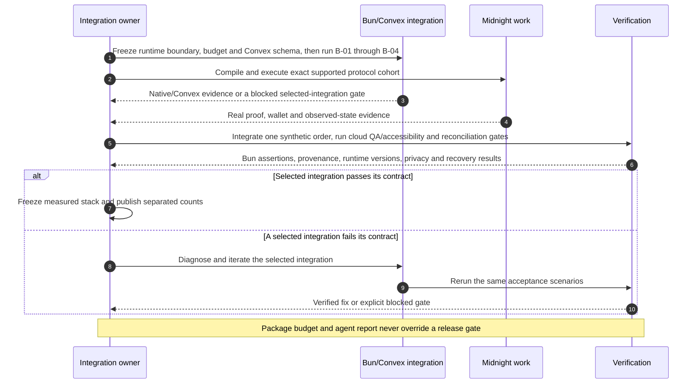

# Milo — accelerated roadmap, from Wave 1 to a real product

> **Planning baseline · revised 7 September 2026 · all delivery and adoption targets are prospective.**
> Build the complete, narrow order experience early. Use later waves to prove reliability, customer value, and distribution—not to postpone the first working product.

This roadmap implements the [blueprint](01-blueprint.md). The [building guide](03-building-guide.md) governs scope changes, agent execution, evidence, and commercial judgment; the [UI design specification](04-ui-design.md) owns proposed page flows, wireframes and free-source provenance. Milo remains a private fixed-price creative-order workflow; it is not an AI-credit wallet, exchange, general marketplace, or new payment currency.

**Selected architecture:** Bun `1.4.2` runs local scripts, tests, builds, and the native HTML/React development server; it does **not** run inside Convex. The target is a React web frontend with Convex as the backend (default V8 runtime and opt-in supported Node actions justified by compatibility or measured workload), Stripe hosted Checkout/manual capture, experimental Privy authentication, and Browser Use Cloud API V4 through its selected SDK for cloud GUI QA. There is no separate Hono/API service, Bun worker, PostgreSQL/Drizzle database, S3 driver, Vite/plugin, Playwright/Puppeteer/CDP client, Better Auth, or login-mail service in the product/QA design. The optional post-MVP media renderer is a separate, explicitly counted tooling cohort, not a second app backend. See the [package budget](01-blueprint.md#65-the-package-budget-eight-product-plus-two-qa), [native recipes](01-blueprint.md#66-native-integration-recipes), and [experimental policy](01-blueprint.md#67-experimental-integration-policy-and-deferred-options).

**Free-tier prototype decision:** Cloudflare Pages Free + Convex Free + eligible Privy Developer Free + Stripe sandbox + Midnight local/testnet, contingent on [Blueprint §6.10](01-blueprint.md#610-free-tier-deployment-and-spending-boundary). No paid plan or automatic overage is authorized. Live reviewer inference, cloud QA capacity, proving/DUST and optional archive fees need their own allowance evidence; a free frontend does not pay for them. The new [review-assistance design](01-blueprint.md#38-review-assistance-and-agent-operated-prototypes) is optional and unimplemented, not another MVP dependency or an increase from **0/6 and 0/14**.

**Architecture extension:** Lumera Cascade is a gated public-evidence archive, not a Convex replacement or a customer private-state store. An optional operator-run Node publisher adds explicitly counted SDK/signing dependencies without adding a buyer wallet or an always-on backend. Keep [actor-local private state, public ledger state and protected application files](01-blueprint.md#24-how-private-and-public-state-work-together) distinct. B-07 proves the boundary and ordinary synthetic evidence-bundle prerequisite; B-08 alone demonstrates the optional Cascade upload/retrieval integration. The original contract now has [full compiler and generated-runtime evidence](PROTOCOL_VERIFICATION.md); real local execution, admission/maintenance and M-01–M-03/R1 completion remain open. This is not organizer acceptance or a submitted entry.

**Next improvement slice:** one Milo account, one continuous order journey, one supported wallet profile. Privy remains the only app login; Midnight connection/action consent is a contextual step, not another account. Prove the exact connector/private-state lifecycle (B-09), then test operator-funded DUST sponsorship (B-10) before optional archive/3D work. B-11 measures whether intended users can understand and complete the result. All are requirements, not implemented features or improved conversion measurements.

## Contents

The [Midnight core audit and next-code plan](08-midnight-core-audit.md#5-next-code-dependencies-and-services) supplements the existing gates with evidence-backed integration ROI and a [red/yellow hackathon review](08-midnight-core-audit.md#4-red-and-yellow-hackathon-audit). Prioritize compiling bilateral order logic and falsifiable integration evidence, not additional partner count. The organizer conflicts remain unresolved.

1. [What “Wave 3 ready by Wave 1” means](#1-what-wave-3-ready-by-wave-1-means)
2. [Dates and the unresolved official-rules conflict](#2-dates-and-the-unresolved-official-rules-conflict)
3. [Readiness ladder and critical path](#3-readiness-ladder-and-critical-path)
4. [Dependency-gated execution manifest](#4-dependency-gated-execution-manifest)
5. [Release gates and judging evidence](#5-release-gates-and-judging-evidence)
6. [Wave 2 and Wave 3: expansion by evidence](#6-wave-2-and-wave-3-expansion-by-evidence)
7. [Commercial validation and ecosystem growth](#7-commercial-validation-and-ecosystem-growth)
8. [Risk, scope, and release management](#8-risk-scope-and-release-management)

## 1. What “Wave 3 ready by Wave 1” means

The ambition is **Wave-3-shaped engineering and product completeness within one bounded vertical slice**: a real Compact order, separate buyer/merchant actions, a usable interface, payment-adapter boundaries, recovery, adverse-case tests, and reproducible evidence.

It does **not** mean claiming a completed audit, production permission, legal clearance, consumer-ready proving, paying customers, or product-market fit by an arbitrary date. Those require external evidence and cannot be generated by adding agents or writing more code.

### End-of-Wave-1 target

An evaluator can open Milo, understand the service, inspect a synthetic offer, connect the supported wallet, reserve agreed confidential terms, accept as the merchant, submit a delivery, approve or dispute it, observe the correct chain state, and see the separate test-payment result. They can also trigger a failure and recover without the author editing a database behind the scenes.

The demo includes:

- One service, one merchant, one buyer, one pre-agreed dispute operator.
- Real Compact compilation, real proof generation, and a real local-network execution.
- A verified Preview path if the selected wallet/prover environment supports it; otherwise the release remains explicitly local/developer preview.
- Stripe test-mode authorization/capture/void when credentials and provider setup are available; a clearly labeled deterministic simulator for repeatable QA regardless.
- A complete synthetic happy path, dispute path, timeout path, interrupted-transaction recovery, and encrypted application-state restoration.
- A CSS-first, licensed template adaptation and a coherent, accessible operational UI. An optional ThreeUI/WebGL marketing scene may be explored only after core gates, has a static fallback, and is outside the core package budget and critical path.
- Public/private data inspection, falsifiable claims, documentation, and safe demo media.
- If B-08 passes after the core flow: retrieve a synthetic public verification bundle from Cascade and verify it against the admitted Midnight contract without trusting a Convex status row. Archive failure must not block approval, recovery or payment reconciliation.

**A simulated payment cannot satisfy the real test-adapter gate. A local network cannot satisfy the Preview gate. A nice screenshot cannot satisfy a workflow gate.** Report those distinctions even if the submission is still valuable.

### Staffing assumption

The stretch schedule assumes two or three experienced builders working in parallel: protocol/integration; product/API/payments; and UX/QA, with one person accountable for architecture and integration. Agents can accelerate bounded implementation and research but do not count as independent security reviewers or replace merchant/customer participation.

For a solo builder, preserve the protocol, truthful UX, recovery, and testing. Reduce visual ambition and defer optional sponsorship before reducing correctness. If the required gates cannot pass, submit the smaller verified state rather than label an incomplete system “Wave 3 ready.”

## 2. Dates and the unresolved official-rules conflict

There is a material discrepancy as of this research date:

| Source | Wave 1 build | Wave 2 build | Wave 3 build | Interpretation |
| --- | --- | --- | --- | --- |
| [Live AKINDO page][r1], marked updated schedule | Aug 27–Sep 16, 2026 | Sep 27–Oct 17, 2026 | Oct 27–Nov 16, 2026 | Operational planning reference, not resolution of legal conflict |
| [Official Rules PDF linked by AKINDO][r2] | Aug 13–Sep 2, 2026 | Sep 13–Oct 3, 2026 | Oct 13–Nov 2, 2026 | Page says the Official Rules prevail where inconsistent |

The live page lists judging through September 27, October 27, and November 27 respectively. The [public platform API][r14], read September 6, supplies the active-wave timestamps below. These resolve the platform's time representation, **not its authority over the conflicting PDF**.

| Active-wave field | Observed UTC timestamp | JST conversion |
| --- | --- | --- |
| `startedAt` | `2026-08-26T15:00:00.000Z` | August 27, 00:00 |
| `submissionDeadline` | `2026-09-16T15:00:00.000Z` | September 17, 00:00 |
| `judgementDeadline` | `2026-09-26T15:00:00.000Z` | September 27, 00:00 |

Do not interpret the page's “September 16” as midnight at the beginning of that day. The API also retains `firstWaveStartedAt` as August 13, 13:00 UTC; use neither that legacy field nor a countdown to silently resolve the rules conflict.

**Authorization gate:** obtain written organizer confirmation of the applicable schedule, timezone, registration requirements, and whether the updated schedule supersedes the linked PDF. Do not represent Wave-1 eligibility as certain until the conflict is resolved. Continue safe development while seeking confirmation; do not delay engineering to wait for a reply.

The September 6 overview fetch still presents these conflicting sources. The PDF additionally says “Dates: August 5–November 5,” defines a Contest Period of August 13, 13:00 GMT–November 13, 12:59 GMT, and requires net-new work from August 5 in its originality clauses. Its schedule is therefore internally inconsistent as well. The live page permits existing codebases with meaningful Midnight functionality newly developed/materially extended during the wave; both sources also contain existing-license language. Preserve provenance and obtain written clarification of permitted project/template reuse; license permission alone is not competition eligibility. The linked detailed judging rubric also conflicts with the page/PDF weights; see [§5.2](#52-map-effort-to-the-actual-rubric).

The September 7 refreshed overview lists an August 27 start and September 16 Wave-1 end; these are program dates, not the page's publication/update timestamp. The official PDF snapshot retrieved through Firecrawl is cached September 6 and retains older dates; the detailed rubric also conflicts with the page/PDF weights. The overview explicitly gives the Official Rules precedence. Use the authorization gate and relative sequence below; no elapsed calendar date, countdown, or planned sprint closes work or guarantees a deadline.

## 3. Readiness ladder and critical path

### 3.1 Name the level actually achieved

| Level | Meaning | Evidence required |
| --- | --- | --- |
| R0 — specified | Architecture and UX are defined | These documents, unresolved decisions, evidence sources |
| R1 — locally working | The bounded protocol runs end to end | Compiler artifacts, circuit/runtime tests, real local proof/submission |
| R2 — usable developer preview | Independent actors can use and recover the workflow | Browser evidence, public/private inspection, recovery test, exact wallet/prover setup |
| R3 — controlled-pilot candidate | External test integration and operational safeguards work | Preview execution, payment test-mode run, failure/reconciliation suite, B-09/B-11 supported-wallet and task evidence, privacy/access review, support runbook |
| R4 — approved limited live pilot | Real counterparties and payments may be admitted | Live-provider readiness, legal/merchant arrangements, safe proving, deployment approval, consent, operator capacity |
| R5 — repeatable product | Repeated customer value and viable delivery economics | Cohort retention, repeat orders, margins/support costs, independent integrations |

Aim for R3 by Wave 1. R4 is conditional and must not be claimed because R3 passed. R5 is a business result, not a feature checklist.

“No token purchase” requires B-10 on the named consumer profile; “no wallet installation” also requires a proven safe no-install signer/prover/recovery path, which is unresolved. Neither follows from passing Privy login. A funded-wallet/local-prover demonstration can still be valuable R2 evidence, but must not be marketed as frictionless consumer onboarding.

### 3.2 Dependency chain

```text
Pinned toolchain + runnable local infrastructure
  → compiling order contract + independently authorized transitions
  → real proof / wallet / submission / observation
  → safe browser integration and recoverable private state
  → delivery integrity + chain/payment reconciliation
  → adverse-case, privacy, accessibility, and operational verification
  → reproducible submission / controlled-pilot candidate
```

Marketing design, customer interviews, and license review run in parallel. They must not consume the time needed to prove the protocol integration. No roadmap item is “done” because a scaffold or mock screen exists.

### 3.3 First 24-hour feasibility decisions

| Question | Experiment | Decision if it fails |
| --- | --- | --- |
| Do Bun and Convex have a real, narrow runtime boundary? | Run local Bun scripts/build/tests and a deployed Convex query/mutation/action against the generated client | Fix the boundary or block the integration gate; Bun is not moved into Convex and no server/API fallback is introduced |
| Does the ten-package product-plus-QA budget resolve as specified? | Freeze direct manifests and lockfile; count the eight product and two QA packages separately from devtools and Midnight cohorts | Remove unneeded scope only when behavior remains proved; never claim a whole monorepo is under ten or conceal extra cohorts |
| Does experimental Privy-to-Convex auth pair safely? | Validate the client bridge refresh behavior and a native Convex custom-JWT ES256 token (`iss=privy.io`, `aud` = application ID) against Privy's JWKS | Block authenticated rollout and iterate the selected integration; do not silently substitute another auth system |
| Can Browser Use Cloud prove the synthetic UI workflow without browser-driver infrastructure? | Run a recorded Cloud API V4 scenario through the selected SDK from a versioned agent JSON/script and independently assert the resulting Convex/chain/provider state with Bun | Block the cloud-QA capability gate and improve the scenario/integration; never substitute a browser-driver fallback or self-reported pass |
| Does the current SDK/compiler/browser cohort work? | Compile a minimal contract; typecheck generated integration; perform one real call | Fix or explicitly pin a documented compatible exception; never fake transaction success |
| Can buyer and merchant act without sharing secrets? | Independent vaults/profiles, different credentials, role-negative test | Redesign before adding commerce features |
| Can the intended browser prove safely? | Capability-check selected wallet and inspect the actual proving path | Developer-preview label and local trusted path; consumer rollout remains blocked |
| Does every required Midnight coverage row have real proof? | Map every row in the [Midnight integration coverage contract](01-blueprint.md#37-midnight-integration-coverage-contract) to its preserved requirement ID, exact test ID(s), execution environment, and evidence record | Block the affected release claim until the real SDK/contract/provider execution and required proof exist; an RPC response, fixture, or agent narrative is not execution evidence |
| Is per-order deployment affordable and tolerable? | Measure artifact sizes, deployment/proof time, confirmation, DUST behavior | ADR for smaller circuits/shared registry; no unmeasured scale promise |
| Is payment test setup available? | Create an isolated test authorization and inspect its expiry | Keep simulator for QA; mark payment integration gate unmet |
| Can the selected free template be legally published? | Inspect Community files, assets, license, source revision | Use licensed subset/original assets; exclude Pro/restricted source |

### 3.4 Native/Convex integration acceptance gates

These are subdivisions of the implementation work packages, not a second backlog. The docs-only repository has no passing implementation to migrate: each gate therefore establishes a first proof, not a claimed regression result. The core architecture is selected for this build. A failed integration blocks its applicable claim and must be diagnosed and iterated; it is not permission to quietly restore an older stack. B-08 is conditional on enabling the archive; B-10 is conditional on sponsorship. Neither can weaken core gates; B-10 precedes B-08 when choosing optional work because it addresses the buyer's setup cost.

The [Midnight integration coverage contract](01-blueprint.md#37-midnight-integration-coverage-contract) is mandatory for every required flow. Preserve its requirement/coverage-row ID in the implementation, list one or more stable test IDs, and attach evidence identifying the SDK/contract/provider, execution environment, trust boundary, transaction or rejection result, and artifact/version fingerprint. A green mocked unit test, synthetic RPC result, Convex projection, or cloud-agent report cannot close a row that requires real Midnight execution. Do not claim “100% working,” complete coverage, or an end-to-end chain flow until every required row has its actual proof.

| Gate | Smallest useful experiment | Pass evidence / block rule |
| --- | --- | --- |
| B-01 — Bun, React, and browser WASM | Run Bun `1.4.2` native HTML/React `dev`, `test`, and production `build`; strict TypeScript/Biome checks; load and execute a minimal compiled Midnight browser-WASM canary | Record runtime boundaries, frozen lockfile, actual WASM results/rejection assertions, production asset/deep-link behavior, unsupported-host handling and shutdown. This proves tooling, not a wallet transaction. Real provider/contract execution remains mandatory in M-04/MID coverage; the supported account/network lifecycle belongs to B-09. No mocked RPC response closes either integration requirement |
| B-02 — Convex data and idempotency | Define schema, query, mutation, generated React `useQuery` cache, scheduled action/cron, and a payment/chain inbox-outbox flow | A read-index plus insert in the **same atomic mutation** proves uniqueness; duplicate/out-of-order events and crash recovery produce one effect. Do not claim `.unique()` provides the constraint; nontransactional external actions reconcile from durable Convex state |
| B-03 — Privy and authorization | Exercise Privy email OTP login and the experimental client auth bridge refresh with Convex's native custom-JWT validation | Verify ES256 issuer `privy.io`, audience application ID, JWKS, membership, disabled-account denial, refresh failure, and token redaction. Consumer login is neither a Midnight wallet secret nor connector. Ordinary JWT validation adds no Privy Node dependency; failure blocks rollout rather than falling back to another login system |
| B-04 — Convex private files | Upload a constrained file/manifest to Convex storage and fetch it repeatedly through an authenticated Convex HTTP action | Deny cross-order reads, overwrite, malformed type/size/checksum, and disabled membership. Never use `storage.getUrl` for private files: its bearer URL is public and has no expiry. Contract secrets never enter Convex, Privy, or Browser Use |
| B-05 — cloud QA and accessibility | Execute `browser-use-sdk@3.11.3` Cloud API V4 agent runs against strict synthetic UI-simulation profiles; syntax-validate versioned agent JSON/task scripts and validate structured agent output; use standalone `axe-core` `4.13.0` only through a reviewed native DOM probe/public test build when capability is verified | Record script/model/run provenance and use Bun assertions to inspect actual Convex, chain, and provider results. Browser Use is the primary cloud GUI runner, not an optional explorer. If the deterministic probe or Browser Use native script cannot be verified, mark UI-automation proof blocked and complete manual accessibility review—never record a fake automated pass |
| B-06 — Stripe/Convex reconciliation | Perform test-mode hosted Checkout/manual authorization, interrupted redirect recovery, observed chain approval/cancellation, capture/void, webhook intake, and restart reconciliation through Convex functions/actions | Confirm immutable single-attempt binding; below/equal/above deadline-plus-margin checks; no same-order replacement authorization; all cancellation sources, capture/void races, abandoned Checkout expiry and timeout-after-effect recovery. Include externally initiated refund/partial/failed incident observations and late/duplicate events. App hold gates are not circuit-enforced; return URLs never prove a hold. External effects reconcile against their real authorities |
| B-07 — private/public state and independent verification | Follow reserve → submit → approve through separate actor stores, canonical commitments, public ledger and Convex projection; export a public synthetic evidence bundle | Preserve MID-P1–P6 and MID-T01–T14 evidence; add `midnight.boundary.private-public` and `midnight.receipt.independent`. Reject modified terms/delivery, forged projection, wrong network/artifacts and leaked openings. With Convex offline, verify public evidence against the named indexer with freshness/trust limitations; do not claim private-file availability or locally verified consensus |
| B-08 — optional Cascade archive | Pin the published SDK/signing cohort and execute an operator-owned Node upload/register/retrieve round trip on a named Lumera network with explicitly approved synthetic public bytes | `cascade.archive.roundtrip`, `.privacy`, `.reconcile`, `.outage`: allowlist fields before irreversible upload; preserve action/task/transaction IDs; reconcile ambiguous registration; retrieve and verify bytes against digest and canonical Midnight state; test failed task, wrong bytes, budget limit and gateway outage. No real secrets/customer files, deletion guarantee, automatic Compact access enforcement or full-backend-replacement claim; disable the add-on if unmet |
| B-09 — unified account and wallet readiness | Compose B-03 with the exact connector `4.0.1` and Midnight.js `4.1.1` candidate interfaces; run two actors, two orders and two tabs on one named wallet/browser/network profile | `midnight.wallet.discovery`, `.context`, `.submission`, `ux.onboarding.continuity`: no wallet required for authorized reads, no second login, UUID discovery/version/permission handling, no invented account events, one SDK network per realm, stale async result rejection. Persist ledger identifiers before send; reconcile finalized `SucceedEntirely` plus expected transition before private-state update. Prove supported predeployment backup staging and isolated restore without overwriting active state; retain clean-profile engineering recovery. Readiness/recovery precede a card hold; failure blocks the corresponding consumer claim |
| B-10 — optional operator-funded DUST | After the funded baseline and B-09 pass, execute the same order actions with an eligible sponsor and a zero-DUST buyer | `midnight.sponsor.intent`, `.payload`, `.expiry`, `.budget`, `.resume`: explicit Milo consent even without a wallet prompt, valid expected network/contract/effects, transaction expiry, rate/cost ceilings, altered-response denial, depletion/rejection/timeout reconciliation. Verify sponsor payload privacy and stable identifier matching after fees/merging; no witness/`callTxData` leakage, duplicate spend or hidden user-paid fallback. Record full provider/service/license/cost footprint; the separate TTL parameter cannot be assumed enforced |
| B-11 — task-first usability and premium finish | Exercise [the canonical screen/UX contract](01-blueprint.md#85-usability-acceptance-contract) with synthetic orders, first-time and returning actors, supported mobile read-only/handoff and adverse states | `ux.order.comprehension`, `.recovery`, `.accessibility`, `.performance`: one contextual next step, no second product login, correct hold/capture/approval/freshness/deadline copy, independent state assertions, keyboard/screen-reader/reflow/reduced-motion and real-wallet human review. Five buyer/two merchant qualitative attempts target four buyers/both merchants completing without coaching; any observed financial/privacy misunderstanding is corrected and retested. Report named-device performance and safe matching screenshots/recording; no award, SLA or conversion claim from the design |

The package budget is **ten only for core declared product plus QA packages**; [blueprint §6.5](01-blueprint.md#65-the-package-budget-eight-product-plus-two-qa) owns the exact package/version list. Devtools, Midnight, optional sponsor and Cascade SDK/signers **must be counted separately and included in full enabled-feature totals**. Record direct counts, unique lockfile counts, browser bytes, service/configuration count, integration code, cold/warm timings, flakes and cost independently. No measured 40% reduction or regression parity exists. `convex-test`, if justified, is an extra disclosed QA package, not a concealed tenth-plus dependency.



### 3.5 What remains before a truthful readiness claim

The design is specified with open mechanism gates; **no implementation, integration, test, or browser proof has been completed by this documentation package**. Prioritize and record these gates in order: (1) resolve the official deadline/timezone conflict; (2) freeze the package/cohort budget and Bun/Node/Convex runtime boundaries; (3) prove Privy-to-Convex auth pairing and membership/disabled-account controls; (4) prove browser WASM plus Compact protocol safety, role separation, and deadline boundaries on the real local chain; (5) prove B-09 wallet/session/recovery integration and Convex private-file/atomic inbox-outbox recovery; (6) prove Browser Use Cloud's synthetic-profile, SDK/API, and accessibility capability without wallet signing; (7) prove Stripe test reconciliation; then (8) run B-11 task comprehension and capture safe same-build local and human wallet evidence. B-10 is the first optional consumer-friction experiment; B-08 remains later. No “SOTA,” pilot, browser end-to-end chain, production, or under-ten-whole-repository claim is available until its stated evidence exists.

Do not spend the critical path “using more Midnight.” Spend it proving the [selected Midnight patterns](01-blueprint.md#69-purposeful-midnight-patterns): disclosure manifest and negative compiler canary, constrained roles/terms/delivery, stable operation recovery and explicit fee/approval separation. Compare any OpenZeppelin module against the minimal fixed-role circuit for equivalent authority, license/cohort and measured circuit/proof cost before adding it. A tutorial, partner announcement or larger package inventory cannot close those gates.

## 4. Dependency-gated execution manifest

This is the canonical execution order and acceptance contract, not a calendar sprint. [PROGRESS_MANIFEST.md](PROGRESS_MANIFEST.md) records evidence-backed implementation status. **R0 includes a synthetic UI prototype; every real integration milestone remains open.** Documentation completion does not equal runtime completion: required MID evidence remains **0/6 provider slots and 0/14 operations**. Owners are accountable roles and can be one person. Preserve M-01–M-14, B-01–B-11, MID-P1–P6 and MID-T01–T14 IDs and acceptance contracts. The canonical readiness definitions in §3.1 remain authoritative; the table below assigns existing work, not a second set of release levels.

| Readiness milestone | Existing work and accountable owner | Status | Entry → exit evidence | Stop rule |
| --- | --- | --- | --- | --- |
| **R0 idea — specified** | Product/architecture: canonical scope, source register and M-01 entry decisions; organizer owner: rules clarification | **SPECIFIED; decisions open** | These documents, explicit claims/non-goals and unresolved evidence | No eligibility, implemented integration, or customer-value claim. |
| **R1 prototype — locally working** | Contract/platform: M-01–M-03; local circuit/runtime and provider portions of MID coverage; B-01/B-02 feasibility in parallel | **NOT STARTED** | Frozen cohort, compiler/artifact fingerprint, real local end-to-end protocol/proof/submission and rejection evidence | Missing real proof blocks R1; local evidence does not close browser/payment rows. |
| **R2 usable developer preview — recoverable slice** | Integration/backend/UX: M-04–M-06, M-08/M-09 developer-flow portions; B-03/B-04/B-07/B-09 | **NOT STARTED** | Independent actors, browser/provider evidence, protected-file verification, public/private inspection and recovery; payment simulator labeled | Cut optional work if the named wallet/network or recovery proof is absent; no real payment-adapter claim from a simulator. |
| **R3 narrow MVP — controlled-pilot candidate** | Payment/QA/operator: complete M-07–M-11 and core predecessors; B-05/B-06/B-09/B-11 and all required MID evidence | **NOT STARTED** | Real Preview and test-mode reconciliation, supported-wallet/recovery evidence, adverse cases, accessibility/usability, support runbook and immutable release record | Any missing required privacy, payment, recovery or operational evidence blocks R3. |
| **R4 live pilot — approved limited admission** | Business/legal/operator: live-provider and merchant approvals | **NOT STARTED** | R3 evidence plus consent, legal/merchant arrangements, safe proving, deployment approval and operating capacity | No live counterparty/payment admission without each external authorization. |
| **R5 repeatable product** | Product/business/operator: repeated customer and cost observations | **NOT STARTED** | Retention/repeat orders and sustainable margins/support costs under §3.1 | More features, waves or agent-generated testimonials cannot close business evidence. |

**Wave sequence is evidence-led, not date-led.** Wave 1 targets the one `image-pack-v1` narrow slice through R3, but submits only the verified R-level. Wave 2 targets reliability and observed customer learning; it does not broaden the protocol merely because a wave began. Wave 3 expands contexts or distribution only where evidence supports it. M-12 packages each wave's exact submitted version and changes since the previous wave; unfinished gates remain open across waves. M-13 and M-14 are optional archive/film work, never substitutes for M-12's technical demo. Each completed gate records preserved requirement ID, stable test IDs, expected/actual result, command, environment/network, direct/resolved cohorts, artifact/contract fingerprints, safe media, limitations, owner and immutable release reference.

The September 7 matrix recheck reconfirms the blueprint's existing network-specific rows; it does not resolve the separate August report's `2.1.0-beta.1` announcement versus matrix `1.0.2` for Preprod/Mainnet. Keep [Blueprint §6.2](01-blueprint.md#62-midnight-protocol-cohort) as the only protocol version table, preserve that explicit conflict, and record the actual target endpoint in each canary.

**Optional next phase:** B-10 sponsorship is the first optional experiment only after the funded baseline and B-09 have passed. It precedes B-08 archive work when optional capacity is authorized, but is never a core gate; archive/3D remain disabled until their own evidence passes.

### 4.1 Minimal backlog, with acceptance contracts

#### Ordered build flow: UI, environments and testing

**Current state: synthetic UI implementation authorized and started.** Local prototype commands now exist; the [progress manifest](PROGRESS_MANIFEST.md) distinguishes their verified results from unprovisioned protocol/provider environments. UI prototyping starts alongside environment/contract work, not after every backend gate. A clickable synthetic prototype remains R0; only executed protocol evidence earns R1, and real independent-actor browser/recovery evidence earns R2. Keep the fixed `image-pack-v1` scope throughout.

| Order / readiness target | Build and accountable role | UI developed at this point | Environment / SDK / API needed | Tests and completion evidence before advancing |
| --- | --- | --- | --- | --- |
| **0 — authorize and freeze R0** | Product/platform: confirm scope, account ownership, free allowances and unresolved organizer rules; select the named wallet/prover/network profile | Existing wireframes and task wording; no working-product claim | No live keys or funded production account; inventory access to development tools and provider dashboards | Record required vs optional services, secret ownership, stop rules and exact package/image candidates. Missing organizer clarification blocks eligibility claims, not safe authorized local work |
| **1A — early UI prototype, parallel with 1B** | UI/UX: M-08 draft shell and M-10 isolated synthetic sample; do not close either work package yet | Quote, preparation, order timeline, three-file review, approve/dispute, receipt, unknown/failure/recovery states; responsive CSS, keyboard/focus and reduced motion | Bun, selected React/router/Radix/Zod and native CSS; browser with synthetic fixtures. No Convex, Privy, Stripe, real wallet or public network is needed for this isolated prototype | Run UI locally; capture safe screens; observe task comprehension before explaining it; test forms, validation, navigation, focus and error states. Label every mocked state. These tests do not prove auth, chain, payment or recovery |
| **1B — reproducible development environment** | Platform: M-01, B-01/B-02 feasibility | Same prototype can continue independently; no elaborate marketing polish | Selected Bun plus separate supported Node tooling; Compact devtools/compiler; Docker Engine + Compose v2 or the verified [native lane](docs/native-network.md); exact local-dev service artifact pins; isolated testkit and synthetic funded actors | Frozen lockfile, exported API/type checks, generated-code build, actual service health, artifact digests, reset/funding and fresh-setup evidence. A local-dev smoke process that exits is not a persistent browser-test network |
| **2 — real protocol prototype, R1** | Contract/integration: M-02/M-03 and applicable MID circuit/provider portions | Replace simulated protocol status only as each real result is observed; retain unmistakable simulator mode elsewhere | Local node/indexer/proof server; generated Compact artifacts; Midnight.js core/protocol/providers; independent actor-local private stores | Original contract compiles; legal and forbidden transitions, disclosure, terms/digest/role binding, admission/maintenance and local prove→submit→observe pass. No self-reported successful API return substitutes for observed execution |
| **3 — connected developer preview, R2** | Backend/integration/UX: M-04–M-06 and developer-flow portions of M-08/M-09; B-03/B-04/B-07/B-09 | Real sign-in, invite/membership, contextual wallet consent, merchant acceptance, authenticated file upload/review, actor recovery and pending outcomes | Isolated Convex development deployment, Privy development app, actual compatible browser wallet, matching node/indexer/prover/artifact endpoints; synthetic buyer/merchant/operator profiles | JWT expiry/audience/account-change tests; two independent actors; locally checked immutable bytes; lost-response and clean-profile recovery. No server or cloud agent receives reusable actor capabilities. Keep simulated payments labeled |
| **4 — real test-payment slice** | Payment/backend: M-07, B-06; isolated adapter work may begin earlier, full closure depends on step 3 | Hosted Checkout return/cancel states, observed hold/expiry, approval with capture pending/failed, cancellation and financial exceptions | Stripe sandbox/test secret in Convex only, HTTPS Convex webhook, matching signing secret, manual-capture configuration and allowed return routes | Real sandbox authorization/capture/void, raw-body signature verification, duplicate/out-of-order events, hold-window boundaries, capture/void race and timeout-after-effect reconciliation; no live keys or automatic delayed capture |
| **5 — hosted QA and reliable MVP, R3** | QA/platform/UX/operator: complete B-05/B-07/B-09/B-11, M-09/M-11 and required predecessors | Finish task usability, mobile layout, accessibility, clear blockers and support/recovery guidance; refine visual polish only after the integrated flow works | Built static frontend on an eligible host, isolated Convex QA deployment, separate test credentials/fixtures, supported Midnight Preview wallet/prover path; Browser Use V4 account/API key with verified free task capacity, `axe-core` QA panel and separate authoritative assertions | Real Preview execution, payment sandbox evidence, negative controls, privacy inspection, deterministic adapter tests, hosted-agent task evidence, restore/reconciliation runbook. Cloud QA cannot close wallet-signing tests through a simulated wallet or by receiving real secrets |
| **6 — Wave-1 submission** | Product/QA: M-12 | Tested readiness-appropriate landing/CTA and technical walkthrough, not the optional launch film | Immutable source/lockfile/artifact release, safe synthetic hosted demo where proven; no additional runtime service | Submit compiler evidence, exact achieved R-level, test results, safe media, notices and limitations. R3 is the target; an earlier verified level must be labeled honestly; confirm governing deadline/eligibility |
| **7 — Wave-2 reliability and optional sponsorship** | Integration/product/operator: repeat the same slice; B-10 only after funded-baseline/B-09 evidence and approved capacity | Improve measured confusion/recovery problems; sponsor consent/depletion states only if the experiment is enabled | Existing environments first; optional exact sponsor adapter with separate payer, credentials/capacity and explicit budget | Compare completed tasks, recovery/support burden and cost; prove tamper/replay/expiry/depletion/ambiguity behavior. No silent user-paid fallback. R4 requires separate live-provider/legal/merchant approval |
| **8 — Wave-3 evidence-led expansion** | Product/business: prove reuse and customer economics before generalization | Reuse existing components for validated contexts; optional M-14 film only after its R3/rights gates | No automatic new environment. EffectStream, mobile, archive or inference needs its own justified, isolated experiment | Repeat-order/retention/support/cost observations; same protocol reuse such as UC-13, not a second product. Keep M-12 release evidence per wave; R5 is a business outcome, not guaranteed by Wave 3 |

#### Environment and configuration checklist

This table covers the selected core and explicitly gated extensions. It is not a claim that credentials, subscriptions, ports or sufficient hardware are available here. Configuration labels are responsibilities, not invented SDK environment-variable names. Keep public browser configuration allowlisted; secrets belong in per-environment secret stores, never a frontend bundle, fixture, screenshot or public log.

| Environment / first needed | Prerequisites and configuration | Isolation / exposure rule | Readiness check or blocker |
| --- | --- | --- | --- |
| **Local UI — step 1A** | Exact Bun and selected web/dev packages from [Blueprint §6](01-blueprint.md#6-verified-dependency-decisions); ordinary browser; synthetic fixture set; managed dev-server script once implemented | Public sample only; reserve a consistent dev origin; no backend or private-state credential needed | HMR, form/typecheck/unit checks, route refresh and generated asset serving. Bun transpilation alone is not typechecking [env-bun] |
| **Local Midnight — steps 1B–3** | Official local-dev requires Node `>=22`, Docker and Compose v2; use the selected separate Node pin. The [native lane](docs/native-network.md) is a tested local execution alternative, not a different cohort. Official default ports: node `9944`, indexer `8088`, proof server `6300`; native tests allocate isolated ports. Compact/compiler artifacts remain separate build requirements | Docker-capable host for the Docker route, or a verified native host; keep node/prover local or explicitly trusted and access-controlled. Native prover binding requires explicit access review. Synthetic actor stores and chain state must reset together; no real wallets. Do not expose development funding identities or raw logs | Verify actual selected revisions/artifact digests, architecture compatibility, health, funding/DUST spendability and measured proof memory/disk/time. No universal RAM/CPU minimum is established. Native block/indexer/queue checks do not close the remaining M-01/protocol gates [r4] |
| **Persistent local network versus CI smoke — step 1B** | Local-dev's documented `npm start` is interactive; `--fund-config` is the noninteractive funding/smoke path and tears down on exit | Do not use an interactive menu in CI or mistake completed smoke output for a running devnet. Provide separate bounded smoke/reset and persistent-session lifecycle scripts using the exact upstream configuration | Keep node/indexer/prover alive across browser tests; verify cleanup does not touch another session. A network restart invalidates old contract addresses, observations and fixture bindings [r4] |
| **Convex development / isolated QA — step 3** | Authorized Convex project/deployment, deployment URL, generated functions/types, per-deployment environment settings, membership fixtures and private storage. Separate deploy credentials for automation | Backend runs in Convex, not Bun. Use supported Node actions only where required; no self-hosted database/API replacement. Dev and QA must not share payment mappings or customer data | Authenticated queries/actions/files, durable reconciliation, fixture reset and restore evidence. Dashboard/CLI environment values are per deployment; declaring a variable does not supply its value [env-convex] |
| **Privy app auth — step 3** | Development app ID; optional client ID only if configured; exact allowed development/QA origins, chosen email-OTP method and synthetic identities; Convex ES256 issuer/audience/JWKS configuration | App ID is public configuration, app secrets are not. Native Convex JWT validation does not require adding a Privy server SDK. App login does not provide Midnight authority | Real token refresh/expiry, wrong audience, revoked membership and identity switching. New preview hostnames must satisfy allowed-domain policy; do not broaden production allowlists to unblock QA [env-privy][env-privy-security] |
| **Wallet, proving and artifacts — steps 2–5** | Exact supported wallet version, named network, connector capabilities, prover endpoint/trust recipient, matching public proof artifacts and actor-local encrypted state/export mechanism | Separate buyer/merchant contexts; no wallet seeds, capability openings or unlocked signing sessions in Convex or Browser Use. A remote prover is a private-input recipient, not neutral transport | Actual prove/sign/submit/observe and clean-profile recovery on that cohort. “Midnight Preview” means a blockchain network; “web preview” means a frontend deployment. Neither proves the other is ready |
| **Stripe sandbox — step 4** | Test/sandbox account, test secret key, HTTPS webhook and its own signing secret, event selection, hosted Checkout/manual capture and allowlisted return routes | Keys and signing verification stay in backend; preserve raw request bytes. Local Stripe CLI forwarding is optional, not needed merely because frontend development is local: hosted Convex can receive HTTPS events directly | Verify correct account/mode/amount/currency and capture window. CLI forwarding has its own signing secret; do not confuse it with the registered webhook secret. Test data only [env-stripe] |
| **Static hosted frontend — step 5** | Eligible Cloudflare Pages account/project, built static HTML/JS/CSS/assets, deploy access, public Convex URL/Privy app config and exact allowed origin; free subdomain suffices | Pages hosts built assets, not the Bun dev server or Convex runtime. Private delivery bytes remain authenticated Convex reads. No implicit Workers/R2 service | Prove static output, deep links, TLS, MIME/CORS/CSP and wallet/artifact loading. Keep the existing 25 MiB per-asset and whole-account allowance gates; fullstack Bun server output is not automatically a Pages static bundle [env-pages][env-bun] |
| **Cloud GUI QA — step 5** | Browser Use V4 API key in the Bun QA controller (`BROWSER_USE_API_KEY` in documented quickstart), public synthetic QA URL, verified recurring task allowance, actor-isolated runs, app-owned `axe-core` diagnostics and authoritative assertion runner | Cloud browser cannot use the developer machine's `localhost` as that machine. Do not tunnel a witness-bearing prover or unlocked wallet to make it reachable. API key and real secrets never enter the app or agent task | Check create/status/result/cancel lifecycle and budget cleanup; an agent's prose is not a passing assertion. If free capacity or safe reachability fails, B-05 stays blocked; manual UI research can continue with correct labels [env-browser-use] |
| **Limited live pilot — after R3, never automatic** | Distinct authorized live-provider credentials, merchant/legal arrangements, data retention/support policies, safe proving/funding, monitored reconciliation and operating reserve | No development defaults, cross-environment payment reuse or silent live promotion; minimal authorized access and tested rollback | R4 approval record and capacity for the entire admitted order lifecycle, not merely an accessible deployment |
| **Optional later experiments** | Sponsorship: approved payer/capacity and B-10. EffectStream: isolated Bun/derived database only if observation need is demonstrated. Cascade: isolated operator signing/archive cohort and B-08. Mobile/inference/film: their own compatibility, budget and rights gates | None is a prerequisite to begin UI prototyping, compile the core contract or claim the funded baseline. No blanket installation of partner SDKs | Each adds explicit direct/transitive packages, services and trust recipients to the budget; fail closed rather than hide an unsupported fallback |

**Environment-source receipt, 7 September 2026:** Firecrawl retrieved the local-dev README, Bun fullstack docs, Convex environment docs, Privy setup/security, Stripe webhooks, Pages static hosting and Browser Use V4 reference. Some provider bodies were September 6–7 cached snapshots. The local-dev README is a moving upstream reference, not an automatic change to the pinned commit or cohort. Its noninteractive teardown behavior must be rechecked at the selected implementation revision. An initial Convex hosting query returned no extracted answer; the concrete per-deployment configuration claims use the environment-variable page instead. No application environment, credential configuration, deployment, compiler, payment/chain/QA integration or browser flow was exercised by this research.

[env-bun]: https://bun.com/docs/bundler/fullstack
[env-convex]: https://docs.convex.dev/production/environment-variables
[env-privy]: https://docs.privy.io/basics/react/setup
[env-privy-security]: https://docs.privy.io/security/implementation-guide/security-checklist
[env-stripe]: https://docs.stripe.com/webhooks
[env-pages]: https://developers.cloudflare.com/pages/framework-guides/deploy-anything/
[env-browser-use]: https://docs.browser-use.com/cloud/api-v4-overview

#### Existing work-package acceptance contracts

| ID | Deliverable | Acceptance contract | Depends on |
| --- | --- | --- | --- |
| M-01 | Reproducible environment | Frozen Bun lockfile, explicit local Bun/browser/Convex/Node boundaries, fresh setup and real local-network health; selected integration gates documented; no secret in repo | None |
| M-02 | Terms/capability schema | Fixed test vectors; separate roles; salts; bounded values; explicit disclosure table | M-01 |
| M-03 | Order contract | Every specified transition compiles; forbidden transitions reject; bootstrap/maintenance policy tested through the supported local harness; circuit/runtime-owned coverage carries preserved IDs and evidence, not a claim that browser/provider/payment rows are closed | M-02 |
| M-04 | Midnight browser adapter | Correct network/contract/artifacts; one-time quote-to-address binding; rejected/stale/pending outcomes recoverable; Bun SDK/browser-WASM build and actual provider execution evidence | M-03, B-02/B-03 data and authorization gates |
| M-05 | Recovery | Encrypted export and clean-profile import restore own order access; no wallet seed collection | M-02, M-04 |
| M-06 | Private delivery | B-04 passes: Convex membership checks, authenticated HTTP read every time, constrained upload/manifest, overwrite and tampering rejection | M-02; early storage work may run independently, but B-03 must pass before B-04/M-06 closes |
| M-07 | Payment adapter | B-06 passes: hosted test authorization/capture/void and return recovery; atomic Convex inbox/outbox idempotency; expiry/cancellation policy; no live key acceptance in demo | M-02, M-04, M-05; isolated Stripe work may start earlier, but the complete path needs admitted/observed chain state and pre-hold recovery |
| M-08 | Buyer/merchant workspace | One usable flow per role; native CSS, React form actions with Zod validation, and retained Radix accessibility primitives; no Tailwind, React Hook Form, or bulk motion helper; environment and settlement truth visible | M-04–M-07 |
| M-09 | Failure and privacy suite | B-05/B-06; wrong role, replay, races, timeouts, outage, restore, webhook, and leak cases; runner changes preserve assertions | M-03–M-08 |
| M-10 | Landing and demo | Follow the [UI guide](04-ui-design.md#4-landing-page-and-marketable-story): interactive synthetic `/demo` modal/standalone route, tested history/focus and no privileged calls; licensed CSS-first composition with static/reduced-motion paths and readiness-appropriate CTAs. Optional ThreeUI/WebGL is separately measured; no Pro assets or hidden dependency | M-08 and source review for real product evidence; original wireframes/static landing and isolated sample may proceed earlier without a working-product claim |
| M-11 | Operational candidate | Reconciliation queue, health/expiry alerts, restore drill, incident owner | M-07–M-09 |
| M-12 | Submission | Exact SHA, compiler evidence, public code/notices, README, deck, video, limitations | All claimed gates |
| M-13 | Optional public archive | B-08 passes; operator-approved synthetic bundle retrievable from Cascade, digest/chain verified, full dependency/cost inventory, no impact on core order semantics | B-07, M-09; separate publication approval |
| M-14 | Optional post-MVP launch film | Follow the [video specification](07-video-design.md): truthful 52s master/15s teaser, release-specific CTA, single evidence/rights manifest, isolated free local renderer and full-output review | R3 evidence, M-08–M-11 and approved capture/rights; storyboard now, production later. Not a prerequisite for M-12 or a substitute for its technical walkthrough |

Scope labels: M-01–M-09 and M-12 are core to the proposed complete slice; B-07 belongs to M-04/M-09. M-10's heavy visual, optional sponsorship and M-13 are stretch. R3 additionally needs M-11 plus real Preview/payment-adapter evidence. A smaller submission may stop earlier, but the readiness label must change accordingly. Do not trade a real Compact flow for a partner-storage demo.

### 4.2 Gate execution rhythm

The [UX scenario matrix](05-ux-design.md#9-scenario-coverage-and-review) maps discovery, onboarding, role handoffs, failure/recovery and support to existing gates rather than creating another backlog. Before the controlled pilot, assign and prove the reminder/escalation and invitation/retention decisions; an in-app status page is not evidence of closed-browser notification delivery.

Use the [backend handoff](06-backend-design.md#10-gate-to-scenario-acceptance-map) for M-02/M-07/M-11 execution and operations evidence: canonical records, validation, file ownership, external observation, bounded jobs and safe restore/rollback. Its scenario mapping does not create another readiness ledger.

Start with the highest-risk unproven assumption, not the most visible screen. Assign bounded parallel tasks with explicit interfaces. Integrate before claiming the next gate. Update one short record: commit, environment, commands/results, media, unresolved risks, and next gate. Do not bury failures under a percentage-complete dashboard.

Human observation starts before visual polish is finished. Ask a tester to explain the amount, merchant, action consequence, what remains private, and how to recover. Record confusion before explaining the answer; otherwise the test measures the author's presentation, not the interface.

### 4.3 Planning coverage and unresolved-evidence handoff

This final planning pass assigns the requested surfaces; it does not claim every future defect has been anticipated. Keep completion status in this roadmap, not in each companion guide.

| Concern | Canonical planning home | Remaining evidence owner / blocker |
| --- | --- | --- |
| States, capabilities, provider/operation coverage | Blueprint §§3–5 | Contract/integration owners; real compiler, proof, wallet, admission and timeout evidence |
| Packages, built-ins, exports and cross-dependencies | Blueprint §6; guide §7.5 | Platform owner; actual lockfile, generated imports, builds, graph/bytes and compatibility checks |
| Interactive landing, all routes, images/SVG/canvas, responsive motion and source rights | UI design §§3–4, 12–14 | UI/QA owners; implementation, no-privileged-call sample, licensed assets and safe visual evidence |
| Onboarding, consent, handoffs, interruptions and support | UX design §§2–10 | UX/operator owners; B-09/B-11, invitation/reminder/locale/retention operating decisions |
| Backend, files, jobs, payment incidents, restore and deployment | Backend design §§3–11 | Backend/payment/security owners; B-02–B-07, safe bytes, races, restore and live-policy authorization |
| Video hooks, use cases, CTA, storyboard and local production | Video design §§3–11 | Product/media owners; R3 first, exact render environment, claim/rights approval and final-output review |
| Human and agent maintenance, experiments and release | Building guide §§4–7, 9–10 | Maintainers; bounded ADRs, updated canonical claims, regressions, safe rollout and evidence |

Unproved mechanisms and external decisions remain in the [blueprint's open-gate register](01-blueprint.md#111-decisions-that-require-evidence-before-release), with owner and fail-closed behavior. No anonymous “later” task, page illustration or upstream feature announcement closes them. An implementation finding updates its canonical owner and dependent journeys/tests in the same change; it does not start a parallel architecture document.

### 4.4 Context coverage and reuse evidence

The blueprint owns the [seven service contexts](01-blueprint.md#14-seven-service-contexts), [twenty-case fit matrix](01-blueprint.md#15-twenty-case-fit-matrix), and [extension contract](01-blueprint.md#16-extension-contract). All remain R0 hypotheses. This section extends existing gates; it creates neither a parallel readiness ledger nor another set of provider operations.

| Evidence slice | Existing owner/gate | Required result |
| --- | --- | --- |
| UC-01–UC-20 fit | Product/UX, B-11 | Each case maps to one context and a bounded candidate offer; identify excluded formats, normal revisions, time/payment incompatibility and unproven demand |
| SC-01–SC-07 fixtures | Contract/backend, B-04/B-05/B-07 | Reuse one `image-pack-v1` implementation, typed terms and file pipeline; test template-to-frozen-scope identity without public context leakage |
| First complete workflow | Integration/QA, B-03–B-07/B-09 | UC-01: three product images, independent actors, real proof/submission/observation, protected files, recovery and separately observed payment |
| Second reuse demonstration | Integration/UX, B-05/B-07/B-11 | UC-13: release artwork plus two promotional images, same contract/policy/components; no new state machine or actor privilege |
| Negative controls | Contract/security, B-04/B-05/B-07 | Unsupported service version; modified frozen scope/template/terms; wrong role; substituted commitment; served-byte mismatch; stale revision. Name which authority rejects each |
| Admission and understanding | Product/payment/UX, B-06/B-11 | No case bypasses deadline-plus-margin, immutable payment identity, recovery or consent; revisions/source files/quality guarantees are not implied |

Implement and prove UC-01 first. Build seven small synthetic context fixtures; complete UC-13 with the same machinery when the first flow is stable. The second flow is a reuse target, not a reason to delay the compiling-contract gate or fabricate coverage. A passed shared circuit test is not usability or commercial evidence for every case. Only context-specific results at the applicable R-level permit support claims; public sample coverage is not live admission.

For the technical walkthrough, show a wrong-terms or wrong-role circuit rejection, an approval bound to the submitted commitment, byte-integrity detection in the application, public/private inspection and separate payment state. Do not attribute file inspection or payment checks to Compact. Broader positioning changes neither the compulsory compilation gate nor the unresolved official-rules conflict.

### 4.5 Research decisions, ROI and activation order

This is the before/after decision record for the 6 September research pass, not a measured performance or revenue result. Detailed service/source receipts belong to [Blueprint §§6.10–6.11](01-blueprint.md#610-free-tier-deployment-and-spending-boundary); runtime/jobs and all fourteen agent-role operation boundaries belong to the [backend handoff](06-backend-design.md#7-human-roles-agents-and-operator-exposure).

| Area | Before this update | After / expected value | Evidence still required |
| --- | --- | --- | --- |
| Deployment and cost | Frontend host unspecified; backend selected | Free static Pages plus existing managed backend; avoid a second backend and paid fallback | Asset-size/auth/deep-link/wallet canary, actual account allowances, exhaustion behavior and active-order reserve |
| File/action memory | Protected storage design without explicit base64 job boundary | Storage IDs and bounded jobs; benchmark before changing action runtime | Three maximum-size images, sequential byte access, worst-case copies/concurrency and rejected oversized job inputs |
| Review assistance | General future-agent boundary | One optional service, three role configurations; potentially reduce preparation/review effort without transferring decisions | Human baseline, task-specific quality/time/latency/cost comparison, explicit consent and complete failure suite |
| GLM/Kimi/0GM | No selected reviewer routing policy | Text/image candidate map; privacy qualification before model choice | Live admitted-provider evidence, quality canaries and recurring free inference entitlement; no live inference activated |
| Pi harness | Research candidate | Deferred: bounded native requests reuse Convex jobs/validators, avoiding coding-agent tool authority | Reconsider only for a proven multi-step need with isolation and measured net benefit |
| Demonstration | Synthetic demo and real protocol evidence already distinct | Human-assisted, synthetic live-testnet actors and scripted fixtures are explicitly separate; chain-live and inference-live are separate facts | Mode isolation, provenance labels and distinct fixtures for mutually exclusive success/timeout/dispute branches |

1. **Core first:** compile the selected Compact contract and prove UC-01; use the existing storage/auth/payment/recovery gates, not agents, to solve deterministic correctness. Run the free-host asset and account-budget canary early enough to avoid building around an unusable deployment target.
2. **Prove reuse and demand:** complete UC-13 through the same machinery. Test whether fixed three-image/no-revision terms match actual customer work before expanding service scope or automating judgment.
3. **Optional bounded review experiment:** only after the human flow is stable, privacy is qualified and a no-spend inference path is verified. Compare the same permitted fixtures against human-only review, record actual task time, incorrect/unsupported recommendations, latency and resource use, and predeclare an acceptable quality/time tradeoff. Start with one role/task; add the other configurations only when that measured result justifies them. If no free live path exists, use labeled fixtures to test the UI and keep inference activation blocked.
4. **Test role coverage, not autonomy theatre:** use branch-specific synthetic actor fixtures for MID-T01–T14. Assert no consequential model tool, wrong-role access, private-route downgrade, unconsented upload, stale suggestion, prompt-injection execution or payment/finality invention. Human sign-off remains required outside the isolated synthetic harness. Stop the extension if it worsens understanding, cannot stay within free capacity, or needs a new authority/custody model.

Hosting is a proposed deployment choice; reviewers are an opt-in exploration. Neither closes an existing gate or delays the first compiling contract. Record blocked cloud-QA/inference claims rather than relaxing mandatory verification or buying a plan silently.

## 5. Release gates and judging evidence

### 5.1 Non-negotiable release checklist

- [ ] The submitted Compact contract compiles with the recorded compiler version.
- [ ] A real proof and transaction produce the expected ledger state; the execution profile is identified.
- [ ] Deployment is followed by a proved reservation; arbitrary initial states, verifier-key substitution, and retained maintenance authority cannot counterfeit an admitted immutable order.
- [ ] Intended merchant identity/capability is fixed before acceptance; no takeover or arbitrary witness authorization.
- [ ] Both user roles operate independently; application-state recovery is tested.
- [ ] No private brief, role secret, raw amount, or payment token appears in public state/logs/URLs unexpectedly.
- [ ] Pending proof, pending transaction, confirmed order, and captured payment have different UI meanings.
- [ ] Concurrent/replayed actions and repeated webhooks do not duplicate effects: the Convex read-index and insert occur in one atomic mutation, and nontransactional actions reconcile durable state.
- [ ] The Privy experimental bridge has an actual ES256/JWKS issuer/audience validation result; local membership and disabled-account checks deny access.
- [ ] Private files are fetched through an authenticated Convex HTTP action on every read; no `storage.getUrl` bearer URL is treated as private.
- [ ] Browser Use Cloud evidence identifies the SDK package, Cloud API V4 and script/model/run provenance, uses only strict synthetic UI profiles, and is independently corroborated by Bun assertions; it never signs a wallet or claims buyer-role capability.
- [ ] Every nonterminal state has an explained exit, including disappearance/timeout cases.
- [ ] The public landing is useful without WebGL and before wallet connection.
- [ ] Keyboard, zoom/reflow, reduced-motion, and screen-reader-critical interactions have been checked.
- [ ] Third-party source/assets have recorded rights and required notices; no Pro code is exposed in the public repository.
- [ ] Reproduction instructions work on a clean supported environment.
- [ ] Bun/Convex/Privy/Browser Use integrations passed their relevant gates, actual runtimes and separated dependency cohorts are reported honestly, and failed gates remain blocked rather than silently reverting the architecture.
- [ ] Coverage checks really fail below their required thresholds; cloud browser/accessibility and real-chain evidence were not replaced by agent summaries, unverified scripts, or mocked success.
- [ ] Demo media is synthetic/redacted, captured from the submitted version, and clearly labels payment/network mode.
- [ ] Limitations include proving, operator visibility, external payment authority, and production gates.

### 5.2 Map effort to the actual rubric

**Unresolved source conflict, rechecked September 6:** the [live program page][r1] and [Official Rules PDF][r2] agree on the weights below, but the page's [linked detailed rubric][r10] differs. Preserve the source-backed mapping without describing the inconsistent materials as one confirmed governing rubric or predicting scores.

| Criterion | Weight | Milo evidence |
| --- | ---: | --- |
| Engineering & Implementation | 40% | Compiling meaningful Compact contract, correct private-input checks, independent roles, real SDK/provider integration, reproducible artifacts |
| QA & Reliability | 15% | Adversarial transition tests, actual-network integration, recovery/reconciliation, privacy-canary scans |
| Product & Vision | 15% | One clear customer/job, credible why-Midnight argument, narrow value hypothesis and expansion gates |
| UX & Design | 15% | Useful onboarding, honest asynchronous states, accessible visual system, graceful graphics fallback |
| Communication | 10% | Concise demo, architecture/privacy diagram, accurate limitations, clear evidence links |
| Business Development & Viability | 5% | Actual discovery notes, pilot commitments if obtained, testable pricing/economics—not fictional traction |

The linked rubric instead gives Product Leadership 20, Backend Engineering 20, Frontend/UX 15, QA 15, Communication/Marketing 15 and Business Development 15 points. Its five 0–5 criteria per domain do not explain normalization to the stated domain totals. Obtain written confirmation of governing weights and normalization before allocating effort by percentages. “Engineering & Implementation + QA = 55%” follows the overview/PDF mapping. The detailed rubric separately names Backend Engineering and Frontend/UX; do not assume a like-for-like aggregate category conversion. Under either, preserve the compiling-contract gate and complete flow, and supply real customer/communication evidence rather than optimizing decorative breadth.

### 5.3 Submission artifact contract

No numeric video/pitch duration was specified in the three reviewed sources. Confirm any submission-form or organizer limit before recording; do not invent one. Preserve:

1. Public repository with `midnightntwrk` discoverability. The rules call it a GitHub “label”; add the repository topic and confirm whether the submission form requires another mechanism. Newly developed or materially extended Midnight-related code, including the Compact contract and code needed to evaluate it, must satisfy the stated Apache-2.0 requirement. Keep third-party licenses/notices and clarify scope rather than relicensing dependencies by assertion.
2. README with problem, current readiness level, quickstart, supported versions/network, architecture, privacy model, contract functions, test commands, limitations, and demo access.
3. Compiling contract source plus reproducible generated-artifact instructions and fingerprints.
4. Slide deck explaining customer, workflow, why Midnight, what is proven, what is trusted, evidence, and next experiments.
5. Safe demo video showing the actual product, not only slides or a mock.
6. Evidence index naming exact commit, environment, test results, screenshots, and payment mode.
7. Accurate contribution/progress statement, individual registration of every team member, and attribution for reused libraries/templates. Resolve the page/PDF originality and date conflict before claiming eligibility; permission under an upstream license is a separate question.
8. Human submission by an eligible entrant: the overview prohibits automated entry tools. Coding, research and QA automation do not authorize an agent to submit the contest entry. Be available for any requested presentation/interview.

Use synthetic submission data and reviewed assets. The PDF's conditions address third-party personal/confidential material, likenesses, copyrighted assets and branding; ordinary template or logo licensing does not necessarily settle contest-specific permission. Clarify ambiguous restrictions rather than adding partner logos or customer screenshots for credibility.

Suggested demo narrative, compressed to the organizer's permitted duration: customer problem and useful order → buyer/merchant handoff → approval and separate external test capture → attempted terms/role/delivery substitution rejected → public/private inspection → recovery → limitations and observed customer evidence. If B-08 passes, add a short independently retrieved public archive verification; do not replace real contract evidence with upload success. Avoid a dependency tour or treating the buyer's self-declared limit as proof of funds.

### 5.4 Buildathon fit and compliance status

Milo is **conceptually aligned, not yet technically eligible or certified compliant**. The requested overview [r1] requires meaningful Midnight functionality, not a superficial fork, and at least one successfully compiling Compact contract; failure of that technical gate means disqualification. No requirement found in the reviewed overview mandates Lumera, bridges, tokens, or maximum partner count.

| Requirement / expectation | Milo fit and present evidence | What closes it |
| --- | --- | --- |
| Meaningful Compact/private-state functionality | Strong planned fit: verified authority/terms/delivery and real state transitions; implementation evidence still 0/6 provider slots and 0/14 operations | Compiling source, generated-runtime negatives and actual provider/network evidence |
| End-to-end UX, reliability and progress | Detailed plan, no working app or passed suite yet | Reproducible build, separate actors, failure/recovery/payment evidence, honest readiness label |
| Public repo and Apache-2.0 Midnight code | Workspace/source location alone does not establish public visibility or license compliance | Verify repository visibility, required code/license scope and third-party notices |
| `midnightntwrk` topic, deck, video/pitch | Required artifacts not established by these planning documents | Inspect final public submission, accessible media and exact SHA; confirm current duration requirements |
| Original work and permitted reuse | Page's new/material-extension language conflicts with PDF's stricter net-new/date clauses | Provenance plus organizer clarification; never submit a superficial fork |
| Team and participant eligibility | Not assessed from technical documentation | Up to five members, each registered; verify age/jurisdiction/conflict-of-interest rules without publishing personal evidence |
| Deadline and judging rules | Platform UTC/JST cutoff is observed; governing PDF/page dates and detailed-rubric conflicts remain unresolved | Written authoritative clarification retained with submission checklist |
| Product, business and ecosystem value | Narrow merchant-led hypothesis; partner research is not traction | Actual discovery/observed attempts, pricing/support-cost experiment, reusable tested integration evidence |

The team owns administrative confirmation. Continue safe development while it is pending; do not label the documentation update an eligible submission, legal clearance, or a hackathon win.

## 6. Wave 2 and Wave 3: expansion by evidence

Do not stop building during judging. Keep the submitted version immutable and develop the next release separately. Each wave must show material progress since its own baseline; finishing a narrow MVP early does not remove the need for later iteration.

### 6.1 Between Wave 1 and Wave 2

After Wave 1's submitted baseline is frozen and the organizer authorization status is recorded, use the next evaluation interval to:

- Triage reviewer/user findings; fix confusing states and unstable integrations.
- Complete blocked proving, payment, authentication, or licensing gates before admitting real users.
- Recruit a small cohort of merchants already selling the exact kind of service; use their existing audience instead of building marketplace discovery.
- Measure first-order completion time, proof-stage failures, merchant acceptance delay, review delay, support minutes, and price willingness.
- Document real operational incidents and run a restore drill. A quiet week with no users is not evidence of reliability.

### 6.2 Wave 2: prove the workflow survives real use

**Authorization sequence:** begin only after the Wave 1 baseline is frozen, the organizer-source conflict is recorded, and the Wave 2 scope has an evidence-backed reason. This is not a promised calendar window.

| Workstream | Candidate work | Evidence needed to include it |
| --- | --- | --- |
| Reliability | Safe consumer proving path, sponsor fallback, performance tuning | Observed onboarding/proof failures, exact wallet/network capability evidence |
| Commerce | Limited live pilot with a reviewed provider model | R4 gates passed; actual merchant onboarding and support capacity |
| Product | Delivery revision or partial-refund policy, not both by default | Repeated observed need; a versioned protocol and settlement test plan |
| Distribution | Merchant-branded order links or an embeddable start-order widget | At least one merchant willing to place it in their existing workflow |
| Privacy | Better disclosure receipts, possibly per-field commitment schema | A customer/auditor question the current bundled receipt cannot answer |
| DevX | Extract a small order-client integration package | A second independent integration needs the same code/API |

Internal target: a handful of active merchants and enough completed orders to observe repeated behavior. These are recruitment goals, not existing traction. Use actual cohort counts in the submission and distinguish invited, activated, completed, and returning users.

Wave-2 exit: a demonstrated improvement in reliability/usability, at least one externally observed workflow if feasible, an evidence-backed customer finding, and a transparent account of what remains blocked. Live payment is conditional, not a mandatory reason to bypass safety.

### 6.3 Wave 3: demonstrate repeatability and a distribution wedge

**Authorization sequence:** begin only after Wave 2 has recorded reliability/customer observations and the chosen expansion has an approved evidence record. This is not a promised calendar window.

Prioritize the strongest validated bottleneck:

- **If merchants return:** add a low-friction merchant integration and measure repeat-order behavior.
- **If buyers value confidentiality but onboarding fails:** improve proving/recovery and reduce setup friction before adding categories.
- **If support dominates cost:** improve exception handling and narrow policies; do not hide costly disputes from metrics.
- **If proving/deployment cost dominates:** benchmark a versioned shared-registry design against the existing per-order contract, including leakage/contention tradeoffs.
- **If demand is weak:** refine the customer/service wedge and test it. Do not pivot into a universal credit wallet under the same roadmap.

Wave-3 deliverables should include repeat-cohort evidence, supported integration documentation, a transparent security/reliability backlog, measured unit economics, and a concrete post-buildathon operating plan. Independent review is more valuable here than a second ornamental shader.

### 6.4 Exploration lanes, with stop conditions

| Exploration | Earliest trigger | Timebox / evidence | Stop when |
| --- | --- | --- | --- |
| Sponsored no-DUST onboarding | Core wallet path and B-09 pass; first optional UX experiment | B-10 on one supported sponsor/provider; explicit intent, payload/expiry/ambiguity tests and cost/license/privacy review | It requires unsafe proving, unbounded cost, hidden paid fallback or unsupported wallet assumptions |
| Shared order registry | Per-order measurements fail a product budget | Compare latency/cost/contention and public leakage | Improvement is unmeasured or privacy becomes unacceptable |
| Agent-created draft orders | Human order workflow is stable | Agent proposes structured draft; human confirms exact terms | Agent needs spending/approval authority or raw secrets |
| Merchant/buyer/dispute review assistance | Stable human flow and UC-01/UC-13 reuse; verified free allowance and privacy route | One bounded service; per-task human comparison, source-grounded suggestions, all MID-T01–T14 authority/failure scenarios; Blueprint §3.8/§6.11 | Unconsented disclosure, route downgrade, stale/unsupported advice, no free inference, delegated real-order signing or no measurable benefit |
| Merchant website SDK/widget | Second real integration request | Small adapter with versioned example and conformance tests | It becomes a generalized orchestration platform |
| End-to-end encrypted briefs | Customers require operator-blind content | Key management, sharing, recovery, and dispute-access threat model | It cannot be safely supported or reviewed |
| Cascade public-evidence archive | Core Midnight flow and B-07 pass | B-08/M-13 synthetic upload/retrieval, independent verification, fee/runtime/privacy evidence | Permanence, gateway/signing dependencies or incompatible SDK prevent the bounded public use case |
| Cascade encrypted private deliveries | Repeated customer need beyond the public archive | Separate protocol/key-management ADR: encryption, recipient authorization, recovery, metadata, permanence/legal review, deletion expectations and real adversarial tests | `isPublic: false`, erasure coding or a partnership announcement is mistaken for end-to-end encryption or automatic Compact enforcement |
| Bun.WebView deterministic QA lane | Browser evidence gap is identified and core delivery is stable | Explicit no-CDP-policy exception; pinned runtime, installed browser where needed, auth/WASM/isolation and negative controls | It weakens required evidence, silently shares cloud sessions, or claims zero browser dependencies on Linux/Windows |
| Further context or offer | Fit evidence for the shared capability profile | Reuse frozen scope, three-image manifest and existing lifecycle; extend the case/fixture mapping, not the provider matrix | It hides unsupported output, routine revision or payment-window needs |
| Bounded count or file-class expansion | A repeated customer need and stable core evidence | Apply Blueprint §1.6; count-policy compile/vectors and/or storage/security/preview tests, measured proving/file budgets | It becomes an unbounded manifest, unsafe viewer or unproved capability claim |
| Revisions, milestones or delegated review | Core repeat use and an observed workflow gap | Separate versioned authority, lifecycle, consent, recovery and payment decision | It silently replaces an immutable delivery, transfers authority or reauthorizes the same order |
| Mobile signing / native app | Material mobile demand and compatible wallet path | Real device and recovery tests | It adds a new custody architecture before product validation |
| Shielded token settlement | Supported asset/rail and actual customer need | Liquidity, custody, compliance, redemption, protocol review | It is motivated only by a better hackathon story |

No exploration silently changes the core product or public promise. A result can be “do not build this yet.”

## 7. Commercial validation and ecosystem growth

### 7.1 Discovery before automation

Recruit creative providers who already sell fixed-price work and launch teams who have recently purchased it. Ask about their last real order: scope changes, confidentiality concerns, how approval was recorded, payment timing, disputes, and what they currently pay for coordination. Do not ask only “would you use a privacy app?”

Initial founder targets, explicitly hypothetical:

- 5–8 relevant conversations before claiming a stable problem statement.
- 2–3 merchants willing to run a consented test through the exact workflow.
- A small cohort of completed orders before adding another service category.
- At least one repeat-order observation before presenting retention as a growth story.

Request permission before using names, logos, quotes, briefs, or results publicly. A warm conversation is not a customer. A test-mode order is not revenue.

### 7.2 Metrics that change decisions

| Metric | Definition | Decision it informs |
| --- | --- | --- |
| Qualified activation | A relevant invited buyer/merchant completes setup and understands the privacy/payment boundary | Whether onboarding is usable |
| Order completion | Eligible reserved orders reaching approved + provider-confirmed capture, excluding internal fixtures | Whether the core workflow delivers value |
| First-value time | Start of intended order journey to first useful milestone, with wallet/prover setup measured separately | Whether infrastructure friction overwhelms value |
| Repeat use | Same real customer places another eligible order within a defined cohort period | Retention, not raw registrations |
| Exception rate | Orders needing manual intervention / eligible orders, categorized by cause | Product/operations priority |
| Support effort | Human minutes per completed order, including disputes and recovery | Whether pricing can sustain service |
| Cost per order | Proving, sponsored capacity, storage, provider fees borne by Milo, support, and refunds/losses | Unit economics and scope |
| Privacy comprehension | Users correctly identify who sees terms, what the chain proves, and who controls payment | Safety and sales-copy quality |
| Independent integration | A non-team merchant/developer operates a documented integration | Ecosystem value beyond a demo |

Use minimal, consented telemetry; do not send sensitive order content to analytics to measure conversion. Early small samples are directional. Do not present a p95 from a handful of transactions as a stable production SLA.

### 7.3 Pricing and a believable growth loop

Test a merchant subscription or a transparent workflow fee before combining multiple pricing mechanisms. Separate payment-processing charges, creator fees, and Milo fees. The correct model is a discovery result, not something determined by a competitor's fee percentage.

Include buyer-driven authentication cost in every cohort scenario. The reviewed Privy bands are 0–499 MAU free, 500–2,499 at $299/month and 2,500–9,999 at $499/month [r11]; auth-only usage counts, and billing boundaries/add-ons need dashboard confirmation. Illustratively, ten paying merchants sharing the $299 tier carry $29.90 each in auth cost before anything else. Measure rather than assuming managed auth is cheaper. Cascade adds Lumera action/gas fees, signing operations and retrieval/support costs if enabled; DUST sponsorship does not pay LUME storage fees.

Compare observed attempts against the merchant's current proofing/payment process, including a clearly labeled conventional prototype where useful. Measure time-to-value with wallet/prover/backup steps separately, comprehension, abandonment, support minutes and repeat use. A simulated comparison is discovery evidence, not a verified Midnight order or revenue. Keep Stripe for commissioned-order holds/capture; any Creem experiment bills Milo's own SaaS separately and needs provider approval.

An illustrative sensitivity check—not a forecast: a $2 workflow fee minus $0.50 of infrastructure and three support minutes valued at $30/hour leaves $0 before payment fees, refunds, sales, and overhead. The point is to measure support cost, not to pretend those input values are known.

The proposed loop is:

```text
Merchant uses Milo for an existing paid workflow
  → invites buyers through an order link
  → buyers complete and understand a protected order
  → repeated merchant use validates the workflow
  → a second merchant integrates the same tested interface
  → reusable Midnight order patterns and developer examples reduce integration cost
```

This is an adoption hypothesis, not an automatic network effect. Free test transactions or token incentives do not establish organic demand. Publish a useful Compact example, adverse-case tests, measured wallet/proving findings, and integration guidance; those can benefit Midnight even before commercial scale exists.

## 8. Risk, scope, and release management

### 8.1 Risk register

| Risk | Severity | Owner | Mitigation / release consequence |
| --- | --- | --- | --- |
| Conflicting submission dates | Critical | Product lead | Written confirmation; no eligibility promise |
| Unsafe/unsupported proving path | Critical | Midnight owner | Trusted developer path; block consumer rollout |
| Fragmented login or unsafe wallet context reuse | High | UI/integration owner | B-03/B-09 one account experience, separate authority checks, explicit actor/network invalidation; no guessed native Privy signer |
| Misunderstood consent or unserved deadline | Critical | Product/operations owner | B-11 comprehension/retest; show timezone/next actor; tested funded timeout caller and pilot notification/coverage policy. A closed browser receives no in-app notification |
| Role-secret sharing or merchant takeover | Critical | Contract owner | Independent capability test and frozen role commitments |
| Forged deployment / mutable active circuits | Critical | Contract owner | Inspect initialization/verifier keys, prove reservation, verify maintenance lock; block immutable-order/pilot claim if unmet |
| Chain approval confused with payment | Critical | Product/payment owner | Separate state machines, truthful labels, reconciliation tests |
| Payment capture race/duplicate | Critical | Payment owner | Atomic Convex read-index/insert, provider idempotency, authoritative re-fetch, reconciliation and crash tests |
| Experimental auth/cloud-QA capability gap | High | Platform owner | Validate Privy bridge/JWKS and Browser Use SDK/profile/provenance; block the affected claim and retain manual accessibility review where automation is unverified |
| Free allowance exhausted or static asset too large | High | Platform/operations owner | Blueprint §6.10 size and account canaries; reserve capacity for active orders, stop admissions/optional work conservatively, no auto-upgrade. Block hosted/pilot claim if safe service cannot be maintained |
| Reviewer disclosure, authority or quality failure | Critical | Security/product owner | Default off; consent before transfer, admitted route/no downgrade, bounded validated output and stale checks, human decision; disabling review leaves orders operable |
| Private data or capability leakage | Critical | Security owner | Threat review, canary tests, safe logging/media, incident stop |
| Irreversible Cascade disclosure or archive outage | Critical / High | Storage/security owner | Synthetic public allowlist and explicit approval; no secrets/private files; reconcile registration, verify retrieval, disable add-on without touching orders |
| Organizer/network sources disagree | High | Product / integration owner | Retain dated evidence; confirm rules and actual supported target cohort; no inferred eligibility or live compatibility |
| Sponsor dependency/licensing failure | High | Integration owner | Optional adapter, funded test fallback, no misleading free-onboarding claim |
| Recovery unusable | High | Product/security owner | Clean-profile restore drill; block consequential onboarding |
| Latest toolchain incompatibility | High | Platform owner | Cohort pinning and explicit exception ADR, not ignored peer errors |
| Template performance/license mismatch | Medium | UI owner | Licensed subset, current renderer migration, static fallback |
| No customer willingness to switch/pay | High | Founder | Real workflow interviews/pilots; narrow or stop expansion |
| Mainnet/external approval delayed | High | Product lead | Preview milestone; never fabricate production status |

### 8.2 What to cut first

Cut extra landing effects, secondary themes, optional archive/sponsor integration, additional service categories, AI assistants, mobile-native work, complex analytics, and speculative SDK packaging—in that order as relevant. Keep the scope small rather than hiding failed tests. Never move private-state recovery onto permanent storage to save scope.

Do not cut role checks, terms integrity, replay/race protection, privacy disclosure, payment separation, recovery, provenance, or accurate test labels. If one of these is missing, reduce the readiness claim.

### 8.3 Version and release discipline

Every evaluated wave gets an immutable release reference: submitted Git SHA, contract source/compiler/artifact fingerprints, network addresses, dependency lockfile, demo fixture version, media links, and known limitations. Subsequent fixes do not retroactively become part of the submitted version.

Contract upgrades create a new version for new orders. Do not silently migrate active orders or change their agreed dispute policy. Plan Convex schema evolution, rollback of web/Convex code, and client backup import compatibility separately. Payment reconciliation must remain able to interpret older order versions.

At every milestone, publish one short truth table: **implemented, verified, externally observed, blocked, deliberately excluded**. That is a stronger progress story than “90% done” or an inflated feature count.

### Sources

Program dates, submission requirements, and rubric: [live AKINDO page][r1], [linked Official Rules PDF][r2], [detailed rubric][r10] and [observed public API timestamps][r14], with conflicts explicitly retained. Technical dependency/prerequisite claims: [Midnight compatibility matrix][r3], [local-dev repository][r4] and the differing node announcement in the [August report][r12]. The [Lumera partnership][r13] motivates a gated archive, not automatic backend/privacy parity; exact SDK evidence is owned by blueprint §5.9. Payment-window and reconciliation constraints: [Stripe manual capture][r5] and [webhooks][r6]. [Privy pricing][r11] informs cost sensitivity, not a forecast. Accessibility/performance targets: [WCAG 2.2][r7] and [Core Web Vitals][r8]. Task-boundary/progressive-disclosure guidance: [the requested Eric Provencher post][r9]. Staffing, sprint dates, metrics, pricing examples, and expansion triggers are Milo planning judgments, not externally validated predictions.

[r1]: https://app.akindo.io/wave-hacks/jaMZjqPOBsLXvjdG?tab=overview
[r2]: https://drive.google.com/file/d/1YKXtsw5nghcEBEW0BFrLn-U34AfH_MF4/view
[r3]: https://docs.midnight.network/relnotes/support-matrix
[r4]: https://github.com/midnightntwrk/midnight-local-dev
[r5]: https://docs.stripe.com/payments/place-a-hold-on-a-payment-method
[r6]: https://docs.stripe.com/webhooks
[r7]: https://www.w3.org/TR/WCAG22/
[r8]: https://web.dev/articles/vitals
[r9]: https://x.com/pvncher/status/2095991462416490862
[r10]: https://docs.google.com/document/d/1-dDTqWa2CcfnSEvgXq83La2M8zAxi4jtVtKpMJRm3Oo/edit
[r11]: https://privy.io/pricing
[r12]: https://midnight.network/blog/state-of-the-network-august-2026
[r13]: https://www.lumera.io/lumera-x-midnight-foundation-bringing-decentralized-storage-to-the-midnight-network
[r14]: https://api.akindo.io/public/wave-hacks/jaMZjqPOBsLXvjdG
