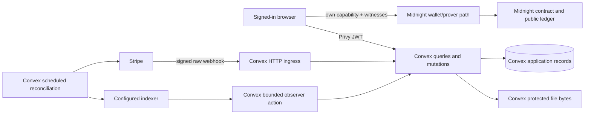

# Milo — backend design and operations handoff

> **Implementation handoff · 7 September 2026 · R0.** This is a proposed Convex-oriented execution design for the selected MVP. It records responsibilities, boundaries, and proof gates; it does not claim code, infrastructure, payment capability, or any of the six providers / fourteen protocol operations has been implemented. Current evidence remains **0/6 and 0/14**.

## Contents

1. [Purpose and authority](#1-purpose-authority-and-non-goals)
2. [Operating model](#2-operating-model-and-trust-boundaries)
3. [Module and record responsibilities](#3-proposed-convex-module-responsibilities)
4. [Validation and authorization](#4-validation-and-authorization-contract)
5. [External reconciliation](#5-external-observation-inboxoutbox-and-reconciliation)
6. [Files and restoration](#6-file-lifecycle-and-application-restoration)
7. [Humans and agents](#7-human-roles-agents-and-operator-exposure)
8. [Diagnostics and jobs](#8-diagnostics-jobs-and-incident-operation)
9. [Deployment and rollback](#9-environments-deployment-migration-and-rollback)
10. [Scenario acceptance](#10-gate-to-scenario-acceptance-map)
11. [Remaining mechanism gates](#11-decisions-still-gated-not-solved)
12. [Evidence maintenance](#12-evidence-and-documentation-maintenance)

## 1. Purpose, authority, and non-goals

Milo needs one coherent operational backend for an invite-only fixed-price creative order: agreed private terms, separately observed Midnight state, private delivery files, and externally reconciled payment. **Private agreements. Clear approvals.** The backend makes that workflow usable and recoverable. It never becomes a substitute authority for the contract, a wallet, a payment processor, or a private-state vault.

This handoff complements rather than overrides the canonical documents:

- Data recipients and runtime authority: [blueprint](01-blueprint.md#24-how-private-and-public-state-work-together).
- States, invariants and operations: [protocol](01-blueprint.md#41-canonical-data) and [coverage contract](01-blueprint.md#37-midnight-integration-coverage-contract).
- Payment, files, recovery and archive: [blueprint implementation boundaries](01-blueprint.md#51-two-independent-state-machines).
- Readiness and release status: [roadmap](02-roadmap.md#34-nativeconvex-integration-acceptance-gates).
- Human/agent and incident practice: [building guide](03-building-guide.md#2-the-boundaries-that-make-milo-honest).
- Screen composition and participant handoffs: [UI design](04-ui-design.md) and [UX service design](05-ux-design.md).

No separate Hono/API service, SQL database, Drizzle layer, S3 adapter, Bun worker, or always-on indexer process is proposed. Bun orchestrates local build/test/QA; Convex hosts application functions and bounded schedules. Select the default or Node action runtime from a verified library's compatibility **and** measured workload; current Convex supports Node 20, 22, and 24, so Node 24 is not a blanket requirement [Convex runtimes](https://docs.convex.dev/functions/runtimes). Actor-local Midnight private state, generated wallet/prover integration, and signed user transactions stay out of Convex.

The following remain out of scope: general marketplace behavior, split payments, autonomous dispute decisions, customer wallet custody, raw card handling, private-state synchronization, delivery revisions, and archive-as-backend. The optional Cascade archive does not add an operation or alter core transition authority.

## 2. Operating model and trust boundaries



Arrows denote controlled information flow, not permission transfer. A Privy identity grants an authenticated request only after Convex validates its token and Milo membership. It neither proves a Midnight role nor permits payment capture. A webhook is provider evidence to verify and reconcile; it is not permission to change a ledger phase. A Convex record is a useful projection, never independent proof of ledger finality.

### 2.1 Authority table

| Decision or fact | Authority | Convex responsibility | Explicit non-authority |
| --- | --- | --- | --- |
| Order transition and role capability | Admitted Midnight contract | Cache provenance/freshness; request reconciliation | No mutation, operator, or admin flag can authorize a transition |
| Commercial decisions | Merchant accepts, buyer approves, committed dispute operator resolves where the phase permits | Store protected supporting record and show next task | No agent or automatic quality verdict decides |
| Payment authorization/capture/refund | Stripe/provider | Bind intent, receive events, reconcile requests/results | Contract approval is not payment success |
| Access to terms/files | Current authorized Milo membership | Authenticate, authorize per record, serve protected bytes | Storage ID/route/order ID is not a credential |
| Capability secrets/openings/witnesses | Respective actor-local private state | Never receive, log, query, back up, or restore | Neither support nor agents may impersonate an actor |

### 2.2 Privacy field classes

| Class | Examples | Allowed location / reader | Prohibited handling |
| --- | --- | --- | --- |
| Public protocol metadata | address, phase/revision, commitments, deadlines, transaction IDs | Midnight/indexer; provenance-bearing Convex projection | Treating observation as capability or publishing extra application metadata |
| Protected application data | terms, brief, invite/member linkage, provider IDs, manifest, case notes | Convex after role/membership checks; only an explicitly consented review subset may leave through §7.1 | Public URLs, client role claims, analytics payloads, public logs, unconsented model disclosure |
| Private file bytes | delivery bytes and permitted dispute material | Convex storage plus authenticated HTTP byte action; a review-only derivative only after exact external-disclosure consent | `storage.getUrl`, public/bearer URLs, Cascade, or an unconsented external model transfer |
| Actor-local secret state | capabilities, salts/openings, pending private context, buyer limit | Actor device/private-state provider and proved backup path | Convex/Privy/Cascade transmission, support access, telemetry |
| Service secret | Stripe webhook secret and provider credentials | Least-privilege backend action environment | Browser bundle, documents, errors, screenshots or evidence export |
| Optional archive signer | Lumera publication credential | Isolated approved Node publisher, not Convex or browser | Generic operator session, support tool or private-data archive |

Terms are private from public chain observers, not necessarily end-to-end encrypted from Milo. Authorized counterparties and the protected backend are recipients. Any operator-blind encryption, encrypted archive, or new data recipient is a security/design decision with owner, threat model, recovery/dispute model, and approval before implementation.

## 3. Proposed Convex module responsibilities

The [Midnight core audit](08-midnight-core-audit.md#2-how-midnight-is-already-at-the-core) prioritizes explicit actor-local scope, admission fingerprints/maintenance policy and immutable operation observations inside the existing record families. An EffectStream projection is not chain authority or a drop-in Convex replacement; any observer experiment must preserve the same privacy, freshness and reconciliation boundaries.

The target layout in [Blueprint §9.1](01-blueprint.md#91-proposed-structure) is canonical. Keep policy vocabulary in the shared domain package; do not reproduce protocol transitions in a second state machine. The rows below name responsibilities, not a mandate for a directory, service or abstraction per row; keep small related functions together until extraction has a real benefit.

| Module | Responsibilities | Required boundary |
| --- | --- | --- |
| `auth.config.ts` + `auth/` | Privy JWT configuration, identity lookup, membership helpers | Validate issuer/audience/JWKS/expiry; redact token failures; no auth database replacement |
| `quotes/` | Merchant offers, draft/frozen quotes, and invitations | Freeze accepted-version inputs; editing never rewrites admitted terms or creates a separate agreement record |
| `orders/` | Authorized projection, canonical address binding, observation status, timeline read model | Projection only; address-binding race-safe in one mutation; no contract authority |
| `payments/` | Intent binding, inbox/outbox, Stripe actions, reconciliation | Durable intent before effect; external work in actions; no distributed transaction claim |
| `files/` | Manifest records, upload authorization, protected byte streaming, retention candidates | Reauthorize every operation; never expose storage bearer URL |
| `operations/` | Client-visible pending-operation metadata and recovery prompts | Non-secret identifiers/status only; no call data, witnesses, or capabilities |
| `reviewService` / `reviewLoop` | One optional advisory-job interface for merchant preflight, buyer review, and dispute case briefs | Server-authorized, consent-gated ID requests; no separate role services or mutating model tools |
| `http.ts` | Signed webhook ingress and authenticated private-file endpoints | Minimal routing; verify signature before accepting effect; limit request size |
| `crons.ts` + `reconciliation/` | Bounded scan/cursor/retry, stale and orphan detection | No permanent indexer websocket; budgeted idempotent work units |
| `audit/` / `admin/` | Redacted audit events; explicit operator case tools if needed | Operators cannot impersonate, rewrite chain history, or bypass file access |

Do not introduce a global event bus, separate job queue, generic repository layer, or overloaded `status` that mixes UI, payment, and ledger state. Convex documents, actions, scheduled functions, and indexes are sufficient only after B-02/B-04/B-06 prove the required failure modes. A discovered platform gap is a narrow decision/gate, not a reason to preemptively add infrastructure.

### 3.1 Proposed records and identity boundaries

Use the [canonical record families](01-blueprint.md#341-convex-data-and-execution-contracts), opaque Convex IDs and stable non-secret external identifiers where needed. `orderId`, `quoteId`, `caseId`, provider IDs and an address require authorization, never act as bearer capabilities. Do not add parallel `providerInbox`, `outbox`, `fileManifests` or `operationRecovery` tables for responsibilities already owned by the records below.

| Record family | Minimum responsibility | Privacy / integrity constraint |
| --- | --- | --- |
| `memberships`, `invites` | Verified identity, actor scope, status and invitation lifecycle | Current server-side check; no parallel credential/session database |
| `offers`, `quotes` | Fixed-service description and draft/frozen private commercial representation | Versioned; material changes invalidate consent; no overwrite after admission or new agreement table/state enum |
| `orders` / participants | Address, version, public observation envelope, role-to-membership association | Atomic bind; app role does not replace circuit commitment; no secret material |
| `chainObservations` | Endpoint, revision/phase/tx, time, artifact/network identity | Preserve provenance; contradictory/stale results block dependent effects |
| `paymentIntents` | Immutable single Session/PaymentIntent/account/amount/currency/expiry/environment binding | No same-order replacement attempt; validate all bindings before capture/void |
| `paymentInbox`, `settlementOps` | Event receipt, normalized observation and requested external effect | Deduplicate atomically; operation retries are not new payment attempts |
| `deliveries`, `fileGrants` | Immutable manifest/bytes association, upload ownership and retention | URL is not identity; submitted manifest is immutable |
| Optional `reviewJobs` | Consent, pinned review configuration, request/evidence fingerprints, bounded result and failure state in one job record | IDs/revision/digests first; advice expires on a stale source and is not an authority record |
| `orders`, `auditEvents`, `notifications` | Scoped pending identifiers, case/timeline projection, safe diagnostics and in-app status | No backup/call data; protected case evidence is authorized separately, never dumped into diagnostics |

Indexes should serve authorization-first reads and bounded reconciliation: membership-by-user/scope, order-by-address, provider-event ID, intent-by-order/environment, file-by-order/manifest, and pending work by next attempt. Exact index names, retention windows, and raw-payload policy remain decisions. The backend owner must prove that read-index plus insert/bind occurs in one atomic mutation; Convex does not make a hypothetical `.unique()` declaration correct.

### 3.2 Shared capability-profile boundary

The canonical [service contexts and fit matrix](01-blueprint.md#14-seven-service-contexts) are presentation and discovery inputs, not backend partitions. Persist `contextId` and `templateRevision` only inside the canonical frozen scope document already committed by `scopeDigest`; do not add a public-ledger field, context registry, profile DSL, or another API resource. `serviceVersion` privately selects a compiled capability policy; the circuit never interprets a merchant-authored template.

The initially selected `image-pack-v1` profile admits exactly three PNG, JPEG, or WebP files of at most 5 MiB each, with fixed price, quantity one, one immutable full delivery, and no revisions. Compact checks the private agreed count/price and transition rules; the protected-file pipeline checks actual bytes, MIME, size, count and ownership. It is category-general only within that bounded profile, not count-general. A changed format requires storage/security/UI validation; a changed count requires a newly compiled policy and encoding tests. Revisions, milestones, delegation, or another payment attempt require a new cross-layer decision rather than a configuration value.

An agency buyer in UC-03 and its freelancer merchant use the existing buyer and merchant roles. A separate client order has no implicit membership linkage, payout instruction, or capability delegation. Cases, disputes, finance/support exceptions, and optional archive publication remain separately authorized.

## 4. Validation and authorization contract

Convex validators are input hygiene and boundary documentation, not proof-system checks. Share bounded domain schemas only where browser/Convex compatibility is real; compile the Compact relation separately. At every protected boundary:

1. For user calls, verify the Privy JWT; internal actions and signed webhook ingress use their own explicit trust boundary, never a fabricated end-user token.
2. For user calls, load current membership/invitation state inside the function. Internal workers validate their bound record/environment and narrowly authorized purpose instead of impersonating a logged-in participant.
3. Authorize the specific relationship or pre-authorized internal operation and record/version. Reconciliation of existing obligations does not require an active buyer session or create new consent.
4. Validate type, length, integer bounds, enum, ID shape, currency configuration, and manifest metadata.
5. Apply one atomic application mutation or create a durable intent; perform external work only in an action.
6. Persist required redacted audit events within the relevant mutation. Queries remain read-only; do not introduce side effects merely to log a read.

Browser input cannot set phase, payment truth, capture eligibility, another participant, membership, file ownership, observation freshness, or archive destination. Operators receive explicit case permissions; they do not receive “superuser means buyer.” A role-specific mutation controls application data, but the actual contract action must independently reject wrong capability, stale revision, terms, deadline, or delivery commitment.

Shared validation may render the selected context prompt and validate the frozen scope document, but authorization uses the resulting quote/order relationship and actor role—not a context label. The backend accepts only supported compiled `serviceVersion` values, verifies the matching scope encoding before freeze, and stores no raw capability, witness, or client-secret recovery material. A reload reconciles a pending operation from non-secret identifiers before offering a new hold; it never reauthorizes a failed, expired, or voided same-order payment attempt.

Privy–Convex is experimental until B-03 records real ES256/JWKS/issuer/audience/refresh/disabled-user/membership evidence. Failure blocks authenticated rollout; it does not allow a quiet Better Auth or second-login fallback.

## 5. External observation, inbox/outbox, and reconciliation

External systems do not participate in Convex transactions. Use durable state around effects, then independently observe outcomes. Never call this “exactly once” across Stripe, Midnight, or an indexer.

Use the existing operation and observation records as one evidence envelope, not another database: requested effect/operation identity; expected network, canonical address, artifact fingerprint and revision; stable ledger identifiers; actual execution result and observed revision; endpoint, observation time and block/position where supported; reconciliation status. Unsupported fields remain explicitly unavailable rather than invented. A matching transaction identifier without the expected successful transition cannot authorize capture. Private provisional state and witnesses stay outside this envelope.

```mermaid
sequenceDiagram
  participant C as Convex mutation
  participant A as Convex action
  participant X as Stripe or indexer
  participant S as Scheduled reconciler
  C->>C: atomically bind intent/event and record pending work
  C->>A: schedule bounded external attempt
  A->>X: request or inspect with correlation metadata
  alt response known and bindings valid
    A->>C: atomically record observed result / next intent
  else timeout, crash, duplicate, or ambiguous response
    A->>C: retain pending state and diagnostic correlation
    S->>X: re-observe authoritative state before retry
    S->>C: converge projection; block unsafe effect if unknown
  end
```

### 5.1 Stripe lifecycle

Follow [Blueprint §5.1](01-blueprint.md#51-two-independent-state-machines), not a combined order status.

1. A mutation validates frozen quote/order/environment and atomically creates or resumes one application payment intent.
2. A Node action creates/retrieves the single hosted Checkout/manual-capture mapping with the same persisted idempotency identity after ambiguity. It does not create a replacement attempt.
3. Browser return is navigation only—not proof of authorization, cancellation, or capture.
4. Raw HTTP ingress verifies Stripe signature, atomically records/deduplicates the event, and schedules reconciliation. Validate account, mode, amount, currency, order binding, and provider state.
5. A reconciler requests capture only after the expected finalized `APPROVED` transition and a freshly retrieved usable bound hold; void/cancellation only when provider state and policy allow it.
6. Provider confirmation becomes a provenance-bearing payment observation. Failure remains visible beside the protocol result.

Before deployment/admission/reservation, require the canonical latest-approval/resolution deadline plus the positive configured capture/reconciliation margin to be strictly earlier than actual `capture_before`; missing expiry/margin or insufficient time blocks progress and triggers safe hold reconciliation. Recheck at acceptance/capture. This is Milo application policy: Compact cannot see Stripe, and a capability holder may bypass the app's hold check with a direct valid circuit call. Do not add a payment oracle implicitly.

The timing contract is: verified wallet/recovery readiness → manual authorization → retrieval of actual charge expiry → admission-window check → reservation/merchant acceptance → independently observed approval → fresh provider retrieval → capture/reconciliation. Authorization expiry and immutable contract deadlines are different clocks. Include confirmation/observation/retry delay in the measured margin; a UI countdown is not its evidence. Stripe's `automatic_delayed` may capture before expiry without approval and must not replace this sequence. B-06 must reject that configuration and preserve `APPROVED` plus expired/failed payment as an exception, not counterfeit cancellation or success ([Stripe manual capture](https://docs.stripe.com/payments/place-a-hold-on-a-payment-method)).

Cancellation, every expiry path, abandoned Checkout, timeout-after-effect, replay/out-of-order events and capture-versus-void races are B-06 cases. No same-order reauthorization exists in v1. Expired/failed attempts require the actual cancellation/dispute/finance-support path; approved/unpaid remains a terminal-order exception. A new quote is a new agreement only after safely resolving the old outcome, not another attempt attached to it.

Late provider events are retained/deduplicated and cause retrieval of current provider state, never a blind last-event-wins update or reopened order. Refunds are externally authorized finance incidents: no automatic Milo refund endpoint. Record existing provider refund IDs, actual amount/status and decision audit; test pending/failed/partial/duplicate results and preserve them separately from capture history and ledger phase.

### 5.2 Chain observation and timeout liveness

The browser persists its own pending recovery context before user submission. Convex stores only non-secret operation identifiers required for product continuity. The client applies private-state updates only after SDK-finalized `SucceedEntirely` **and** expected address/revision transition; abort must not be assumed to cancel a submitted transaction.

A bounded internal action polls/cursors the verified public observation schema and writes provenance-bearing projections. It handles unavailable, stale, and contradictory data by showing uncertainty and blocking capture/unsafe follow-on work. It does not run a permanent websocket, generate a user proof, or retry from a client-supplied status.

The canonical matrix's expiry operations are permissionless but still require a capable caller, fee path, network, and real transaction. A cron may identify an approaching deadline and notify/reconcile; time alone does not transition the contract. The canonical matrix owns all phase predicates and rejection evidence; §7 maps agent participation to those IDs without defining another state machine.

The bounded observer remains selected. The [official EffectStream reader](https://docs.midnight.network/guides/index-state-with-effectstream) is a possible future derived-state service, not a replacement consensus source or a function to embed in Convex actions. Admit it only after measuring a real history/replay gap, proving decoder compatibility and durable restart behavior, and approving its additional Bun/database/service budget. Never reshape confidential/public protocol fields solely to satisfy its positional decoder or import its decoded-state logging into Milo. No observer or sponsor is activated by this handoff.

## 6. File lifecycle and application restoration

### 6.1 Private-file sequence

```mermaid
sequenceDiagram
  participant M as Authorized merchant browser
  participant F as Convex files module
  participant S as Convex storage
  participant B as Authorized buyer browser
  M->>F: request constrained upload for named order
  F->>F: authenticate + merchant/order/phase authorization
  F-->>M: short-lived, write-only upload URL
  M->>S: upload bytes; receive storage ID
  M->>F: submit manifest: digest, size, type, storage ID
  F->>F: validate/freeze immutable manifest when protocol allows
  B->>F: request delivery through authenticated action
  F->>F: authorize buyer/order/current membership
  F-->>B: bounded byte response
  B->>B: hash bytes and compare frozen manifest locally
```

Upload stages are: authenticate and authorize a short-lived Convex upload URL; the browser posts bytes and receives `Id<"_storage">`; the backend validates actual type/size/count/digest and ownership before freezing the manifest and using the separately proved merchant operation to commit immutable delivery identity. Persist storage IDs behind the authorized manifest. Review work is scheduled with a small reference such as `{ jobId, orderId, expectedRevision, manifestDigest }`, not file content. Never pass base64 in Convex function arguments/returns or scheduler payloads; the upload URL is write-only and is not a download-policy exception. A generated URL is not inherently a per-order type/size guarantee. Finalization must reject arbitrary storage-ID attachment, cross-grant reuse, wrong bytes and expired/consumed grants using persisted ownership and actual stored metadata/byte checks. Enforce one-time attachment in an atomic mutation; quarantine/delete rejected or orphaned bytes through the approved bounded retention process. Convex storage ID, thumbnail and URL are not delivery commitments.

The raw `image-pack-v1` maximum is 15 MiB; base64 encoding alone is about 20 MiB before JSON and in-memory copies. Function-payload limits and the documented 64 MiB default Convex-runtime / 512 MiB Node-action memory limits are independent constraints ([Convex limits](https://docs.convex.dev/production/state/limits)). An authorized action resolves IDs with `ctx.storage.get`, processes files sequentially where possible, and caps derived image/request sizes before any approved external call. Encoding required by a model's HTTP API stays inside that bounded action, never in a scheduled payload. Measure peak memory, concurrency, serialization and latency with three maximum-size files; the arithmetic alone proves neither an OOM nor that Node is required. Use Node only when supported-library compatibility or the measured workload justifies it, retaining all byte limits.

For `image-pack-v1`, the backend enforces exactly three PNG, JPEG, or WebP files, each at most 5 MiB, against the frozen terms and manifest. The browser independently checks retrieved-byte identity; Compact binds the approval to the submitted commitment, not a byte inspection. These checks do not establish quality, malware absence, rights, human review, or payment.

Downloads use an authenticated Convex HTTP action that rechecks membership, role/order scope, revocation, and response limits at request time. Do not return `storage.getUrl`, a public bearer URL. A digest match establishes byte identity only; it does not establish quality, malware absence, rights, user review, or payment outcome.

Deletion/retention requires a policy before real-user use: owner, scope, trigger, legal/support exception, failure behavior, and evidence. Until approved and proved, do not promise deletion, restore of deleted bytes, or an SLA. Cascade is never a private-file fallback.

### 6.2 Restore boundaries

- Convex may restore authorized protected records, manifests, observations, and payment reconciliation context under retention policy.
- It cannot recreate a lost capability, salt/opening, wallet seed, buyer limit, or provider-specific private-state scope.
- A clean-profile drill must prove predeployment staging and account/network/order scoping without secret or cross-order leakage (B-09).
- If recovery is unavailable or conflicted, provide a truthful read-only/lost-capability route; never offer email reset as substitute.

Wallet restoration recovers only what the selected wallet actually backs up. It does not establish restoration of Milo's order capabilities/openings or Convex files. Test these three recovery responsibilities independently and together. Keep predeployment nonce-scoped state until its admitted address binding is confirmed; retain pending operation identifiers across interruption; apply confirmed private state only once after successful execution and the expected transition. A stale backup must never overwrite newer active state. Terminal-order secret/file retention follows an explicit policy, not automatic deletion when payment changes.

The recovery owner must close the predeployment capability-staging decision with a tested provider-compatible path. Blocking behavior: no consequential onboarding/payment-hold claim and no “recoverable” label until evidence exists.

An application-data restore is not permission to replay side effects. Restore into an isolated environment with scheduled/external effects disabled, inspect mappings and provider outcomes, then explicitly authorize resumption of the original identities. Never clone restored production payment mappings into a test environment that can call live credentials. Record the restore point and any missing post-backup observations; their absence does not mean a capture never occurred.

## 7. Human roles, agents, and operator exposure

The single-account UI coordinator is presentation over independently verified facts; see [UI Design §5.2](04-ui-design.md#52-progressive-prerequisites). Backend role checks secure protected reads/writes; Midnight commitments independently authorize protocol actions.

| Actor | May do | Must not do |
| --- | --- | --- |
| Buyer | Read authorized order; prepare/recover own context; approve/dispute through canonical flow | Act as merchant/operator, expose capability, infer payment success from chain state |
| Merchant | Create bounded quote, access authorized brief, upload/submit delivery, decline | Replace terms/delivery after commitment, inspect buyer-only inputs |
| Dispute operator | Access assigned pre-agreed case evidence and full-resolution flow | Create hidden partial settlement, impersonate either party, rewrite terms |
| `financeOperator` | Reconcile scoped payment incidents and use separately approved provider authority | Sign dispute resolution, forge observations, silently refund or replace a payment |
| Support | Diagnose redacted state and guide recovery under explicit scope | Read arbitrary files, handle secrets, impersonate or grant itself another authority |
| `archivePublisher` | Publish approved synthetic evidence with its isolated signer | Access private cases, spend payment funds or act as dispute operator |
| Advisory role agent | Merchant preflight, buyer review recommendation, or `disputeOperator` case brief through the single review loop | Hold secrets, sign/submit, approve, capture/refund, resolve, call mutating tools, or treat content as instructions |
| Build/QA agent | Run synthetic bounded tests and report artifacts | Create real-user evidence, decide readiness alone, upload private data, invent provider result |

Operator surfaces enforce the [separate authority assignments](01-blueprint.md#343-operational-authority-assignments), including explicit dual-role assignment when one person has multiple responsibilities. “Admin” is not universal read. Case notes identify source/confidence and do not call subjective quality cryptographic truth. Preserve the [UI's bounded resolution controls](04-ui-design.md#9-merchant-operator-and-account-surfaces).

### 7.1 One optional advisory review service

The proposed `reviewService` and its bounded `reviewLoop` are one shared implementation—not three role-specific services and not a Pi SDK or OpenAI SDK dependency. They implement the canonical [review-assistance boundary](01-blueprint.md#38-review-assistance-and-agent-operated-prototypes): `merchantPreflight` identifies missing manifest/scope checks, `buyerReview` recommends questions or a review outcome, and `disputeCaseBrief` organizes assigned evidence for the `disputeOperator`. Each begins as a minimized, typed identifier request, never browser-supplied content:

```ts
type ReviewRequest = { disclosurePolicyDigest: string } & (
  | { kind: "merchantPreflight" | "buyerReview"; orderId: Id<"orders">; deliveryId: Id<"deliveries">; expectedRevision: number; expectedManifestDigest: string }
  | { kind: "disputeCaseBrief"; orderId: Id<"orders">; expectedRevision: number; expectedCaseDigest: string }
);
type ReviewAdvice = { sourceRevision: number; sourceDigests: string[]; findings: { evidenceId: string; observation: string }[]; uncertainties: string[]; suggestedNextStep: string };
```

These are proposed schema shapes, not generated bindings. Merchant preflight binds the uploaded candidate manifest before chain submission; buyer review binds the submitted delivery; case review binds the order's assigned dispute evidence. The server validates `disclosurePolicyDigest` against the disclosure actually confirmed by the authenticated participant and stores that receipt, actor, source fingerprints and timestamp on the job; requesting an order ID is not consent. Source revision/digests are server-owned envelope fields. Findings may cite only the supplied evidence IDs; `suggestedNextStep` is bounded advisory text, never a dispatchable operation. Every kind has server-side role/phase checks and bounded field/array lengths.

The server loads current membership and the exact role/case scope, records explicit per-revision consent, and **only then** resolves protected terms, case material, or private bytes. Consent names the source digest, recipient/router, modality, retention and any review-specific derivative; the resolver may make only that minimized derivative available for the external analysis. This is a disclosure exception, not a delivery route: it creates no `storage.getUrl`, public URL, browser download, or broader membership access. It pins the provider, model/version, trust/data-recipient policy, permitted modality, zero-cost policy, verified recurring allowance, token/tool-round/byte ceilings, and wall-clock timeout on the job. Before activation, query and retain the live per-model provider record; pin the admitted address/trust mode/model identifier, disable unqualified fallback, and never hardcode provider counts. The [dated candidate routes](01-blueprint.md#611-review-model-selection-and-routing)—including their exact casing and Private versus Verified/Standard distinction—remain canonical. The model gets no tools (especially no mutating tools); validate its structured response as untrusted input, retain only bounded/redacted output, and discard it if the source revision or manifest/case digest changed before display or use. It may never assert ledger finality, trigger capture/refund, or replace a human signature, approval, dispute opening, or resolution.

Recheck membership, phase, consent, source fingerprints and qualified provider immediately before dispatch and before serving advice. Consent also expires on a changed model, provider, disclosure policy or purpose, not just changed bytes. Use existing transactional job admission and bounded reconciliation, deduplicating the request/consent fingerprint and reserving the free allowance before dispatch. An ambiguous external call consumes its reserved attempt budget; never retry indefinitely or promise deletion of data already disclosed. Initially allow one request, no tools and zero tool rounds; any further bounded loop needs separate measured justification.

No paid authorization is assumed for the free-tier prototype, so a hosted call stays blocked until a recurring no-cost allowance is verified. A non-free route would additionally require explicit spend approval as a separate later decision under [Blueprint §6.10](01-blueprint.md#610-free-tier-deployment-and-spending-boundary). Allowance exhaustion, provider/model mismatch, timeout, invalid schema, denied consent, or stale evidence produces a visible human-review fallback—not a fabricated recommendation. The routing/model choice remains a named gate in [Blueprint §6.11](01-blueprint.md#611-review-model-selection-and-routing).

| Canonical operation | Deterministic support / optional assistance | Existing execution authority |
| --- | --- | --- |
| MID-T01 Bootstrap deploy | Deterministic artifact/verifier/maintenance checklist; no model admission decision | Authorized deployer and independently checked admission path |
| MID-T02 Reserve | Typed draft/terms explanation; no delivery-review call before delivery exists | Bound buyer confirms and signs |
| MID-T03 Accept | Frozen-agreement checklist; no premature delivery-preflight call | Bound merchant confirms and signs |
| MID-T04 Cancel reserved | Phase-aware cancellation explanation, not model review | Buyer confirms and signs |
| MID-T05 Decline | Phase-aware decline explanation; no invented refund result | Bound merchant confirms and signs |
| MID-T06 Submit delivery | Application checks manifest bytes/digest; optional merchant preflight reviews permitted scope/image evidence | Bound merchant confirms immutable submission and signs |
| MID-T07 Approve | Application checks byte identity; optional buyer review supplies observations/questions | Buyer inspects, decides and signs |
| MID-T08 Open dispute | Deterministic/human case preparation; only the buyer's submitted-delivery advice may inform this step. No merchant dispute-review call is introduced | Phase-eligible buyer/merchant under the canonical predicate confirms and signs |
| MID-T09 Resolve | Assigned `disputeOperator` case brief labels evidence/uncertainty | Precommitted operator chooses the permitted full outcome and signs |
| MID-T10 Expire bootstrap | Deterministic public-input deadline/phase check; no LLM required | Supported fee-paying permissionless caller submits; observe actual result |
| MID-T11 Expire reserved | Same deadline/phase check with accept/cancel races | Supported fee-paying permissionless caller; not the reviewer |
| MID-T12 Expire undelivered | Same check with submission/dispute races | Supported fee-paying permissionless caller; not the reviewer |
| MID-T13 Escalate unreviewed | Deadline alert; never an auto-approval recommendation | Supported fee-paying permissionless caller escalates; not the reviewer |
| MID-T14 Expire dispute | Same check with operator-resolution race | Supported fee-paying permissionless caller; not the reviewer |

Exercise the fourteen coverage rows with branch-specific fixtures, not one linear order: acceptance/cancellation, delivery/dispute/expiry, and resolution/expiry branches are mutually exclusive. Each fixture records its expected predecessor phase, actor contexts, deadline and intended terminal transition; public testnet evidence confirms only the actual branch taken.

For real orders, commercially consequential role decisions remain human-confirmed and signed through the existing actor path. This does not remove the existing deterministic permissionless-timeout caller or payment reconciliation; neither accepts model instructions. Synthetic live-testnet agent actors use an isolated deterministic test-signer harness, including deployment and permissionless fee-payer contexts distinct from order-role authority. Its keys never enter an LLM or Convex, and public ledger evidence must confirm the actual transition—free inference is not presumed. Scripted fixture simulation may exercise routing/failure UI only and makes no chain or inference claim. Selecting any mode never disables real-order membership, role, consent, or capability boundaries.

Acceptance/failure cases: deny an ID request outside current role/case scope or without consent before byte resolution; reject/expire advice after a revision or digest change; and prove an exhausted free allowance, malformed response, or timeout yields human review with no state/payment effect. For a testnet run, retain the isolated harness identity and public transition evidence for the exact MID-T row; a fixture-only run is explicitly labeled simulation.

## 8. Diagnostics, jobs, and incident operation

Use structured redacted diagnostics with a correlation ID linking application operation, inbox/outbox record, and authorized support view. Useful fields: environment, release/artifact fingerprint, internal order ID, non-secret provider/ledger ID, observation endpoint, attempt count, expected/observed transition, and bounded error class. Never log plaintext briefs, bytes, tokens, capabilities, secrets, openings, raw sensitive webhook bodies, or `callTxData`.

Scheduled work is bounded by cursor, scope, row count, deadline, retry budget and backoff. Durable intent survives a crashed action; a sweeper reclaims expired leases and resumes the same operation identity after observing the external outcome. Completion is generation-fenced, but a database lease cannot fence an already issued provider call. A cron may schedule the already-authorized capture reconciler or an operator task; time alone cannot grant capture, discard protected data or sign a user's transaction.

For suspected private-data leakage or duplicate payment, follow [Building Guide §9.2](03-building-guide.md#92-release-and-incident-workflows): pause new high-risk application operations, preserve minimal redacted evidence, establish facts from authorities, involve human owners, add a regression, and resume only after the affected gate is re-proved. Pausing Convex does not freeze Midnight or revoke a disclosed capability.

## 9. Environments, deployment, migration, and rollback

Each environment needs distinct labels/configuration: local developer/protocol, synthetic Preview/QA, Stripe test mode, and any controlled pilot. Test/live resources must not share provider IDs, webhook endpoints, fixtures, file namespaces, archive signers, or ambiguous copy. Preview is not production.

Release manifests bind Git SHA, web/Convex release IDs, contract source/compiler/artifact fingerprints, admitted addresses, network/indexer configuration, lockfile, fixture revision, and known limitations per [Roadmap §8.3](02-roadmap.md#83-version-and-release-discipline). Deployment requires matrix evidence, not a documentation build or agent narrative.

Convex schema evolution should be additive and backfillable: ship old/new-tolerant readers; backfill in bounded idempotent batches; validate counts/invariants; retire fields only after rollback/retention windows. Record schema/data migration version separately from contract and payment-policy version. Never overwrite historical observations or merge payment/ledger phases.

Web and Convex code may roll back only when compatible with stored data and a rehearsal proves it. Contract rules for active orders do not roll back or silently upgrade. New contract versions serve new orders; active readers/payment reconciliation interpret their original protocol/payment policy. Client private-state backup import compatibility is independently gated and not implied by a Convex rollback.

## 10. Gate-to-scenario acceptance map

This is an evidence locator, not a second implementation matrix. Preserve exact `MID-P1`–`MID-P6` and `MID-T01`–`MID-T14` IDs as [Roadmap §3.4](02-roadmap.md#34-nativeconvex-integration-acceptance-gates) requires. Scenario claims supplement the [UX matrix](05-ux-design.md#9-scenario-coverage-and-review), not its status ledger.

| Scenario | Backend assertion | Canonical evidence | Failure behavior |
| --- | --- | --- | --- |
| Uninvited/disabled/expired identity opens deep link | No terms/files/projection leak; useful access explanation | B-03; UI §5.1 | Deny/redact; no partial membership |
| Two actors/orders/tabs change context | Authorization/recovery scoped; stale results rejected | B-09; provider matrix | Clear/reload protected state; never reuse context |
| Concurrent address bind or provider event | One durable binding/effect; attempts diagnosable | B-02; B-06 | Atomic conflict then reconcile, never duplicate |
| Hold succeeds but reservation is ambiguous/fails | Payment and chain remain separate; recovery converges | B-06; Blueprint §§5.1–5.2 | Block capture; show truthful void/reconciliation state |
| Approval observed while capture fails/late | Fresh approval necessary, insufficient; provider result separate | B-06; state machine §4.2 | Preserve approved/payment-failed state and recovery |
| Cancellation, expiry, dispute cancellation | Window boundaries, no replacement attempt and external refund observations are tested | Canonical operation matrix; B-06 | Safe void or finance incident; no automatic refund/reauthorization |
| Context/brief fixture | Shared SC fixtures remain in the same backend; UC-01 and UC-13 end-to-end three-image flows are targets, not completed evidence | Parameterized B-04/B-05/B-07/B-11 | Reject unsupported policy, encoding, or file bounds without creating a context-specific backend |
| Wrong/altered/cross-order delivery bytes | Authorization and manifest/digest mismatch deny it | B-04; B-07; UI §8.1 | No delivery/approval claim; safe diagnostic only |
| Lost capability / restore conflict | Records can restore; secrets/capability cannot | B-09; Blueprint §5.8 | Read-only/lost-capability path; no fake reset |
| Forged/stale/contradictory projection/event | Provenance/freshness prevents unsafe effect | B-06; B-07 | Unknown/stale; block capture/follow-on work |
| Operator/agent exceeds role | Scope and authority denial is auditable | UI §9; Guide §2.4 | Deny; no bypass or autonomous resolution |
| Advisory review request/response | Consent precedes bytes; stale/untrusted/failed advice has no effect | Blueprint §3.8; free-tier gate | Human review; no inference or state change |
| Optional archive enabled | Synthetic allowlisted bytes retrieve/digest/chain-check | B-08; Blueprint §5.9 | Disable add-on; core paths operate |

## 11. Decisions still gated, not solved

| Decision | Owner | Proof | Blocking behavior |
| --- | --- | --- | --- |
| Privy custom-JWT/Convex membership bridge | Backend owner | B-03 real token/refresh/disabled-user/JWKS exercise | No authenticated rollout |
| Convex indexes, raw-webhook retention, backfills | Backend + security owner | B-02/B-06 concurrency/crash/replay/privacy/migration tests | No payment/production claim |
| File limits/retention/deletion | Product + security owner | Recipient/threat review, B-04 proof, approved policy | No real customer-file admission/deletion promise |
| Predeployment staging / clean restore | Midnight integration + security owner | B-09 on named wallet/browser/network | No consequential onboarding/recovery claim |
| Indexer schema/freshness/cadence | Integration owner | B-06/B-07 outage/contradiction/restart tests | Capture/evidence follow-ons blocked on unknown state |
| Stripe account, manual capture, refund responsibility | Payment/business owner | B-06 real test-mode adapter, external incident tests and approved operational/legal model | No adapter claim before execution; no live-payment admission |
| Contract admission/maintenance locking | Contract owner | Deployed policy and rejected-maintenance test | No immutable-order/pilot claim |
| Cascade publication | Storage/security owner | B-08 allowlist, approval, budget, recovery, retrieval | Disabled; no backend substitution |
| Review assistance/provider routing | Product, security + backend owners | Consent/authorization/redaction, pinned model/modality, bounded response, recurring free allowance and stale-evidence tests | Human review only; no hosted inference or paid fallback |
| Node-action runtime/package compatibility | Platform owner | Locked action/build canary plus measured memory/latency workload | Keep external call out until proven; no new backend or blanket Node 24 |

## 12. Evidence and documentation maintenance

At each milestone, publish: **implemented, verified, externally observed, blocked, deliberately excluded**. Retain evidence references—not sensitive contents—for each gate: environment, release/artifact/version fingerprints, test ID, provider/endpoint, actor separation, expected/actual result, redacted correlation ID, and known limitation.

Selected package cohorts and source-backed caveats belong in [Blueprint §6](01-blueprint.md#6-verified-dependency-decisions); this document creates no second version matrix or dependence on private research artifacts. Follow the [maintenance contract](03-building-guide.md#75-long-term-document-and-dependency-maintenance). Experimental integrations need named spikes/gates and a rollback/disable path. New upstream releases are re-evaluation input, not proof that a boundary changed.

Before implementation, reconcile this handoff with then-current canonical docs and provider evidence. Any conflict in a field, endpoint, or flow must be corrected here or decided in an ADR; it must not silently redefine scope. Completion means a small maintainable Convex design backed by evidence for stated authority boundaries—not maximal abstraction, duplicated state machines, or a completeness claim.
